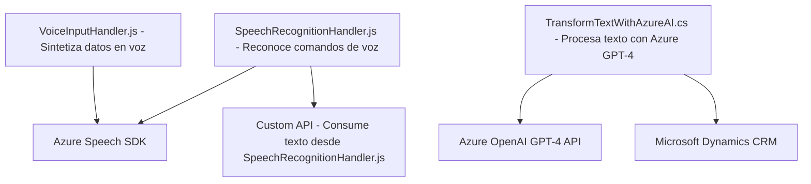

## Breve resumen técnico

El repositorio contiene tres importantes módulos responsables de integrar servicios de reconocimiento de voz, síntesis de voz, y procesamiento de texto con aplicaciones basadas en Microsoft Dynamics CRM. Estas soluciones permiten interactuar de manera más eficaz con formularios dinámicos en un entorno CRM y presentan características orientadas a mejorar la experiencia del usuario mediante tecnologías de inteligencia artificial y voz.

---

## Descripción de arquitectura

La solución tiene una arquitectura de **n capas** integrada por un frontend modular en JavaScript, que sirve como la capa de presentación para interacción con el usuario, una lógica empresarial modular extensible con **Microsoft CRM Plugins**, y la integración con APIs externas (Azure Speech SDK y Azure OpenAI). Aunque el frontend utiliza módulos y JavaScript, la separación de responsabilidades es evidente en los archivos analizados mediante funciones especializadas por tarea.

1. **Capa de presentación (Frontend)**:
   - Archivos `VoiceInputHandler.js` y `SpeechRecognitionHandler.js` procesan los datos dinámicos del formulario representado por el `executionContext` y realizan la síntesis (VoiceInputHandler) y el reconocimiento (SpeechRecognitionHandler) mediante Azure Speech SDK.
   - Tanto la entrada como la salida de voz se manejan directamente para formularios CRM.

2. **Capa de lógica empresarial (Plugin Dynamics)**:
   - `TransformTextWithAzureAI.cs` actúa como un complemento que transforma datos en Dynamics CRM. Llama a Azure OpenAI GPT-4 para generar respuestas JSON que se puedan utilizar dentro del sistema CRM.

3. **Capa de integración externa (API)**:
   - Los módulos aprovechan los servicios de Azure: Speech SDK para reconocimiento/síntesis de voz y OpenAI GPT-4 para el procesamiento de texto.
   - Utilización de APIs externas y servicios de telecomunicación hacia el backend implementado por Azure.

---

## Tecnologías usadas

### Frontend (JavaScript)
1. **Azure Speech SDK**: Reconocimiento y síntesis de voz.
2. **DOM API**: Manipulación de elementos del formulario dinámico.
3. **Promises y programación asincrónica**: Para manejar la latencia de servicios externos.
4. **JSON Handling**: Serialización/deserialización de objetos.

### Backend (C# - Dynamics CRM Plugin)
1. **Microsoft Dynamics CRM SDK**: Para manejar la lógica de negocio dentro del contexto de CRM.
2. **Azure OpenAI GPT-4 API**: Transformación inteligente de texto.

### Patrones arquitectónicos:
1. **Integración con APIs externas**: Los módulos consumen servicios como Speech SDK, OpenAI GPT-4 y potencialmente una API personalizada.
2. **Modularidad**: Funciones y métodos están organizados en segmentos especializados, siguiendo el principio de responsabilidad única (SRP).
3. **Event-driven architecture**: Uso de métodos y callbacks para manejar eventos (carga de SDK, transcripción de voz y envío de resultados).
4. **Asincronía con Promesas** (en JavaScript) y modelo basado en servicios (en C# Plugin).

---

## Diagrama Mermaid compatible con GitHub Markdown

---

## Conclusión final

La solución está diseñada como un sistema de **n capas** donde las interacciones de entrada y salida enriquecidas por voz (frontend, capa presentación) están vinculadas a la lógica avanzada del sistema CRM (capa empresarial) y capacidades de procesamiento inteligentes con Azure OpenAI y Speech SDK (capa de integración externa). Los módulos son altamente especializados y modelan una arquitectura modular orientada a servicios con gran énfasis en la asincronía y la escalabilidad.