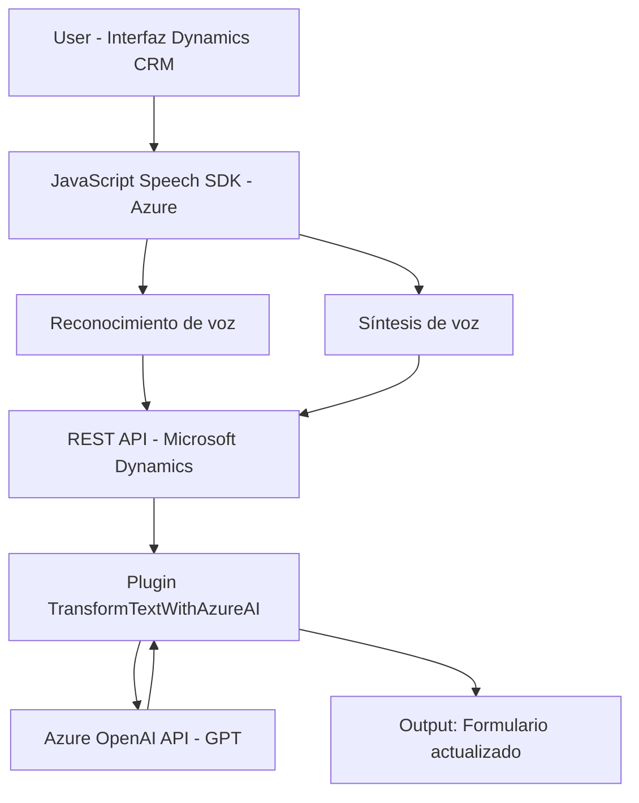

### Breve resumen técnico
El repositorio integra funcionalidades avanzadas de accesibilidad mediante reconocimiento y síntesis de voz usando **Azure Speech SDK**, y procesamiento de texto asistido por **Azure OpenAI API**, todo bajo un ecosistema de **Microsoft Dynamics CRM**. Se enfoca en mejorar la interacción de usuarios con formularios y datos dinámicos mediante APIs, servicios cloud y programación modular.

### Descripción de arquitectura
La solución está dividida en dos principales componentes dentro de una arquitectura de capas:
1. **Frontend:** Scripts JavaScript que operan sobre la interfaz de usuario (Dynamics 365). Implementan reconocimiento de voz, síntesis hablada de datos del formulario y comunicación con APIs de Dynamics y Azure.
2. **Backend:** Un plugin desarrollado en .NET que implementa la interfaz `IPlugin` y extiende Dynamics CRM para hacer solicitudes a Azure OpenAI API. Este plugin actúa como un microservicio que transforma el texto ingresado según reglas predefinidas.

La solución utiliza una arquitectura híbrida con componentes accesibles tanto a nivel cliente (frontend mediante JavaScript) como a nivel servidor (backend en .NET), adoptando patrones orientados a eventos y responsabilidad única.

### Tecnologías usadas
- **Lenguajes y frameworks:** 
  - **JavaScript:** Lógica del frontend.
  - **C# (.NET Framework):** Lógica del backend y el plugin Dynamics.
- **SDKs y APIs:**
  - **Azure Speech SDK:** Para reconocimiento y síntesis de voz.
  - **Microsoft Dynamics Web API:** Interacción con bases de datos del CRM.
  - **Azure OpenAI API:** Transformación avanzada de texto mediante GPT.
  - **Newtonsoft.Json:** Manipulación de estructuras JSON en el plugin.
  - **System.Net.Http:** Manejo de solicitudes HTTP en el backend.
- **Patrones:** Delegate, Modular, External API Integration, Plugin extensibility.

### Diagrama Mermaid válido para GitHub

### Conclusión final
La solución representa una aplicación empresarial con un enfoque en accesibilidad y automatización. Integra tecnologías de vanguardia como AI de Azure y reconocimiento de voz sobre una arquitectura híbrida compuesta por capas. Esta implementación optimiza la experiencia del usuario en el ecosistema de Dynamics CRM, permitiendo una interacción más natural y efectiva con los formularios del sistema. La elección de modularidad y extensibilidad proporciona una base sólida para futuras expansiones o adaptaciones.