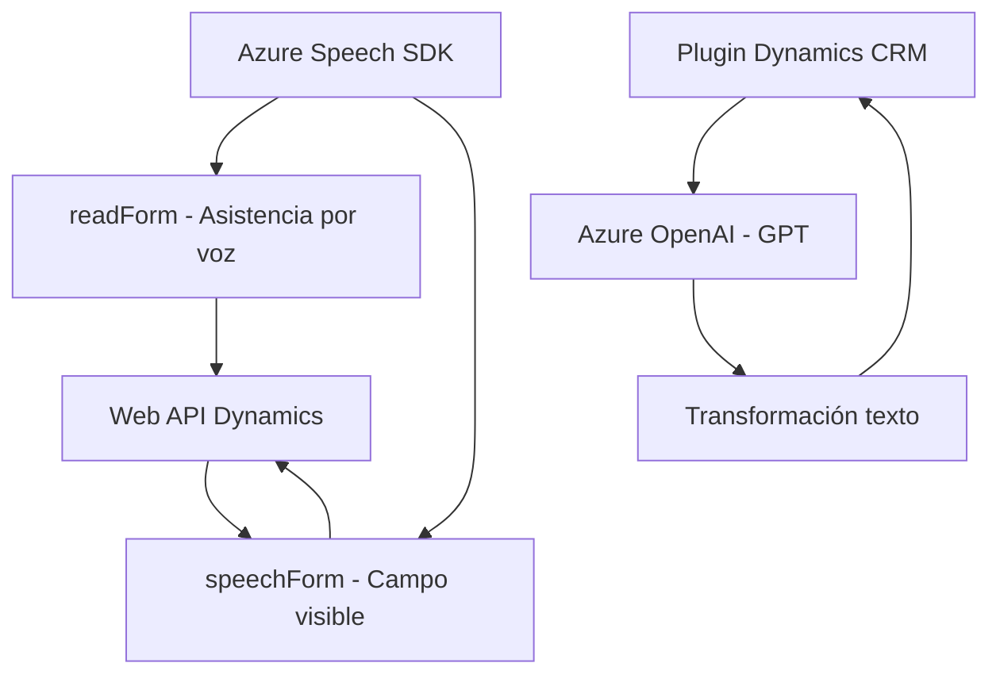

## Breve resumen técnico
El repositorio presenta tres piezas fundamentales: `readForm.js` y `speechForm.js` (arquitectura frontend para interacción con formularios y comandos de voz) y `TransformTextWithAzureAI.cs` (un plugin para Microsoft Dynamics CRM que utiliza Azure OpenAI). Estas soluciones integran servicios externos (Azure Speech SDK y Azure OpenAI) dentro de un contexto CRM para habilitar funcionalidades avanzadas como procesamientos de voz y texto.

## Descripción de arquitectura
1. **Arquitectura monolítica combinada con integración de servicios externos y funcionalidades distribuidas:** 
   - Los archivos frontend utilizan SDK y APIs para manejar voz, comandos y procesamiento de texto en un cliente único.
   - El backend (.NET Plugin) presenta un diseño basado en el patrón Plugin propio de Dynamics CRM, conectándose al servicio API OpenAI de Azure.

2. **Estilo de solución:** 
   - **`readForm.js` y `speechForm.js`:** Modular con integración SDK.
   - **`TransformTextWithAzureAI.cs`:** Plugin orientado al servicio con integración de computación externa en la nube.

## Tecnologías usadas
1. **Frontend:**
   - **JavaScript**: Implementación lógica.
   - **Azure Speech SDK**: Procesamiento, generación y reconocimiento de voz.
   - **Dynamics Context**: Interacción con formularios del CRM online.
   - **Web API** de Dynamics: Integra tecnologías del ecosistema CRM.
2. **Backend:**
   - **C#:** Implementación orientada a objetos.
   - **Microsoft Dynamics CRM SDK**: Lógica del plugin.
   - **Azure OpenAI Service** con GPT: Procesamiento de lenguaje natural.
   - **JSON Handling:** Usos de `Newtonsoft.Json` y `System.Text.Json` para estructuración de datos.
3. **Patrones:** Modularity, Facade, Plugin Design Pattern, API Gateway, servicios integrados externos.

## **Diagrama Mermaid**

## Conclusión final
Este sistema aporta funcionalidades avanzadas para formularios en Microsoft Dynamics CRM, aprovechando procesamiento de voz con **Azure Speech SDK** y **OpenAI GPT** a través de servicios en la nube. El diseño se estructura en dos capas principales:
1. La capa de **frontend** permite interacción por voz con formularios, habilitando comandos hablados y asistencia para el usuario.
2. La capa de **backend** utiliza el patrón Plugin típico de Dynamics para integrar capacidades de AI en el procesamiento de datos.

Gracias a la modularidad y el aislamiento de funciones, el repositorio asegura una interacción optimizada con servicios externos mientras mantiene la lógica de negocio localmente, permitiendo rápida extensibilidad y manejo de servicios en entornos empresariales CRM.