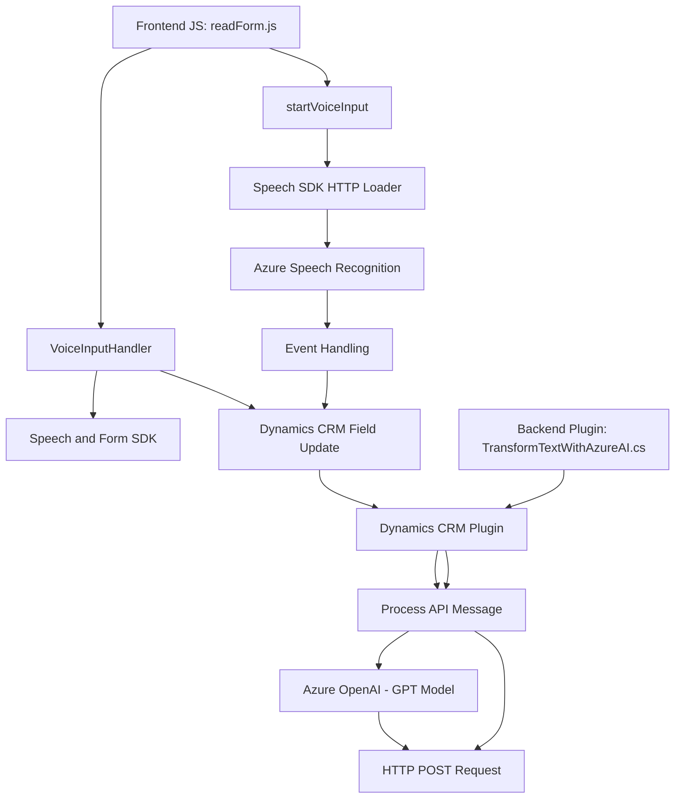

### Breve Resumen Técnico
El repositorio combina funcionalidades distribuidas entre un **frontend basado en JavaScript** y un **plugin backend para Dynamics CRM**. El objetivo principal es mejorar la interacción entre usuarios y dominios empresariales mediante funcionalidades avanzadas como reconocimiento de voz, síntesis de texto e integración con Azure AI. 

### Descripción de la Arquitectura
El repositorio utiliza una arquitectura **n capas**, dividiendo claramente el frontend (para interacción inicial con el usuario y extracción/manipulación de datos del formulario), el backend/plugin (para procesamiento y transformación avanzada de datos mediante Azure OpenAI), y la integración con servicios externos. Aunque un diseño completamente desacoplado utiliza microservicios, este sistema podría considerarse un híbrido, donde las capas dependen de servicios cloud como Azure.

### Tecnologías Usadas
1. **Frontend:**
   - **JavaScript/ES6**: Gestión de eventos y manipulación de DOM.
   - **Azure Speech SDK**: Para reconocimiento de voz y síntesis de texto.
   - **Dynamics 365 SDK (Xrm.WebApi)**: Interacción con objetos del CRM.

2. **Backend (plugin):**
   - **C#/.NET Framework**: Utilizado para implementar plugins en Dynamics CRM.
   - **Microsoft Dynamics SDK (`IPlugin`)**: Extensión personalizada al flujo CRM.
   - **Azure OpenAI Service**: Transformación de texto basada en inteligencia artificial.
   - **Newtonsoft.Json**: Manejo de datos JSON para respuestas API.

3. **Servicios Cloud:**
   - Azure Speech y Azure OpenAI son los servicios primordiales utilizados, a través de API REST para interacción externa.

### Diagrama **Mermaid**

### Conclusión Final
El repositorio representa una solución organizada en **n capas**, con separación clara de conciernes entre frontend (visuales e interacción inicial de entrada), lógica intermedia (gestión de datos y APIs locales/externas) y backend (plugins en CRM respaldados por servicios cloud como Azure AI). Utiliza patrones de modularidad y responsabilidad única, apoyándose en frameworks como Dynamics SDK y tecnologías AI avanzadas de Azure.

Mientras que la arquitectura actual es funcional y apta para el propósito, se podría migrar a microservicios si se desea una mayor escalabilidad o desacoplamiento entre las capas. Esto permitiría manejar dependencias como Azure Speech y OpenAI como componentes reutilizables en diferentes contextos empresariales.