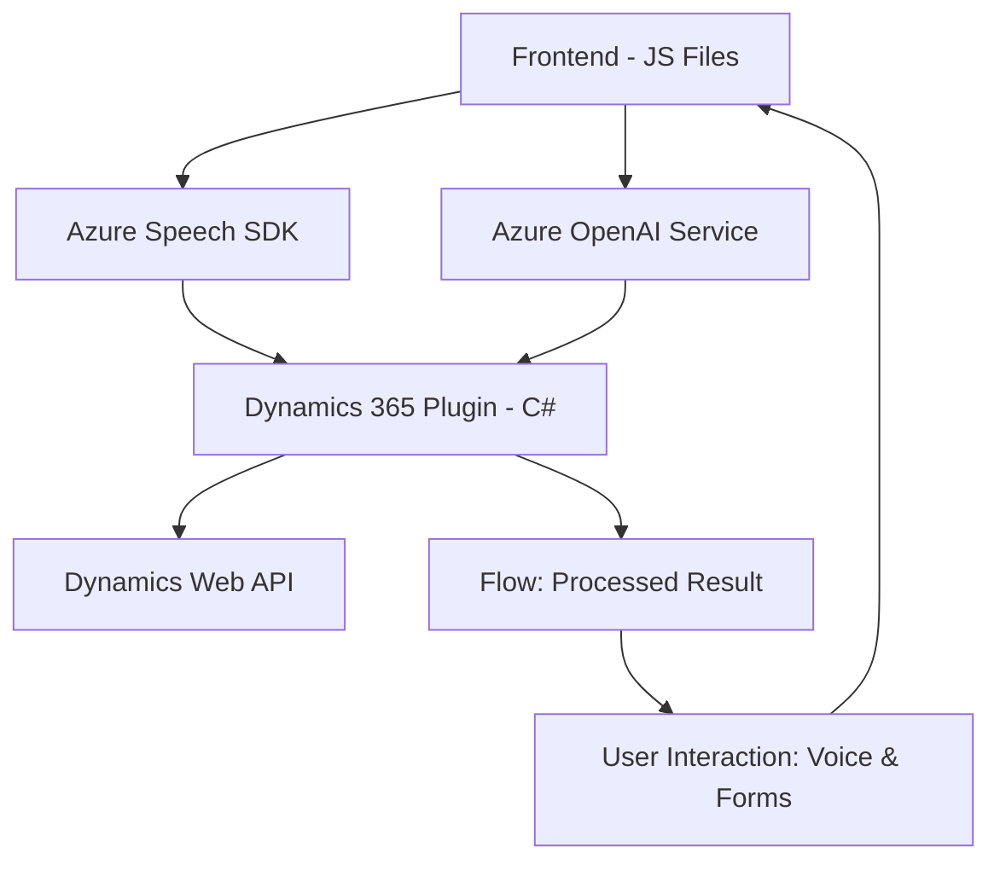

## Resumen Técnico
El repositorio parece tratarse de una solución tecnológica híbrida que integra capacidades de formularios interactivos web con procesamiento de voz y análisis de texto mediante servicios de terceros como Azure Speech SDK y Azure OpenAI. Incluye componentes frontend, lógica backend en forma de plugins para Dynamics 365 y comunicación con APIs externas.

---

### Descripción de Arquitectura
La arquitectura es modular y orientada a servicios:
1. **Frontend (JavaScript)**:
   - Proporciona interfaces interactivas para entrada de voz y procesamiento de formularios.
   - Usa eventos para coordinar acciones como carga dinámica del SDK de voz y transformación de datos en el formulario.

2. **Backend (Dynamics 365 Plugins)**:
   - Implementa procesamiento específico con Azure OpenAI para transformación textual, siguiendo las reglas del dominio CRM.
   - Usa una arquitectura basada en eventos (`IPlugin`) en Dynamics CRM, con capacidades de integración hacia APIs externas.

3. **Integración con Servicios Externos**:
   - **Azure Speech SDK**: Para síntesis y reconocimiento de voz en el frontend interactivo.
   - **Azure OpenAI**: Para procesamiento avanzado de textos en el backend.

La solución apunta a una arquitectura n-capas con **integración desacoplada** hacia servicios de terceros. Los módulos de frontend y backend interactúan mediante servicios externos y reglas claras de transformación de datos.

---

### Tecnologías Usadas
1. **Frontend**:
    - `JavaScript`.
    - Azure Speech SDK (`https://aka.ms/csspeech/jsbrowserpackageraw`).

2. **Backend**:
    - `C#` para plugins desarrollados bajo el modelo de extensiones Dynamics 365 CRM.
    - Uso de `Microsoft.Xrm.Sdk`, integración con Dynamics APIs.

3. **Servicios de Terceros**:
    - Azure Speech SDK: Reconocimiento de voz y síntesis.
    - Azure OpenAI Service: Procesamiento avanzado de texto mediante modelos como `gpt-4o`.

4. **Dependencias administrativas**:
    - `Newtonsoft.Json`, `System.Net.Http` y `System.Text.Json` para manejo de JSON y solicitudes HTTP.

---

### Diagrama Mermaid

---

### Conclusión Final
La solución presenta una arquitectura limpia y modular, orientada hacia la integración de formularios web interactivos con procesamiento basado en inteligencia artificial. Destaca la interoperabilidad de servicios frontend-backend con Azure Speech SDK y Azure OpenAI, dirigido hacia una experiencia de usuario centrada en voz y texto estructurado, ideal para plataformas empresariales como Dynamics CRM. Esta estructura es altamente extensible y escalable gracias al uso de APIs externas desacopladas.