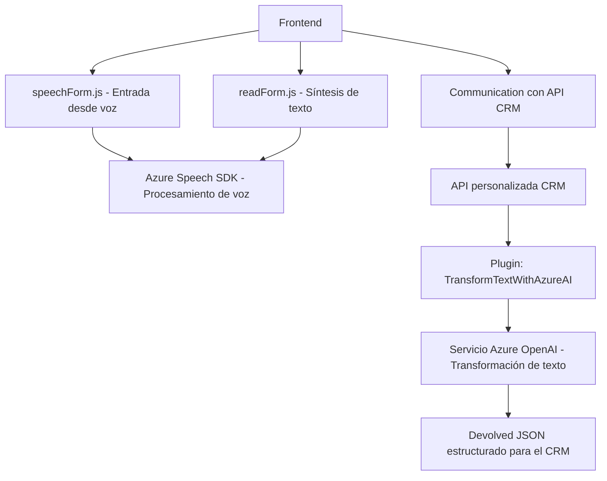

### Resumen Técnico

Este repositorio implementa una solución **integrada** que combina funcionalidades de procesamiento de voz, síntesis de texto y transformación de datos mediante la integración de servicios de nube como Azure Speech SDK y Azure OpenAI. Está orientado a trabajar con plataformas CRM, específicamente con **Microsoft Dynamics 365**, procesando y manipulando información en formularios, mediante entradas de voz y API personalizadas.

---

### Descripción de la Arquitectura

#### Tipo de solución:
Principalmente es una **integración de frontend** y **plugins backend** para Microsoft Dynamics CRM:
- El frontend procesa formularios y síntesis de voz con Azure Speech SDK directamente en el navegador.
- El plugin backend amplía las capacidades mediante el uso de Azure OpenAI para transformar texto.

#### Arquitectura:
La solución se basa en una arquitectura **modular en capas**, diseñada para interactuar con servicios externos mientras aplica procesos específicos localmente:
1. **Frontend Layer**: Realiza la interacción con el usuario, incluyendo entrada por voz, extracción de datos del formulario y llamada a APIs externas.
2. **Backend Plugin Layer**: Procesa datos con IA y transforma información en un formato estructurado, integrándose con Dynamics CRM como un plugin.
3. **Third-Party Integrations**: Servicios externos como **Azure Speech SDK** y **Azure OpenAI** que realizan tareas especializadas como síntesis de voz y procesamiento IA.

---

### Tecnologías Usadas

1. **Frontend**:
   - **JavaScript**:
     - Modularización por funciones específicas (ej.: entrada de voz, síntesis de habla).
     - Procesamiento de eventos y callbacks para cargar SDK y manejar interacciones del usuario.
   - **Azure Speech SDK**:
     - Reconocimiento de voz.
     - Síntesis de texto a habla.
   - **Microsoft Dynamics CRM Javascript API (Xrm.WebApi)**:
     - Inserción y actualización de datos en formularios CRM.
     - Configuración de acciones y conexión con servicios backend personalizados.

2. **Backend**:
   - **C# (.NET Framework)**:
     - Uso de interfaces estándar de Dynamics (ej.: `IPlugin`).
     - Interacción con el contexto de ejecución de CRM.
   - **Azure OpenAI Service**:
     - Transformación de texto mediante modelos GPT.
     - Consume APIs REST con autenticación (API Key).
   - **JSON Processing**:
     - Manejo de datos estructurados mediante `Newtonsoft.Json` y `System.Text.Json`.

---

### Dependencias o Componentes Externos

1. **Azure Speech SDK**:
   - Proporciona herramientas para analizar, sintetizar y reconocer voz.
   - Permite integración modular en una aplicación web.

2. **Azure OpenAI Service**:
   - Herramienta para transformar texto en formatos complejos (JSON) usando IA avanzada.

3. **Dynamics CRM API**:
   - Facilita interacción con registros dinámicos en una plataforma CRM (.NET y JavaScript).

4. **Node.js (posiblemente)**:
   - Podría ser un requisito para el entorno del frontend si se utilizan herramientas modernas de desarrollo web.

---

### Diagrama Mermaid 100 % Compatible con GitHub Markdown

---

### Conclusión Final

La solución presentada es un sistema integrado diseñado para optimizar la interacción de usuarios con plataformas CRM mediante entrada de voz, generación de voz sintetizada y transformación de datos basada en IA. Su arquitectura modular facilita la escalabilidad y utiliza dependencias externas como **Azure Speech SDK** y **Azure OpenAI Service**, que le añaden capacidades avanzadas. Este diseño asegura separación de responsabilidades en un ecosistema de Microsoft Dynamics CRM y mantiene buenas prácticas de desarrollo orientado a servicios.