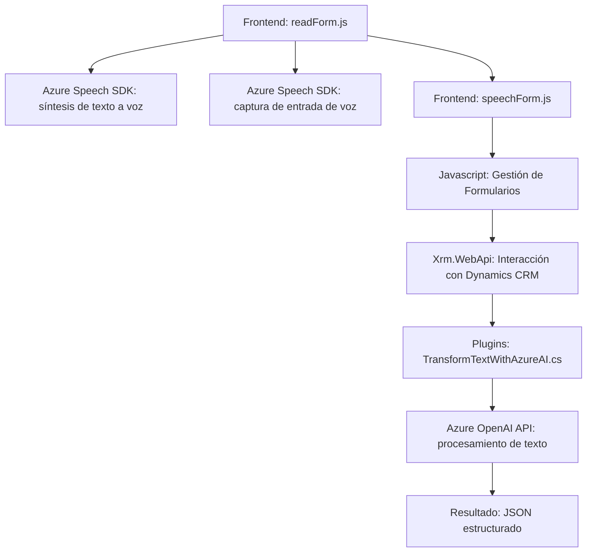

### Breve resumen técnico
El repositorio presenta un sistema centrado en la integración entre interfaces de usuario (formularios) y capacidades avanzadas proporcionadas por servicios de Azure (Speech y OpenAI). Tiene componentes orientados a la interacción con usuarios a través de entrada/salida de voz y procesamiento textual, mientras aprovecha servicios remotos para el análisis de datos. La solución comprende tres bloques principales:
1. **Frontend/JS**: De manejo de formularios (lectura y escritura) basado en reconocimiento de voz.
2. **Backend Plugins**: Plugins de Dynamics CRM que conectan con servicios de Azure OpenAI.
3. **Servicios externos en Azure**: SDK y APIs para síntesis de voz y procesamiento textual.

---

### Descripción de arquitectura
El sistema tiene características de una **arquitectura orientada a microservicios** en combinación con **n capas**:
- **Capa Cliente (Frontend)**: JavaScript desarrollado modularmente que gestiona interacción en el formulario.
- **Capa Backend (Plugins)**: Plugins de Dynamics CRM en .NET Framework que procesan datos y los transfieren a servicios en la nube.
- **Servicios Externos (Azure)**: Uso de Azure OpenAI para procesamiento de texto y Azure Speech SDK para integración de voz. Ambos servicios funcionan como microservicios externos consumidos por la aplicación.

---

### Tecnologías usadas
1. **Frontend**:
   - Lenguaje: JavaScript
   - SDK: Azure Speech para reconocimiento y síntesis de voz.
   - Frameworks: Ninguno específico en los archivos analizados.
   - Patrón: Modularidad funcional y orientación a eventos.

2. **Backend/Plugins (TransformTextWithAzureAI.cs)**:
   - Lenguaje: C#.
   - Framework: Dynamics CRM `.NET Framework`.
   - Bibliotecas: Newtonsoft.JSON y System.Text.Json para manipulación de REST APIs y JSON, Microsoft.Xrm.Sdk para integración CRM.
   - Patrón de diseño: Plugin y Builder para solicitudes de API.

3. **Servicios externos**:
   - **Azure Speech API**: Reconocimiento y síntesis de texto a voz.
   - **Azure OpenAI API**: Procesamiento avanzado de texto mediante IA generativa.

---

### Diagrama Mermaid válido para GitHub

---

### Conclusión final
El repositorio implementa un sistema híbrido enfocado en la integración entre una capa cliente y servicios en la nube para manejo avanzado de voz y texto. Lo hace a través de plugins que interfazan con Dynamics CRM y utilizan APIs de Azure. Su arquitectura utiliza principios de **microservicios**, especialmente con la delegación de procesamiento crítico a Azure OpenAI y Speech. Sin embargo, la solución también conserva elementos de **n capas** para cumplir con funcionalidades específicas integradas con Dynamics CRM.

Si bien el sistema es modular y escalable, destacamos posibles riesgos de seguridad en el manejo de claves y configuraciones directamente incrustadas en el código fuente. Recomiendo realizar ajustes hacia una gestión centralizada de credenciales y configuraciones a través de un gestor secreto o almacén seguro en Azure.