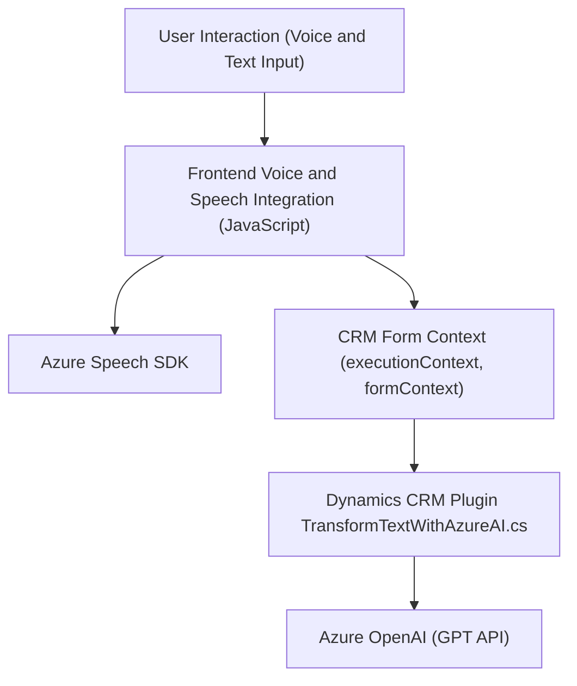

### Breve resumen técnico

Este repositorio contiene la implementación de una solución orientada a la integración de tecnologías como Microsoft Dynamics CRM y Azure Services (OpenAI y Speech SDK) para la interacción mediante entrada y salida de voz con formularios y la transformación automática de texto basado en IA. Consta de archivos JavaScript para frontend y un plugin en C# para el backend CRM.

---

### Descripción de la arquitectura

La solución está diseñada dentro del paradigma **n capas** aplicando una mezcla de arquitectura monolítica (plugin de CRM) y distribución basada en servicios remotos (integración con SDK de Speech y OpenAI). La integración ocurre principalmente en dos niveles:
1. **Frontend:** Manejo de interacción con voz y texto para facilitar la experiencia del usuario en formularios CRM.
2. **Backend:** Extensiones de Dynamics CRM mediante un plugin que interactúa con Azure OpenAI para procesos avanzados de texto.

Los patrones evidenciados en la arquitectura incluyen:
- **Modularidad:** Funciones desacopladas y organizadas para cumplir roles especializados.
- **Integración con servicios externos:** Uso del SDK y APIs de Azure para procesamiento de voz y IA.
- **Dependency Injection:** Enfoque orientado a pasar contextos (ejemplo: `executionContext` en funciones) para desacoplar lógica de infraestructura.
- **Middle-layer Interaction:** Comunicación entre Microsoft Dynamics CRM y Azure mediante el plugin.

---

### Tecnologías utilizadas

1. **Lenguajes y frameworks:**
   - **JavaScript (Frontend):** Código orientado a la integración del SDK de Azure Speech y manipulación de formularios.
   - **C# (Backend):** Plugin implementado con `Microsoft.Xrm.Sdk` para extender Dynamics CRM.
   
2. **Servicios externos:**
   - **Azure Speech SDK:** Manejo de síntesis y reconocimiento de voz.
   - **Azure OpenAI (GPT):** Procesamiento avanzado de texto con reglas específicas.
   
3. **Otras dependencias:**
   - `System.Net.Http`, `Newtonsoft.Json.Linq`, `Microsoft.Xrm.Sdk.Query` para conectividad y manipulación de datos en C#.
   - Dinámicas de formularios CRM basadas en `Xrm.WebApi`.

4. **Patrones:**
   - **SDK integration:** Modularidad mediante herramientas externas como Azure Speech o OpenAI.
   - **Plugin architecture:** Implementación de extensiones en Dynamics CRM.
   - **JSON-based responses:** Estandarización de datos entre componentes.

---

### Diagrama **Mermaid** válido para GitHub

---

### Conclusión final

Esta solución integra diferentes tecnologías y servicios para optimizar la interacción entre usuarios y sistemas de formularios en Dynamics CRM. La capacidad de trabajar con entrada y salida de voz, además del procesamiento avanzado de texto mediante Azure OpenAI, resuelve problemas de accesibilidad y automatización. Aunque la solución muestra características de modularidad, la dependencia directa sobre Dynamics CRM y Azure la encasilla en una arquitectura **n capas** con elementos monolíticos, especialmente en los plugins implementados en C#. Esto la hace ideal para entornos empresariales que ya utilizan Microsoft Dynamics y buscan expandir sus capacidades con IA y voz.