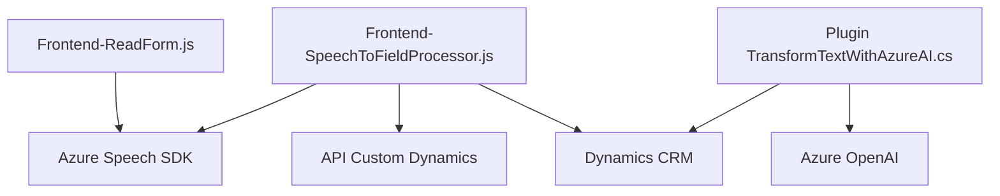

### **Análisis y descripción de la solución**
---

#### **Breve resumen técnico**
Este repositorio contiene los componentes de una solución de software diseñada para integrarse con Microsoft Dynamics CRM y extender sus capacidades mediante el uso de reconocimiento de voz y procesamiento de texto avanzado. Las piezas identificadas tienen las siguientes finalidades:
- **Frontend:** Una interfaz en JavaScript que utiliza el **Azure Speech SDK** para habilitar funcionalidades de entrada de voz y síntesis de voz (archivos `readForm.js` y `speechForm.js`).
- **Backend/Plugins:** Un plugin basado en Azure OpenAI, desarrollado en C#, que normaliza y transforma texto ingresado según reglas predefinidas.

---
#### **Descripción de arquitectura**
La solución está diseñada utilizando el siguiente enfoque arquitectónico:
1. **Arquitectura basada en n-Capas:**  
   - La solución tiene una capa frontend que consume servicios de voz y realiza operaciones contextuales sobre formularios dinámicos.
   - El backend, representado por el plugin, utiliza una lógica basada en servicios externos (Azure Speech SDK y Azure OpenAI) con interacción directa con Dynamics CRM.
   - A pesar de no ser una arquitectura estrictamente desacoplada como la hexagonal, aprovecha los patrones de integración y modularidad, organizando tareas por responsabilidades.

2. **Patrones identificados:**  
   - **Plug-in Design Pattern:** Utilizado en `TransformTextWithAzureAI.cs` para extender las funcionalidades del Dynamics CRM.
   - **Dependency Injection:** En el plugin de Dynamics, donde las dependencias como `IPluginExecutionContext` son inyectadas.
   - **Service Layer:** La integración con Azure Speech SDK y Azure OpenAI evidencia un patrón de servicios.
   - **Mapper Pattern:** En el archivo `SpeechToFieldProcessor.js`, el mapeo de transcripciones de voz a campos utilizables en formularios implementa un patrón de conversión de datos.
   - **Dynamic Loading Pattern:** El enfoque de incluir el SDK en tiempo de ejecución está presente en los archivos de frontend.

3. **Comunicación con Servicios Externos:**  
   La solución interactúa con:
   - **Azure Speech SDK:** Para captura de voz y síntesis en el frontend.  
   - **Azure OpenAI API:** Para transformar texto en el backend.

---
#### **Tecnologías, Frameworks y Patrones usados**
1. **Frontend:**
   - **Core:** JavaScript.
   - **Framework:** Dynamics CRM.
   - **External SDK:** Azure Speech SDK.
   - **Pattern:** Modularidad y orientación al contexto. Dinámicas integradas a un entorno existente (Dynamics CRM).

2. **Backend:**
   - **Core Language:** C#.
   - **Framework:** Dynamics CRM SDK.
   - **External Service Integration:** Azure OpenAI API (via REST API).
   - **Pattern:** Plugin-based design, Service Layer, Dependency Injection.  

3. **General:**
   - **IA-Driven Processing:** Integración con servicios externos para enriquecimiento de datos.  
   - **Modularidad:** Código dividido en funciones que cumplen roles claramente definidos para mejorar mantenibilidad.

---
#### **Dependencias o componentes externos**
1. **Azure Speech SDK** (`window.SpeechSDK`)  
   - Para reconocimiento de voz y síntesis, usado en frontend.  
   - Dependencia HTTP cuyo script se carga dinámicamente desde `https://aka.ms/csspeech/jsbrowserpackageraw`.

2. **Azure OpenAI API**:  
   - Utilizado en el backend para la transformación de texto con modelos de IA basados en OpenAI.  
   - Endpoint interactúa con la API REST mediante solicitudes HTTP POST.

3. **Dynamics CRM Web API** (`Xrm.WebApi`, `IPluginExecutionContext`):  
   - Acceso al contexto y manipulación de formularios dinámicos en Microsoft Dynamics CRM.

4. **Newtonsoft.Json**:  
   - Utilizado en el backend para manipular JSON complejo generado por la respuesta de Azure OpenAI.  

5. **Regex y operaciones de texto**:  
   - Utilizadas en operaciones de normalización en el plugin y procesamiento de transcripciones.

---
#### **Diagrama Mermaid**

- **A:** Representa la parte del frontend funcional para lectura y síntesis de voz.  
- **B:** Procesamiento de voz y asignación de transcripciones en campos de formulario (Frontend).  
- **C:** Plugin que se ejecuta en el contexto del CRM y realiza transformaciones con IA.  
- **D:** La capa central del sistema es Dynamics CRM, donde todas las operaciones convergen.  
- **E:** Representa la integración con Azure OpenAI para procesamiento de texto transformado.  
- **F:** SDK de Azure Speech utilizado para funcionalidades de síntesis y reconocimiento de voz.  
- **G:** API personalizada de Dynamics, usada para interactuar con servicios y datos adicionales.

---
#### **Conclusión final**
Este repositorio representa una solución de software **orientada a Dynamics CRM** para mejorar la interacción humano-sistema. Se implementan funcionalidades de entrada y salida por voz mediante **Azure Speech SDK**, junto con procesamiento avanzado de texto por **Azure OpenAI** en el backend (plugin). Es una **arquitectura de n capas**, donde cada capa tiene una responsabilidad definida, mientras se aprovechan patrones de diseño como orientados a servicios, integración con APIs externas y modularidad. Esto permite adaptarse fácilmente a nuevas funcionalidades como el procesamiento por IA.