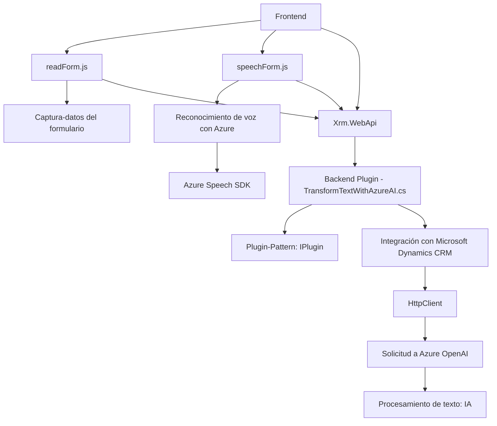

# Análisis del repositorio de código

## Breve resumen técnico
Los archivos presentados pertenecen a un proyecto de integración entre una interfaz de usuario desarrollada con JavaScript para formularios dinámicos (probablemente en combinación con un entorno CRM como Microsoft Dynamics) y un conjunto de plugins y servicios externos (Azure Speech SDK y Azure OpenAI). La funcionalidad principal permite la captura y síntesis o reconocimiento de voz para actualizar formularios, y transformar datos mediante inteligencia artificial.

---

## Descripción de arquitectura
1. **Tipo de solución**:
   - **Multicomponente**, con un enfoque de integración basado en el uso de:
     - Un componente **frontend** que interactúa directamente con usuarios y captura datos desde formularios dinámicos.
     - Un plugin en el backend que utiliza técnicas de procesamiento con Azure OpenAI para transformar datos.

2. **Arquitectura general**:
   - **N-capas**:  
     - Componente de **frontend** que actúa como la capa de presentación y realiza tareas interactivas mediante JavaScript.
     - **Lógica de negocio (backend)**: Abstraída en la capa de plugins y los servicios de Azure (Speech SDK y OpenAI).  
     - Dependencia en APIs externas basadas en microservicios (Azure OpenAI y Speech SDK).  

3. **Integración con APIs externas**:
   - Uso de SDKs como Azure Speech y llamadas a Azure OpenAI, indicando que el sistema depende de microservicios y tecnologías en la nube.

---

## Tecnologías usadas
1. **Frontend**:
   - **JavaScript**: Principal lenguaje para implementar lógica interactiva (captura de datos de formularios, síntesis y reconocimiento de voz).  
   - **Azure Speech SDK**: Para síntesis y reconocimiento de voz.  
   - **Microsoft Dynamics Form SDK**: Para extraer y manipular datos de formularios en el entorno del CRM.  

2. **Backend**:
   - **Plugins con C# (.NET Framework)**:
     - Integración con Microsoft CRM mediante `IPlugin`.
     - Llamadas externas usando `HttpClient` para acceder a Azure OpenAI y realizar transformaciones de texto.  
   - **Azure OpenAI**:
     - Procesamiento de texto avanzado.
     - Generación y síntesis de estructuras JSON para integrarse con los formularios.

3. **Patrones aplicados**:
   - **Modularidad**: El código está organizado en métodos especializados con el principio de responsabilidad única.
   - **Plugin Pattern**: Utilización del patrón de eventos que permite ejecutar código personalizado en un CRM como Dynamics.
   - **Servicios externos**: Delegación de tareas complejas (sintetización/reconocimiento de voz, IA) a APIs externas para escalar funcionalidad.

---

## Dependencias y componentes externos
1. **Frameworks y SDKs externos empleados**:
   - **Azure Speech SDK**: Para reconocimiento y síntesis de voz.
   - **Azure OpenAI**: Para transformación de texto avanzada usando inteligencia artificial.
   - **Xrm.WebApi**: Integra el frontend con el entorno de APIs de Dynamics CRM.
   - **Microsoft.Xrm.Sdk**: Base para crear plugins en Dynamics CRM.

2. **Componentes complementarios**:
   - **HTTP-based APIs**: Llena la integración con microservicios externos (Azure OpenAI) y SDKs dinámicos (Speech SDK cargado desde la web).

---

## Diagrama **Mermaid** compatible con GitHub Markdown

---

## Conclusión final
El repositorio se organiza como una solución multicapa que simplifica la interacción entre usuarios, un CRM con formularios dinámicos, y servicios externos en la nube. La arquitectura es híbrida: combina patrones de capa (sobre Dynamics CRM) con microservicios (Azure OpenAI y Speech SDK). Se perciben principios claros de modularidad, facilidad de integración con APIs externas y legibilidad del código.

Esta solución es adecuada para:
1. Casos de uso que necesiten interacción entre voz y datos visuales dinámicos en formularios.
2. Escenarios que requieran transformar grandes volúmenes de texto en funcionalidades avanzadas.
3. Integrar lógica empresarial en aplicaciones basadas en Microsoft Dynamics.

Las dependencias hacia Azure y Dynamics lo hacen más apropiado para entornos empresariales ya inmersos en el ecosistema de estas plataformas.