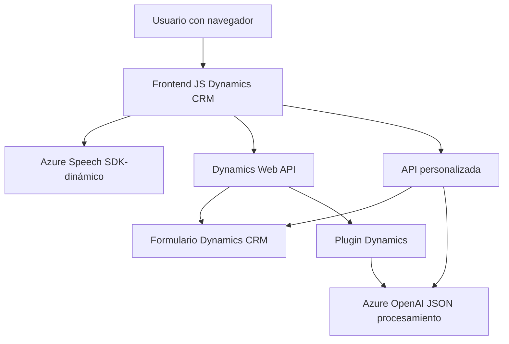

### Resumen Técnico:
El repositorio contiene una solución híbrida que integra frontend JavaScript y backend en .NET con plugins para Microsoft Dynamics CRM. La solución permite realizar interacciones entre usuarios y la plataforma Dynamics CRM, gestionando la entrada de datos mediante voz y transformándolos utilizando Azure Speech SDK y Azure OpenAI Service.

---

### Descripción de Arquitectura:
La arquitectura del sistema sigue un modelo de **n capas** con integración a servicios externos. La solución está dividida en las siguientes capas:
1. **Frontend (JavaScript):** Proporciona funcionalidad como captura de voz, transcripción y procesamiento de datos para rellenar formularios en Dynamics CRM. Utiliza módulos específicos para interacción dinámica y transcripción.
2. **Backend/Plugin (.NET):** Gestiona la transformación de texto mediante Azure OpenAI, encapsulando lógica como un plugin en Dynamics CRM.
3. **Servicios Externos:** Usa Azure Speech SDK para transcripción de voz y Azure OpenAI para transformación avanzada de texto en formato estructurado (JSON).

---

### Tecnologías Usadas:
1. **Frontend:**
   - **JavaScript:** Base de desarrollo del cliente.
   - **Azure Speech SDK:** Captura, síntesis y transcripción de voz.
   - **Dynamics CRM Web API:** Persiste y gestiona datos de formularios.
2. **Backend:**
   - **Microsoft Dynamics CRM Plugin Framework:** Plugin que extiende funcionalidad dentro del sistema de Dynamics CRM.
   - **Azure OpenAI Service:** Procesa texto con normas específicas mediante modelos avanzados de IA (ejemplo: GPT-4).
   - **Newtonsoft.Json:** Manejo y transformación de datos JSON en .NET.
3. **Integración:** HTTP/REST para comunicación con servicios Azure (Speech SDK y OpenAI).

---

### Dependencias y Componentes Externos:
1. **Azure Speech SDK:** Dinámicamente cargado en el frontend para procesar voz en navegadores.
2. **Azure OpenAI Service:** Usado por el plugin del backend para transformar texto.
3. **Microsoft Dynamics CRM:** Sistema base utilizado para formularios y contexto de datos.
4. **Custom API:** Integración personalizada con Dynamics CRM para transformar texto utilizando IA.

---

### Diagrama Mermaid:

---

### Conclusión Final:
La solución es una integración avanzada entre Microsoft Dynamics CRM, un frontend basado en JavaScript y servicios de Azure para procesamiento de voz y transformación de texto. Su arquitectura de **n capas**, junto con dependencias dinámicas y servicios externos (SDK y OpenAI), refuerza su escalabilidad y extensibilidad. Además, los principios como modularidad y delegación funcional garantizan que el código sea mantenible en ambientes empresariales.