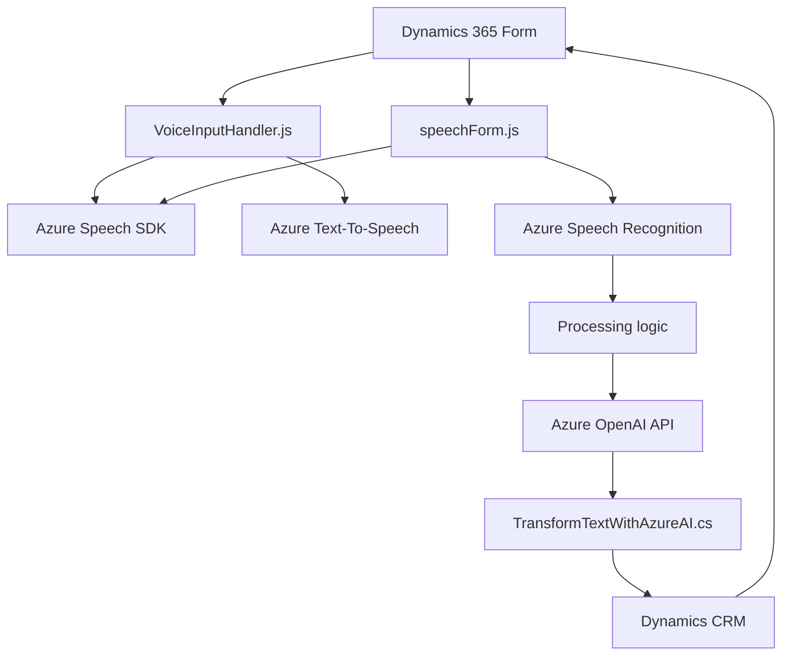

### Breve resumen técnico

El repositorio analizado está compuesto por múltiples archivos que implementan funcionalidades para integrar servicios cognitivos de Azure (Speech SDK y OpenAI). Estas funcionalidades tienen un enfoque orientado al reconocimiento de voz, síntesis de texto a audio, y transformación del contenido mediante inteligencia artificial en el contexto de formularios de Dynamics 365. También destaca la integración nativa con la arquitectura de Microsoft Dynamics mediante plugins (archivo en C#).

---

### Descripción de arquitectura

1. **Tipo de solución:**  
   La solución parece ser una integración para formularios en Dynamics 365, con servicios de Azure añadidos. Esto implica una arquitectura de extensión que incluye:
   - JavaScript para eventos del frontend y widgets del formulario.
   - Plugins de backend en C# para procesamiento adicional y conexión con servicios externos.

2. **Tipo de arquitectura:**  
   Los archivos muestran una arquitectura **orientada a servicios** y componentes **modulares**. Predomina un diseño en capas:  
   - **Frontend:** Archivos JavaScript (`VoiceInputHandler.js`, `speechForm.js`) organizan la lógica del reconocimiento de voz, entrada y salida de datos.  
   - **Middleware:** Plugins como `TransformTextWithAzureAI.cs` se encargan del procesamiento central y delegan tareas a servicios externos como Azure OpenAI y Azure Speech.  
   - **Backend:** Dynamics 365 actúa como la base de datos y sistema de registro.  

   Los plugins implementan patrones tradicionales de **plugin architecture**, junto con integración de servicios externos mediante API REST.

---

### Tecnologías, frameworks y patrones usados

**Tecnologías:**
1. **Frontend:**  
   - **JavaScript:** Para la lógica del cliente y manipulación de formularios en Dynamics 365.
   - **Azure Speech SDK:** Para síntesis de voz y reconocimiento.
   
2. **Backend:**  
   - **C#:** Para implementar plugins en Dynamics 365.  
   - **Microsoft Dynamics SDK:** Provee interfaces para interactuar con las entidades y datos del sistema.  
   - **Azure OpenAI:** API integrada para procesamiento avanzado de texto.  

**Patrones:**
- **Modularidad:** Separación de responsabilidades en funciones/métodos específicos (por ejemplo, funciones de transformación, reconocimiento de voz, interacción con APIs).  
- **Controlador:** Uso de controladores en frontend para gestionar eventos y datos.  
- **Plugin architecture:** Los plugins de Dynamics ofrecen lógica encapsulada que es ejecutada en eventos específicos del sistema.  
- **Integración de servicios externos:** Mediante SDK (Azure SDK) y API REST (Azure OpenAI).

---

### Dependencias o componentes externos

**Dependencias externas específicas:**
- **Azure Speech SDK:** Contiene métodos de reconocimiento de voz y síntesis de texto a audio.
- **Azure OpenAI API:** Realiza transformaciones de texto mediante machine learning.    
- **Microsoft Dynamics SDK:** Proporciona los servicios necesarios para interactuar con objetos y eventos del sistema.

**Dependencias generales:**  
- `System.Net.Http`: Para solicitudes HTTP en el backend.  
- `Newtonsoft.Json.Linq` y `System.Text.Json`: Para manipular JSON recibido de servicios externos.  

**Servicios externos:**  
- Azure Cloud:  
  - Speech Service para la síntesis de voz.  
  - OpenAI para procesamiento de texto.  

---

### Diagrama **Mermaid**

---

### Conclusión final

La solución analizada constituye una integración de servicios cognitivos de Azure (Speech SDK y OpenAI) que complementa la funcionalidad existente en formularios de Dynamics 365. Se emplea una arquitectura modular orientada a servicios, acoplada a la arquitectura de plugins estándar en Dynamics CRM. La solución es escalable, permite agregar nuevas funcionalidades de inteligencia artificial y voz, y optimiza la gestión de formularios con transformaciones automáticas y comandos de audio. Sin embargo, el fuerte acoplamiento con Dynamics puede limitar su flexibilidad.