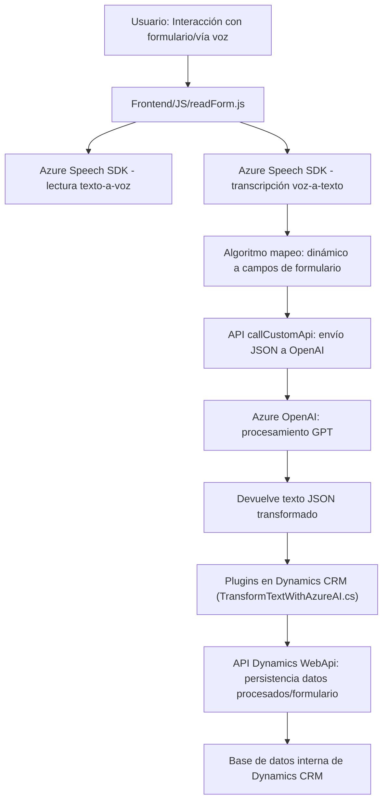

### Breve resumen técnico

El repositorio parece ser una solución relacionada con un sistema CRM, con funcionalidades que integran Microsoft Dynamics y Azure (Speech SDK y OpenAI). Los archivos trabajan en conjunto para procesar datos de entrada y salida mediante voz y texto. A continuación, se realiza un análisis general:

---

### Descripción de arquitectura

1. **Tipo de solución:**  
   - Es una solución híbrida que integra un sistema frontend web (interfaz gráfica), plugins de Dynamics CRM en backend (C#), integración con servicios en la nube como Azure Speech SDK y Azure OpenAI.
   - Principalmente se ve como una **aplicación para la interacción con formularios** a través de voz y texto.  

2. **Arquitectura utilizada:**  
   - La aplicación presenta características de **arquitectura de microservicios** debido a las múltiples integraciones con servicios externos (Azure Speech SDK y Azure OpenAI). Cada servicio cumple una responsabilidad específica, como reconocimiento de voz o procesamiento de texto.  
   - A nivel interno en el frontend y plugins, se nota un diseño **modular** y probable implementación parcial de **arquitectura de capas** en el backend (respecto a Dynamics CRM).  

3. **Patrones identificados:**  
   - Modelo **Facade**: Abstracción de llamadas API con métodos como `callCustomApi` y `GetOpenAIResponse`.  
   - **Plugin Pattern:** Implementado por el archivo en C#.  
   - **Carga diferida (lazy loading):** Uso del método `ensureSpeechSDKLoaded`.  
   - **Modularización:** Funciones organizadas según sus responsabilidades.  
   - **Service-Oriented Architecture (SOA):** La solución consume APIs externas como servicios especializados mediante una clara delimitación de responsabilidades (ejemplo: Speech SDK para voz y OpenAI para IA).  

4. **Características destacadas:**
   - **Integración total con Dynamics CRM:** Apertura del ecosistema CRM mediante plugins personalizados y llamadas a entidades específicas.  
   - **Azure Speech SDK:** Procesamiento de voz (reconocimiento y síntesis).  
   - **Azure OpenAI:** Transformaciones basadas en reglas, utilizando el modelo GPT.

---

### Tecnologías usadas

1. **Frontend (JavaScript):**  
   - Procesamiento de datos y voz mediante Azure Speech SDK.  
   - Modularidad funcional para la interacción con formularios de usuarios.  

2. **Backend (C# Plugins):**  
   - Microsoft Dynamics SDK (`Xrm.Sdk`) para entidades y lógica del sistema CRM.  
   - Azure OpenAI para integración de IA (GPT, generación de texto estructurado en JSON).  
   - Dependencias estándard: `HttpClient`, `Json`, `Newtonsoft.Json` para integración con servicios HTTP y manejo de texto.  

3. **Servicios externos:**  
   - **Azure Speech SDK:** Usado para:
     - Siguiente texto a voz con configuraciones precisas de idioma y voz.  
     - Transcripción de voz a texto.  
   - **Azure OpenAI + GPT Model:** Para transformar texto de entrada en JSON con reglas predefinidas.  

4. **CRM – Microsoft Dynamics:**  
   - Gestión de entidades (formularios y atributos).  
   - Interacción con la API de Dynamics WebApi (`Xrm.WebApi`) para registros y búsquedas.  

---

### Diagrama Mermaid

A continuación, se presenta un diagrama **Mermaid** para ilustrar la arquitectura y los flujos entre los componentes principales. Este diagrama es 100% compatible con GitHub Markdown:

---

### Conclusión final

La solución combina frontend y backend, utilizando un enfoque basado en la modularidad, integración con servicios en la nube y plugins para una plataforma corporativa (Dynamics CRM). El uso de múltiples tecnologías como Azure Speech SDK y Azure OpenAI valida el enfoque hacia un **ecosistema conectado y dinámico**. 

Su arquitectura se alinea parcialmente con **microservicios**, aunque el contexto del CRM y plugins puede ser más fácilmente identificado como **arquitectura híbrida entre SOA y capas internas**, proporcionando flexibilidad y escalabilidad.

Si se sigue desarrollando, podría evolucionar hacia una implementación más **distribuida** con microservicios en el backend.