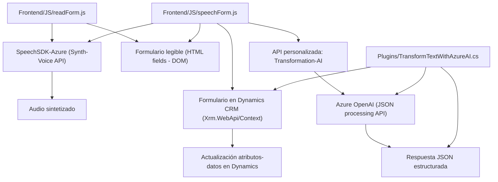

---

# Breve resumen técnico:
El conjunto de archivos presentado define una solución software que utiliza entrada y salida por voz enfocada en la integración con formularios en un sistema CRM (probablemente Dynamics 365). El frontend maneja dos archivos principales: uno para la síntesis de voz (speak) y otro para el reconocimiento de voz y entrada a formularios con procesamiento adicional a través de Inteligencia Artificial (API de Azure OpenAI). Además, existe un plugin backend desarrollado en C# que interactúa con la API de Azure OpenAI para realizar transformaciones de texto, retornando datos estructurados (JSON).

---

### Descripción de la arquitectura:
La arquitectura general puede considerarse como **multicapa orientada a servicios** con una fuerte integración con **microservicios externos**:
1. **Frontend**: Código basado en JavaScript, ejecutado en el navegador para interactuar con formularios y el usuario mediante funciones de voz y procesamiento de texto.
2. **Backend (Plugins)**: Módulos desarrollados en .NET implementados como *plugins* para Dynamics CRM. Estos interceptan eventos dentro del sistema para realizar operaciones con lógica específica.
3. **Servicios externos**: Utilización de Azure Speech SDK y Azure OpenAI como servicios RESTful para reconocimiento/entrada de voz, síntesis de voz y transformación basada en IA.

Esta arquitectura sigue un **patrón SOA (Service-Oriented Architecture)** al separar y delegar la lógica principal en servicios remotos como Azure, empujando responsabilidades específicas al cliente (frontend) y una capa de negocio (plugins).

---

### Tecnologías, frameworks y patrones usados:
1. **Frontend**:
   - **JavaScript** como lenguaje principal.
   - SDK de Azure Speech para síntesis y reconocimiento de voz.
   - DOM y manipulación directa para acceder a formularios.
   - **Patrones usados**: Modularidad funcional, Observer para gestión de callbacks.

2. **Backend**:
   - **Microsoft.Xrm.Sdk** para manipulación del contexto de eventos en Dynamics CRM.
   - **C#** para desarrollo del plugin y lógica de negocio.
   - **Azure OpenAI REST API** para delegar transformación de texto.
   - Manejo de HTTP mediante `System.Net.Http`.
   - JSON manipulación con `System.Text.Json`.
   - **Patrones usados**: Plugin Pattern, SOA.

3. **Integraciones externas**:
   - Azure Speech SDK (para síntesis y reconocimiento de voz).
   - Azure OpenAI API (para IA y procesamiento textual).

---

### Diagrama **Mermaid** válido para GitHub Markdown:

---

### Conclusión final:
La solución presentada emplea una integración inteligente de voz e inteligencia artificial en procesos de CRM. Usa módulos funcionales en frontend que aprovechan el SDK de habla de Azure y el acceso dinámico al DOM, mientras que sus plugins en el backend delegan procesamiento complejo de texto a servicios como Azure OpenAI, maximizando la robustez y flexibilidad. 

Esta solución sigue una arquitectura multicapa con principios claros de integración de servicios externos y modularidad, destacando patrones como SOA. Cada parte desempeña roles específicos para satisfacer los requisitos del sistema, facilitando su mantenimiento y ampliación futura. Un posible reto a mejorar es la seguridad al gestionar claves API (pasar a Key Vault).