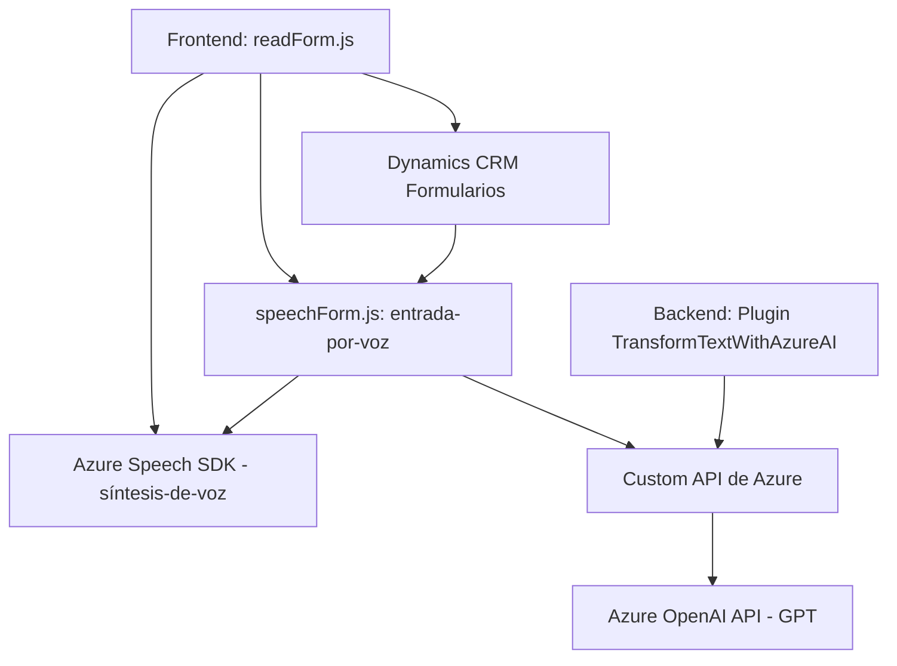

### Breve Resumen Técnico
El repositorio se centra en proporcionar funcionalidades relacionadas con el procesamiento de voz y texto, integrando soluciones basadas en **Azure Speech SDK** y **Azure OpenAI API** dentro del entorno de **Microsoft Dynamics CRM**. Se divide principalmente en dos componentes: **frontend (JavaScript)** para la interacción con formularios y síntesis/reconocimiento de voz y **backend (C#)** para la integración avanzada con servicios como GPT (Azure OpenAI API).

---

### Descripción de Arquitectura
El proyecto implementa una arquitectura **cliente-servidor** con componentes divididos para cumplir diferentes objetivos:
1. **Frontend**: Procesamiento de datos de formularios mediante JavaScript, reconocimiento de voz y síntesis de texto a voz utilizando Azure Speech SDK.
   - Modularidad predominante, cada archivo organiza capacidades específicas con funciones únicas.
2. **Backend**: Plugins en C# para manejar transformaciones avanzadas de texto respaldadas por la API de Azure OpenAI y el entorno Microsoft Dynamics CRM (modelo de plugins).
   - Representa una integración tipo **microservicio**, donde las responsabilidades están distribuidas entre el cliente, el servidor y servicios externos.
   
El enfoque combina patrones **event-driven architecture** (activación a través de formularios y plugins) con **API-driven architecture** (uso de Azure OpenAI y Speech SDK).

---

### Tecnologías, Frameworks y Patrones Usados
#### Tecnologías Principales:
- **Frontend** (JavaScript):
  - **Azure Speech SDK**: Procesamiento de voz (síntesis y reconocimiento).
  - **Dynamics CRM/XRM JavaScript API**: Para manipulación de campos y datos en formularios.

- **Backend** (C#):
  - **Plugins CRM (.NET Framework)**: Uso de la interfaz `IPlugin` para extender capacidades de Dynamics.
  - **Azure OpenAI API (GPT)**: Para transformar texto según reglas específicas.
  - **Newtonsoft.Json**: Manejo de JSON para comunicación y transformación de objetos.

#### Patrones Arquitectónicos:
1. **Cliente-Servidor**: División clara entre funcionalidad frontend (cliente/formulario) y procesamiento backend (plugins).
2. **Event-driven Design**: Los eventos en el formulario disparan funcionalidades como entrada por voz y procesamiento de texto transformado.
3. **Decoupling**: Uso de servicios externos (Speech SDK, OpenAI) desacoplados en métodos específicos.
4. **Modularidad y SRP**: Código dividido en funciones y clases independientes siguiendo el principio de responsabilidad única.

---

### Dependencias o Componentes Externos
#### Dependencias Frontend:
- **Azure Speech SDK**: Para reconocimiento y síntesis de voz.
- **Dynamics CRM / XRM API**: Manipulación de formularios y datos en Dynamics.
- **Custom API**: Backend configurado para transformar texto.

#### Dependencias Backend:
- **Microsoft Dynamics SDK**: Acceso a servicios y ejecución de plugins.
- **Azure OpenAI API**: Transformación de texto basado en IA.
- **Newtonsoft.Json**: Serialización/deserialización JSON.
- **System.Net.Http**: Para realizar peticiones HTTP.

---

### Diagrama Mermaid

---

### Conclusión Final
El proyecto integra de manera eficiente procesamiento de voz y texto en un entorno empresarial respaldado por Microsoft Dynamics CRM. Utiliza servicios en la nube de **Azure** para ofrecer capacidades avanzadas como síntesis/reconocimiento de voz y transformación de texto basada en IA. La arquitectura, aunque distribuida, tiene un enfoque modular y desacoplado, permitiendo extensibilidad.

En términos de seguridad, el tratamiento de claves y configuraciones sensibles debería mejorar usando mecanismos como variables de entorno. Además, la modularidad del código facilita futuras evoluciones hacia soluciones más escalables y adaptadas a principios arquitectónicos modernos como **hexagonal**.