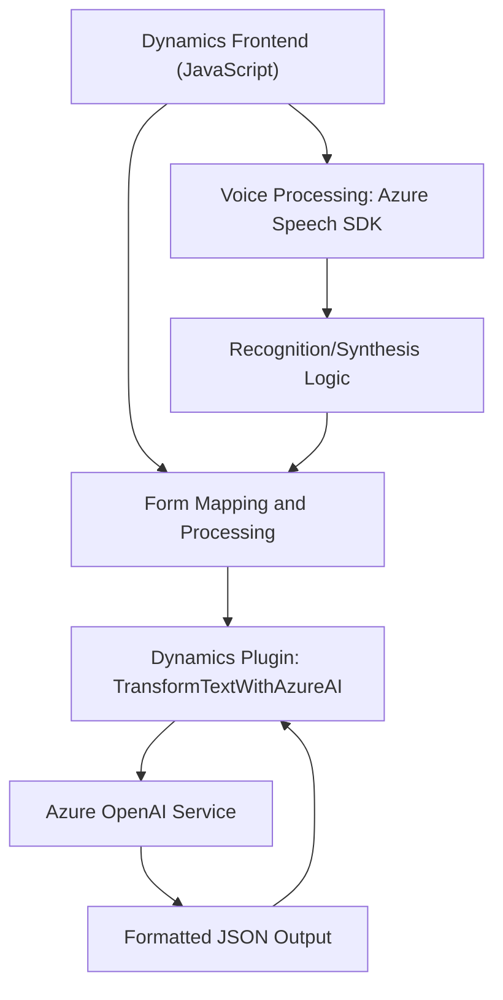

### Breve Resumen Técnico

**Arquitectura General:** El repositorio presentado incluye componentes que combinan un frontend en JavaScript para interacción dinámica con formularios de Dynamics 365, lógica de reconocimiento y síntesis de voz usando el SDK de Azure Speech, y un plugin de Dynamics CRM para enriquecimiento del texto utilizando Azure OpenAI Service.

**Patrones Clave:** Modularidad, integración con servicios externos (Azure Speech y OpenAI), uso de plugins CRM, y separación de responsabilidades entre las distintas capas funcionales.

---

### Descripción de Arquitectura

1. **Tipo de solución:** 
   - Principalmente, se trata de una integración de una solución API (en el plugin de Dynamics CRM) con funcionalidades para el frontend (sistemas interactivos en Dynamics 365 para reconocimiento y síntesis de voz).

2. **Patrones y arquitectura:**
   - **Modularidad:** Cada archivo presenta funcionalidad claramente separada para mejorar mantenibilidad y testabilidad.
   - **Integración de servicios externos:** Llamadas a Azure Speech SDK y Azure OpenAI Service son los puntos clave de integración con servicios externos.
   - **N-Capas:** La solución tiene lógica frontend para recoger datos y enviarlos, lógica de plugin para enriquecer los datos, y dependencia de APIs externas.
   - **Event-Driven Plugin:** El archivo `TransformTextWithAzureAI.cs` se basa en eventos disparados por Dynamics 365 (triggers como creación/actualización de registros).

3. **Dependencias externas:**
   - **Azure Speech SDK:** SDK para realizar síntesis y reconocimiento de voz.
   - **Azure OpenAI Service:** Procesamiento avanzado de lenguaje natural.
   - **Dynamics CRM SDK:** APIs específicas para interacción con estructuras de Dynamics 365.
   - **HttpClient/JsonSerializer:** Utilidades de .NET para comunicación con servicios REST.

---

### Tecnologías Usadas

- **Lenguajes y Frameworks:**
   - **JavaScript:** Lógica frontend; carga dinámica del SDK de Azure Speech.
   - **C#:** Lógica del plugin para procesar texto con Azure OpenAI.
   - **Dynamics CRM SDK:** Integración directa con el sistema CRM para obtener y modificar el contexto del formulario.
   - **Azure Speech SDK & OpenAI Service:** Servicios externos fundamentales para las funcionalidades presentadas.

- **Patrones Utilizados:**
   - **Modularidad:** Funciones desacopladas enfocadas en tareas específicas.
   - **Dynamic Script Loading:** Carga dinámica de scripts en el navegador (`ensureSpeechSDKLoaded`).
   - **Service Layer:** Plugin implementado como capa de servicio que interactúa con APIs externas.

---

### Diagrama Mermaid Válido para GitHub

---

### Conclusión Final

Este repositorio presenta una solución integrada que aborda funcionalidades avanzadas para formularios de Dynamics 365, como procesamiento de voz y enriquecimiento de texto. Combina tecnologías modernas como Azure Speech SDK y OpenAI con el SDK de Dynamics CRM. Además, muestra una clara separación de responsabilidades con una arquitectura orientada a modularidad y reutilización, aprovechando patrones estándar de n-capas e interacción con APIs externas.