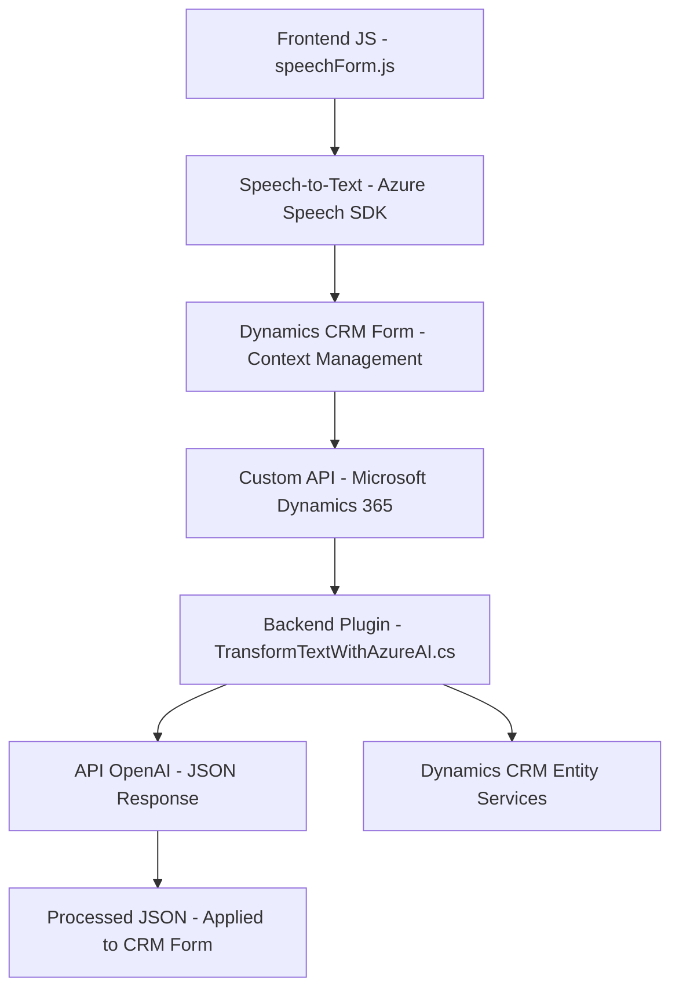

### Breve resumen técnico:

El análisis de los archivos sugiere que el repositorio contiene una solución híbrida centrada en la integración de **Dynamics CRM** con servicios de Azure, concretamente **Azure Speech SDK** y **Azure OpenAI**. Los módulos proporcionan funcionalidad de reconocimiento de voz, síntesis de texto a voz, y transformación de texto en estructuras JSON procesadas por IA, aplicadas en formularios de CRM. Esto habilita una interacción accesible y dinámica mediante comandos de voz y procesamiento de datos.

---

### Descripción de arquitectura:

1. **Tipo de solución:**  
   - Es una implementación híbrida con funcionalidades de cliente (frontend) y servidor (plugin en CRM), enfocada en integración API y servicios externos.
   - Archivos del frontend implementan una interfaz interactiva de voz (text-to-speech y speech-to-text) mientras que el plugin en el backend gestiona el procesamiento de datos con IA.

2. **Arquitectura general:**  
   - **Frontend:** Predomina un diseño modular basado en funciones para interacción del usuario con formularios dinámicos.  
   - **Backend Plugin:** Un **plugin middleware** en Dynamics CRM que actúa como punto de enlace entre el sistema CRM y la API de Azure OpenAI, interactuando mediante protocolos HTTP.  
   - La solución se puede categorizar como una arquitectura basada en **n capas**, donde las operaciones de negocio están separadas por capas de presentación (frontend), lógica de negocio (Dynamics CRM Plugin) y acceso a servicios externos (Azure APIs).

---

### Tecnologías y frameworks utilizados:

- **Frontend:**  
  - **JavaScript:** Motor principal para la interacción dinámica de formularios.  
  - **Azure Speech SDK:** Manejo de síntesis y reconocimiento de voz.  
  - **Dynamics CRM API (`Xrm.WebApi`):** Para interactuar con formularios y entidades de Dynamics 365.  

- **Backend Plugin:**  
  - **C#:** Lenguaje base para la implementación del plugin.  
  - **Microsoft Dynamics SDK:** Para integración directa con el sistema CRM.  
  - **Azure OpenAI SDK:** Para consumir servicios de procesamiento de texto.  
  - **System.Net.Http:** Para realizar peticiones HTTP.  
  - **JSON:** Procesamiento y manejo de estructuras en el backend.

---

### Dependencias y servicios externos:

1. **Azure Speech Service:**  
   - Utilizado en el frontend para conversión de voz a texto y texto a voz.  

2. **Azure OpenAI API:**  
   - Utilizado en el backend plugin para realizar transformaciones de texto mediante IA.  

3. **Microsoft Dynamics 365 SDK:**  
   - Base de la lógica del plugin y los Formularios UI de Dynamics CRM.  

4. **Custom API:**  
   - En el frontend, se mencionan APIs específicas que interactúan con Dynamics 365 para transformación adicional con IA.  

5. **JSON Libraries:**  
   - `System.Text.Json` y `Newtonsoft.Json.Linq` para el manejo de datos estructurados.  

---

### Diagrama **Mermaid** (compatible con GitHub Markdown)

---

### Conclusión final:

La solución presenta una integración avanzada entre servicios de nube (Azure Speech y OpenAI) y un sistema corporativo como Dynamics 365 CRM. La arquitectura modular de frontend con un backend dedicado permite expandir funcionalidades como reconocimiento de voz y análisis IA de texto estructurado, todo acoplado a formularios interactivos. Aunque técnicamente desarrolla componentes desacoplados, sigue predominantemente el patrón de **n capas**, dado el flujo entre presentación, lógica y servicios backend.