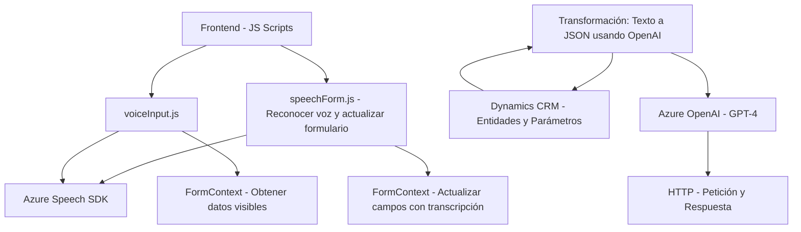

### Breve resumen técnico
El ecosistema del repositorio combina soluciones frontend y backend para integrar funcionalidades avanzadas con formularios y servicios IA. El frontend maneja entrada y salida de voz utilizando **Azure Speech SDK**; mientras que el backend extiende Microsoft Dynamics CRM con un plugin que integra Azure OpenAI para transformación avanzada de texto.

---

### Descripción de arquitectura
1. **Frontend:** El frontend se basa en funciones JavaScript modulares que integran el SDK de Azure Speech para interactuar con formularios. La solución está diseñada con un enfoque de arquitectura cliente-servidor y patrones atomizados, gestionando eventos asincrónicos y datos dinámicos del DOM.
2. **Backend:** El backend implementa un plugin siguiendo el patrón de extensibilidad de Microsoft Dynamics CRM. Este plugin utiliza APIs externas (Azure OpenAI y Dynamics SDK) para conectar la funcionalidad del CRM con servicios de transformación de datos en la nube.
3. **Arquitectura general:** La arquitectura se asemeja a una solución n-capas con diferenciación clara entre presentación (frontend), lógica de negocio (plugin) e integración con servicios externos.

---

### Tecnologías usadas
1. **Frontend:**
   - **JavaScript** para DOM y lógica de negocio.
   - **Azure Speech SDK** para síntesis y reconocimiento de voz.
   - APIs internas de formularios CRM (probablemente Dynamics 365).
2. **Backend:**
   - **C#** para el plugin.
   - **Microsoft Dynamics SDK** para acceso y extensibilidad de CRM.
   - **Azure OpenAI GPT-4 API** para transformación avanzada de texto.
   - **Newtonsoft.Json** y **System.Text.Json** para manejo de JSON.
   - **System.Net.Http** para solicitudes HTTP.
3. **Plataformas y Servicios:**
   - **Microsoft Dynamics CRM** como base de datos y contexto de ejecución.
   - **Azure Speech y OpenAI Services** para capacidades IA.

---

### Diagrama Mermaid válido para GitHub

---

### Conclusión final
El repositorio implementa una solución integrada para plataformas de negocios, que aprovecha tecnologías modernas de IA como Azure Speech SDK y GPT-4 para enriquecer la experiencia de usuario en formularios CRM. Con una arquitectura distribuida pero funcionalmente centrada en n-capas, logra modularidad en el desarrollo y adaptabilidad para futuras extensiones. Sin embargo, es necesario cuidar la seguridad de claves y configuraciones de API.

