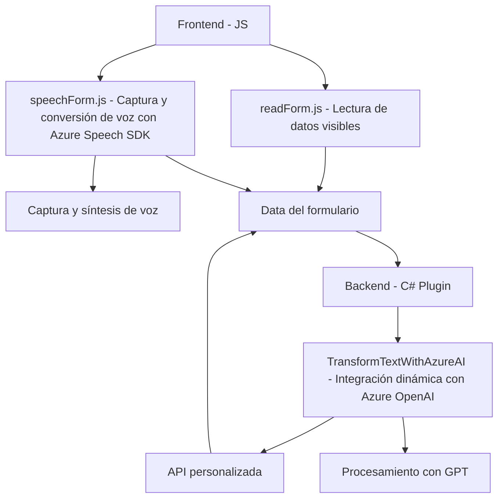

### Breve resumen técnico:
El repositorio parece ser una solución integrada para formularios dinámicos en Microsoft Dynamics CRM. Combina una interfaz cliente (**frontend**) creada en JavaScript y Node.js, junto con un plugin del lado servidor desarrollado en C#. La aplicación utiliza el Azure Speech SDK para reconocimiento y síntesis de voz y se conecta con un API personalizada para procesar datos con Azure OpenAI a través de inteligencia artificial. Está implementado siguiendo principios de modularidad, delegación y diseño orientado a servicios.

---

### Descripción de arquitectura:
La arquitectura se puede descomponer en dos grandes componentes:
1. **Frontend**: Una solución de cliente que interactúa con los formularios de Dynamics CRM para capturar datos de voz, procesarlos y actualizarlos en los campos del CRM. La lógica está segmentada en funciones específicas.
2. **Backend**: Un plugin integrado en Dynamics CRM, que actúa como intermediario para enviar solicitudes de procesamiento a la Azure OpenAI API y devuelve datos transformados en forma estructurada. Este plugin sigue el patrón de desarrollo de extensiones en Dynamics CRM (basado en `IPlugin`).

Esto forma una arquitectura **combinada** de cliente-servidor, con capacidades de integración extensibles. Dado el uso del CRM y el plugin, el enfoque arquitectural puede considerarse **n capas**, con una capa de presentación en el frontend y lógica de negocio en el backend.

---

### Tecnologías usadas:
1. **Frontend:**
   - Lenguaje: **JavaScript**.
   - Framework: No se utiliza un framework de frontend tradicional como React o Angular.
   - **Azure Speech SDK**: Para reconocimiento y síntesis de voz.
   - **Dynamics CRM Web API**: Facilitando acceso y manipulación de datos del CRM como entidad y atributos.

2. **Backend:**
   - Lenguaje: **C#**.
   - Framework: **Dynamics CRM SDK**.
   - **Azure OpenAI API**: Para transformación del texto mediante modelos GPT.
   - Librerías utilizadas: `Newtonsoft.Json.Linq`, `System.Text.Json`, `System.Net.Http`, y patrones como Plugin Pattern.

---

### Dependencias o componentes externos:
1. **Azure Speech SDK**: Maneja el reconocimiento y conversión de voz a texto, así como la síntesis de texto en voz.
2. **Azure OpenAI API**: Gestiona la transformación y procesamiento avanzado del texto usando modelos de IA.
3. **CRM Dynamics 365 Web API**: Se emplea para interactuar con datos del CRM, actualizar, mapear, y leer los valores de los formularios dinámicos.
4. **Newtonsoft.Json**: Manejo de deserialización y estructuración de respuestas JSON.
5. **Custom API del CRM**: Extensión personalizada para manipular o transformar datos según flujos específicos.

---

### Diagrama Mermaid válido:

---

### Conclusión final:
La solución está orientada al procesamiento de formularios dinámicos en una arquitectura de n capas, vinculando la lógica del lado cliente con un servicio de síntesis de voz en Azure y la API personalizada de Dynamics CRM a nivel de plugin. El código es modular y se apoya en el SDK del CRM tanto para interactuar con datos como para extender funcionalidades de negocio. La dependencia de servicios externos como Azure Speech SDK y OpenAI genera una solución poderosa para optimizar la interacción humano-máquina. Sin embargo, podría beneficiarse de mayor uso de patrones de diseño como servicios de dominio o hexagonal arquitectura para desacoplar dependencias.