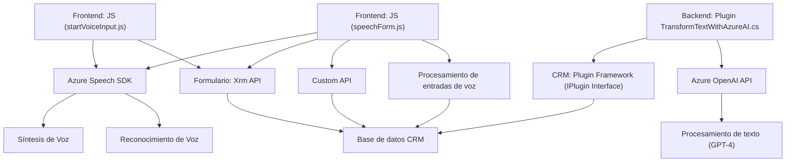

### Breve resumen técnico
El repositorio contiene archivos organizados para la implementación de funcionalidad interactiva en formularios (front-end, procesamiento de voz y APIs) y un archivo backend (plugin en .NET) que conecta CRM con inteligencia artificial. Se utiliza Azure Speech SDK para síntesis y reconocimiento de voz, Azure OpenAI API para la transformación de texto. La modularidad y adaptación a la plataforma CRM son visibles en los archivos proporcionados.

---

### Descripción de arquitectura
La solución está basada en una arquitectura híbrida:
- **Frontend (JavaScript):** Procesamiento interactivo de formularios y soporte para voz, complementando la experiencia de usuarios de un sistema CRM.
- **Backend (Plugin en .NET):** Extiende la lógica de negocio en Microsoft Dynamics CRM mediante servicios externos (Azure OpenAI).

La arquitectura puede considerarse multicapa:
1. **Presentación:** Gestión de datos y eventos en los formularios del CRM mediante JavaScript.
2. **Aplicación:** Plugins en .NET (.dll) conectan el CRM con servicios externos (Azure OpenAI).
3. **Externo:** Uso de servicios en la nube (Azure Speech y OpenAI).

--

### Tecnologías usadas
1. **Frontend:**
   - **JavaScript:** Base para interacción con formularios.
   - **Azure Speech SDK:** Procesamiento de voz para síntesis y reconocimiento.
   - **Xrm API:** Interacción con Dynamics CRM.
2. **Backend:**
   - **.NET Framework (C#):** Plugins que ejecutan lógica en el lado del servidor.
   - **Microsoft.Xrm.Sdk:** Parte de Dynamics CRM para conexión y manipulación de datos.
   - **Newtonsoft JSON / System.Text.Json:** Bibliotecas para manipulación de JSON.
   - **System.Net.Http:** Realiza llamadas HTTP a Azure OpenAI.
3. **Servicios de Azure:**
   - Azure OpenAI y Azure Speech para IA.

---

### Dependencias o componentes externos
1. **Azure Speech SDK:** Proporciona herramientas para síntesis y reconocimiento de voz.
2. **Azure OpenAI API:** Generación de texto estructurado en formato JSON mediante IA preentrenada (GPT-4).
3. **Microsoft Dynamics CRM:** Base de datos adaptable y APIs para gestión de entidades.
4. **Newtonsoft.JSON/ System.Text.Json:** Manipulación estructurada de JSON.
5. **Xrm.WebApi:** Manejo de datos CRM mediante solicitudes API.

---

### Diagrama Mermaid válido para GitHub

---

### Conclusión final
La solución se trata de una plataforma híbrida basada en Microsoft Dynamics CRM que extiende capacidades de interacción con voz e integra inteligencia artificial para procesamiento de texto. Posee tres componentes principales: 
1. **Front-end:** Captura valores del formulario, sintetiza voz y provee interacción fluida con APIs de CRM y servicios en la nube.
2. **Midlayer/Backend:** Plugins del CRM implementados en .NET manipulan datos e integran servicios como Azure OpenAI mediante solicitudes HTTP.
3. **Servicios externos:** Facilitadores en la nube (Azure Speech y OpenAI API) soportan la lógica avanzada de transformación.

La arquitectura es **multicapa** con enfoque modular, permitiendo adaptarse dinámicamente a los cambios del sistema CRM o servicios externos sin romper la coherencia interna del esquema.