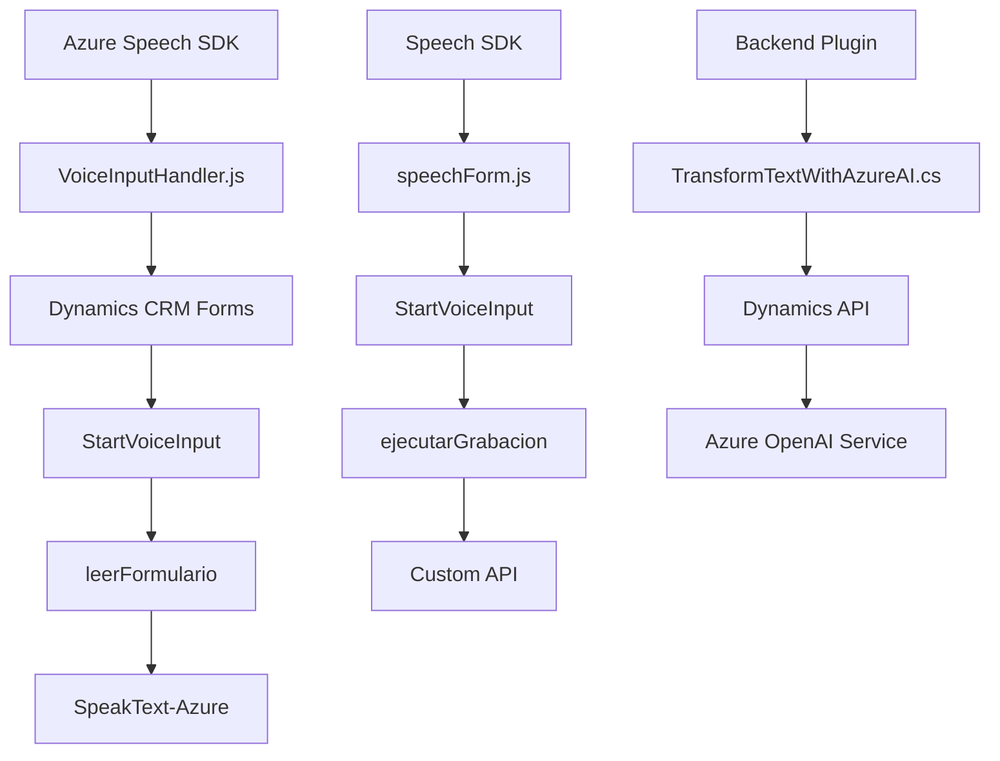

### Breve resumen técnico
El repositorio contiene soluciones independientes para frontend (en JavaScript) y backend (un plugin en C#), enfocadas en integración con Microsoft Dynamics CRM y varios servicios Azure. Los archivos de frontend implementan funcionalidades avanzadas como procesamiento de entrada/salida de voz con el Azure Speech SDK y el plugin de backend interactúa con el Azure OpenAI Service para transformar contenido textual. 

### Descripción de arquitectura
1. **Frontend:** El diseño sigue una arquitectura de **n capas** o una **estructuración modular**. Las funciones están organizadas de manera que gestionan entradas, salidas, y eventos de voz en el cliente, siendo dependientes de APIs externas (Azure).
   
2. **Backend Plugin:** El plugin en C# forma parte de una arquitectura basada en **extensibilidad de Microsoft Dynamics CRM**. Aquí se aprecia el uso del **plugin pattern**, centralizando la lógica para consumir servicios externos, como Azure OpenAI.

### Tecnologías/Frameworks usados
1. **Frontend:**
   - JavaScript ES6.
   - Azure Speech SDK: Para procesamiento de texto a voz o entrada de voz.
   - Microsoft Dynamics Web API: Para operaciones CRUD y llamadas a APIs personalizadas.

2. **Backend:**
   - C# .NET Framework para el desarrollo del plugin.
   - Azure OpenAI Service: Para transformar textualmente datos y devolver JSON estructurado.
   - Newtonsoft.Json y System.Text.Json: Para manejar datos JSON.

Patrones observados:
- **Carga dinámica de dependencias**: La biblioteca del Azure Speech SDK se carga solo cuando se requiere, optimizando el uso de recursos.
- **Microkernel/Plugin Pattern**: En el plugin C#, se usa la interfaz `IPlugin` para integrar operaciones adicionales dentro del contexto de Dynamics CRM.
- **Integración con servicios externos**: Uso extensivo de APIs para interoperabilidad, como el SDK de Azure Speech y el OpenAI Service.

Dependencias externas:
- Azure Speech SDK.
- Azure OpenAI Service.
- Microsoft Dynamics API.
- Librerías de manipulación de JSON (Newtonsoft.Json, System.Text.Json).

### Diagrama Mermaid válido para GitHub

### Conclusión final
El repositorio ilustra una solución híbrida con arquitectura orientada a servicios y que integra capacidades avanzadas de inteligencia artificial (Azure Speech y OpenAI). Cada archivo proporciona módulos independientes que interactúan en un ecosistema de integraciones externas altamente acopladas, ideal para trabajar junto a Microsoft Dynamics CRM en escenarios de entrada y salida de voz, y procesamiento textual avanzado. La arquitectura modular en frontend y el plugin pattern en backend garantizan escalabilidad y funcionalidad extendida, siendo óptimos para entornos empresariales donde las integraciones con tecnologías de Microsoft son críticas.