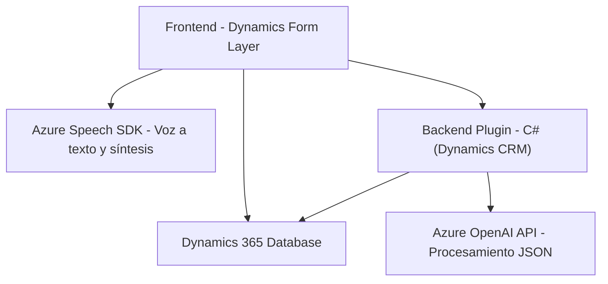

### Breve resumen técnico:
El repositorio en conjunto implementa una solución orientada a la interacción con Dynamics 365 mediante dos capas principales:
1. **Frontend**: Procesa datos de formularios y sintetiza voz usando el Azure Speech SDK.
2. **Backend (Plugins)**: Extiende Dynamics 365 para transformar texto con inteligencia artificial (Azure OpenAI).

El objetivo principal es permitir la entrada de voz para procesar datos en formularios de Dynamics 365, usando servicios externos y reglas específicas.

---

### Descripción de arquitectura:
La arquitectura puede describirse como una **aplicación multicapa**:
1. **Frontend (Capas de presentación y lógica de interfaz)**:
   - Implementado en JavaScript, interactúa directamente con formularios Dynamics 365.
   - Utiliza servicios externos (Azure Speech SDK) para la captura de voz y la síntesis.
2. **Backend (Capa lógica de negocio y servicios)**:
   - Desarrollado como plugins de Dynamics que manejan la lógica de transformación de datos y se conectan a Azure OpenAI para el procesamiento de texto.
3. **Integración con servicios externos**:
   - Azure Speech SDK para reconocimiento y síntesis de voz.
   - Azure OpenAI para generar estructuras JSON interpretables desde texto.

---

### Tecnologías usadas:
- **Frontend**:
  - JavaScript.
  - Dynamics 365 Form Layer (`formContext` y APIs de Dynamics).
  - Azure Speech SDK (Cognitive Services).
- **Backend**:
  - C# (.NET Framework).
  - Dynamics 365 Plugin Framework (`IPlugin`, `IPluginExecutionContext`).
  - Azure OpenAI API (GPT-4o para procesamiento avanzado del texto).
  - Librerías .NET (`HttpClient`, `System.Text.Json`).
  
**Patrones utilizados**:
- **Programación orientada a eventos**: En el frontend, coordinando acciones como carga del SDK y entrada de voz.
- **Plugin-Based Architecture**: En el backend, extendiendo Dynamics 365 mediante plugins.
- **Service-Oriented Architecture (SOA)**: Integración con servicios externos (Azure Cognitive Services y OpenAI API).
- **Encapsulación funcional**: División clara de tareas en funciones y métodos.

---

### Dependencias o componentes externos:
- **Azure Speech SDK**: Captura y síntesis de voz en el frontend. Importado desde `https://aka.ms/csspeech/jsbrowserpackageraw`.
- **Azure OpenAI AI API**: Procesamiento avanzado del texto hacia JSON estructurado en el plugin backend.
- **Dynamics 365 Web API/Xrm.WebApi**: Para operaciones CRUD con formularios y entidades del sistema.

---

### Diagrama Mermaid:

---

### Conclusión final:
El repositorio implementa una solución modular y extensible enfocada en mejorar la interacción con Dynamics 365 a través de entrada de voz y el procesamiento de texto usando IA. La arquitectura está bien definida, combinando capas frontend y backend con integraciones sólidas a servicios externos como Azure Cognitive Services y OpenAI. Esto permite un flujo de trabajo dinámico que transforma voz en datos estructurados útiles para formularios y entidades en Dynamics.