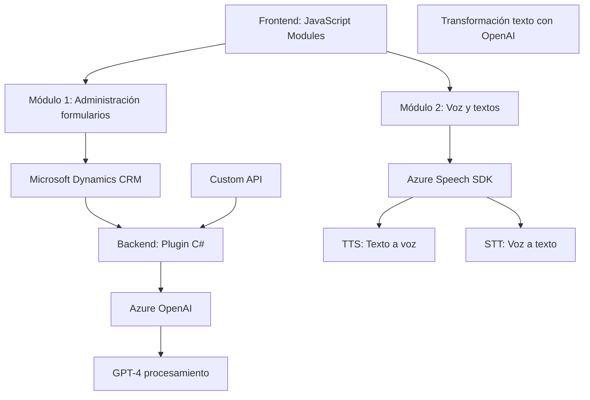

## Breve Resumen Técnico

El repositorio contiene tres módulos principales: dos orientados al manejo de formularios (frontend) en Dynamics CRM con integración a Azure Speech SDK y otro que implementa un plugin en C# para transformar texto mediante Azure OpenAI. El objetivo general es enriquecer la experiencia del usuario con capacidades de reconocimiento de voz, texto a voz, y procesamiento avanzado con inteligencia artificial. Está diseñado para interactuar principalmente con entornos Microsoft Dynamics CRM, usando servicios externos como Azure Speech y, en menor medida, Azure OpenAI.

---

## Descripción de Arquitectura

La solución presenta una arquitectura híbrida. Por un lado, el frontend utiliza un enfoque MVC (Modelo-Vista-Controlador) basado en JavaScript para gestionar formularios en Dynamics CRM. Por otro lado, el backend sigue un patrón de arquitectura de **plugins** en Dynamics CRM, utilizando C# para integrar lógica de negocio avanzada y delegar tareas de transformación al servicio Azure OpenAI.

Esto define una arquitectura de **n capas**:
1. **Capa cliente:** Archivos JavaScript que manipulan formularios y manejan SDK de Azure Speech.
2. **Capa servidor:** Plugin desarrollado en C#, ejecutado por Dynamics CRM para lógica de negocio y conexión con servicios externos.
3. **Capa de servicio externo:** Azure Speech y Azure OpenAI, que realizan procesamiento avanzado.

---

## Tecnologías y Frameworks Usados

### 1. **Frontend:**
- **JavaScript:** Uso modular para gestionar formularios y SDKs externos.
- **Azure Speech SDK:** Manejo de texto a voz y reconocimiento de voz.
- **Microsoft Dynamics CRM SDK:** Interacción con formularios y entidades del CRM.

### 2. **Backend (C# Plugin):**
- **Microsoft Dynamics CRM SDK:** Extensión del CRM mediante plugins.
- **Azure OpenAI:** Proporciona capacidades de procesamiento avanzado usando modelos GPT-4.

---

## Dependencias o Componentes Externos

1. **Azure Speech SDK:** Usado en el frontend para texto a voz y reconocimiento de voz.
2. **Azure OpenAI Service:** Integración desde el backend para procesamiento de texto.
3. **Microsoft Dynamics CRM SDK:** Base para la interacción cliente-servidor y extensibilidad.
4. **Custom API de CRM:** Invocada desde el frontend para ejecutar operaciones de lógica de negocio en el CRM.
5. **Navegador:** La funcionalidad del frontend depende de la ejecución en entornos web compatibles (basado en cliente).

---

## Diagrama Mermaid

---

## Conclusión Final

La solución implementada en este repositorio es una arquitectura híbrida de **n capas**, compuesta por un frontend basado en JavaScript y un backend de Dynamics CRM en C#. La funcionalidad es reforzada mediante servicios externos como Azure Speech y Azure OpenAI, asegurando capacidades avanzadas como texto a voz, reconocimiento de voz y procesamiento de IA con GPT-4. Aunque bien estructurada, presenta ciertas áreas de mejora, como el manejo de credenciales y el acoplamiento fuerte entre módulos. Sin embargo, es un diseño eficiente para entornos centrados en Dynamics CRM.