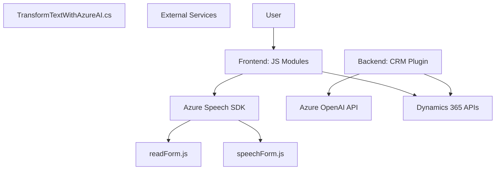

### Breve resumen técnico
El repositorio describe una software que utiliza múltiples archivos para implementar funcionalidades relacionadas con la interacción entre un **entorno de Dynamics 365**, procesamiento de formularios, entrada/salida de voz mediante **Azure Speech SDK**, y transformación del texto con **Azure OpenAI**. La solución es una que combina frontend y backend con un enfoque en integración de servicios externos.

---

### Descripción de arquitectura
La solución implementa una **arquitectura en capas** basada en componentes específicos (frontend y backend) que interactúan entre sí. A nivel macro, es una arquitectura híbrida que utiliza patrones de integración, modularidad, y extensibilidad. La parte del backend (plugin en C#) utiliza la arquitectura de eventos característica de Dynamics CRM (como plugins que se desencadenan ante acciones específicas). El frontend, por su parte, se enfoca en capturar entrada de voz y manipular datos del formulario, con un enfoque modular y dinámico.

**Características principales:**
- **Frontend**: Desarrollado en JavaScript, usa el patrón de carga dinámica para integrar el **Azure Speech SDK**, enfocándose en lectura y reconocimiento de formularios.
- **Backend**: Plugin en **C#** para Dynamics CRM que se comunica con el servicio **Azure OpenAI** para realizar procesamiento de texto mediante un endpoint externo.

---

### Tecnologías usadas
1. **Frontend**:
   - **JavaScript**: Lenguaje principal para manipulación de formularios.
   - **Azure Speech SDK**: Servicio externo para entrada/salida de voz con integración local.
   - **Dynamics 365 Web API**: Comunicación con servicios internos de Dynamics 365.
2. **Backend**:
   - **Microsoft Dynamics CRM SDK (`Microsoft.Xrm.Sdk`)**: Framework para desarrollo de extensibilidad en Dynamics CRM.
   - **Azure OpenAI API**: Servicio para transformar texto mediante inteligencia artificial.
   - **Newtonsoft.Json.Linq**: Biblioteca para manipulación avanzada de JSON.
   - **C#**: Lenguaje usado para desarrollar el plugin.
   - **HTTP clients (`System.Net.Http`)**: Usado para realizar la comunicación con el servicio Azure OpenAI.

---

### Diagrama Mermaid

---

### Conclusión final
La solución presenta una funcionalidad bien estructurada, capaz de realizar tareas avanzadas de reconocimiento y procesamiento de voz, manipulación de formularios, y transformación de datos. Su arquitectura híbrida combina componentes de frontend con un backend extensible en CRM, destacando el uso de servicios cloud de Azure mediante SDKs y APIs. Esto la hace ideal para su integración en plataformas empresariales como Microsoft Dynamics, aunque su complejidad aumentará con el crecimiento del sistema. Optimizaciones se pueden hacer reduciendo dependencia en configuraciones estáticas como claves de API y mejorando el manejo de errores en las interacciones dinámicas.