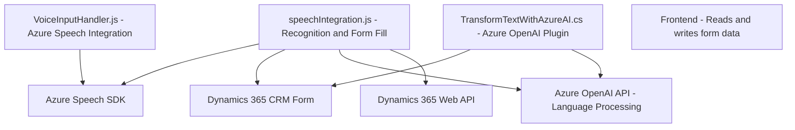

### Breve resumen técnico
El repositorio integra una solución basada en voz y procesamiento de datos mediante el Azure Speech SDK y el modelo GPT de Azure OpenAI para Dynamics 365. Los archivos proporcionan herramientas para lectura, transcripción y síntesis de voz, además de un plugin para transformación avanzada de texto a través de inteligencia artificial. Las dependencias y tecnologías fortalecen el enfoque en procesamiento de voz y automatización basada en datos.

---

### Descripción de arquitectura
La arquitectura sigue un enfoque **modular**, combinando:
- Registro y síntesis de voz usando el **Azure Speech SDK**.
- Integración directa con **Microsoft Dynamics CRM** para manipular formularios y atributos.
- Procesamiento avanzado de texto delegando tareas a un **microservicio** externo basado en Azure OpenAI.

Esta estructura tiene características de una solución **n capas**:
1. **Capa de presentación (frontend)**: Herramientas de voz que interactúan con los formularios de Dynamics 365.
2. **Capa de lógica de negocio**: Plugin en C# que coordina las reglas de procesamiento.
3. **Capa de datos**: Formulario y contexto de Dynamics CRM como modelo de datos.

Además, la incorporación de APIs externas introduce un patrón de arquitectura **hexagonal** (puertos y adaptadores), donde microservicios como Azure OpenAI operan como adaptadores externos.

---

### Tecnologías usadas
1. **Lenguajes**:
   - JavaScript para el frontend.
   - C# para los plugins de Dynamics CRM.
2. **Frameworks y SDK**:
   - Azure Speech SDK (para entrada, salida y síntesis de voz).
   - Dynamics 365 SDK.
3. **Servicios externos**:
   - Azure OpenAI (GPT) para procesamiento de texto avanzado.
4. **Básicos**:
   - JSON, JavaScript, HTTP.
   - Microsoft Dynamics Xrm Web API.

---

### Diagrama **Mermaid**

---

### Conclusión final
La solución presenta una arquitectura sólida y bien segmentada para integrar funcionalidades avanzadas de voz e inteligencia artificial en sistemas empresariales como Dynamics 365. El uso de tecnologías de Microsoft Azure (Speech SDK y OpenAI) como servicios externos, junto con una adecuada modularización del código, refuerza la capacidad de escalabilidad y reutilización.

Sin embargo:
1. Se observa que algunas partes podrían beneficiarse de mayor parametrización o configuraciones más dinámicas.
2. El manejo de errores y los registros requieren atención para robustecer la solución en entornos productivos.

### Recomendación
Considerar la adopción de herramientas de monitoreo y logging como **Application Insights** para depurar y garantizar la calidad técnica del producto.