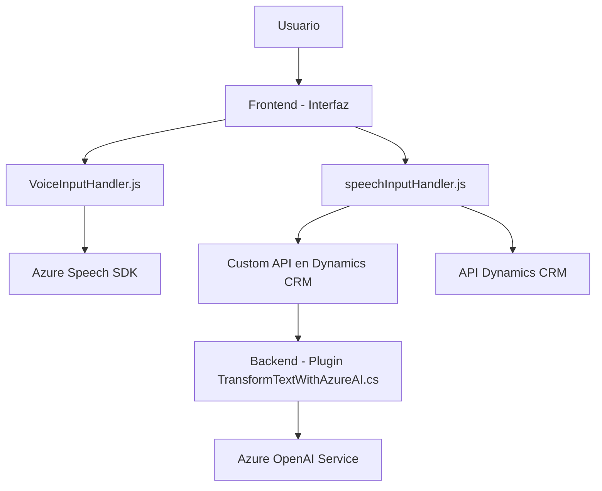

### Breve Resumen Técnico
El repositorio analiza diferentes archivos que forman parte de una solución donde se integran funcionalidades de voz y procesamiento inteligente de texto dentro de un ecosistema de Dynamics CRM. Principalmente, estos archivos manejan la interacción entre formularios, datos de entrada/salida, y servicios externos como Azure Speech SDK y Azure OpenAI.

---

### Descripción de Arquitectura
- La arquitectura del sistema parece corresponder a un enfoque **cliente-servidor** con subcomponentes distribuidos entre un **frontend** (JavaScript) que maneja la interacción del usuario y la sintetización/reconocimiento de voz, y **backend** (C#) configurado como un plugin para Dynamics CRM.
- El sistema utiliza una arquitectura **modular** donde cada archivo tiene roles bien definidos: procesamiento de entrada/salida, integración con APIs externas, y transformación de datos mediante IA.
- Considerando el flujo, el patrón general se aproxima a un diseño de **n capas**:
  1. **Presentación**: Archivos JavaScript que interactúan con el usuario y forman la capa frontend.
  2. **Lógica de Negocio**: Plugins en Dynamics CRM que procesan datos y conectan con servicios externos.
  3. **Integración con APIs Externas**: Servicios de Azure Speech SDK y Azure OpenAI para asistir con voz e inteligencia artificial.

---

### Tecnologías Usadas
1. **Frontend**:
   - HTML/JavaScript.
   - Azure Speech SDK (`https://aka.ms/csspeech/jsbrowserpackageraw`).
   - API Dynamics CRM para interacción con formularios y validación.

2. **Backend/Integración**:
   - Plugins en Dynamics CRM.
   - C#.
   - Azure OpenAI para procesamiento de textos transformados (endpoint configurado).

3. **Patrones Identificados**:
   - **Integración de Servicios Externos**: Uso directo de SDKs (Azure Speech) y APIs dinámicas (Azure OpenAI).
   - **Cargador Dinámico de Biblioteca**: En el frontend para optimizar carga y uso de funciones de sonido.
   - **Plugin-based architecture**: En el backend para permitir respuesta a eventos del Dynamics CRM.
   - **Delegación de funciones auxiliares**: Para tareas específicas del frontend (normalización, búsqueda de campos, etc.).

---

### Diagrama Mermaid 100% compatible con GitHub

---

### Conclusión Final
Este repositorio describe una solución robusta para la integración de funcionalidades avanzadas como voz e inteligencia artificial en un sistema Dynamics CRM. Utiliza un enfoque **n capas** para dividir lógica de presentación y negocio, reforzado con APIs externas y SDKs específicos como Azure Speech y OpenAI. Aunque la solución es modular y extensible, podría beneficiarse de mejoras en la seguridad, como configuración de API Keys mediante variables de entorno.

El diagrama representa la interacción entre los componentes de la arquitectura y muestra cómo se conectan las capas de frontend, backend y servicios externos formando un sistema centralizado dentro del ecosistema CRM de Dynamics.