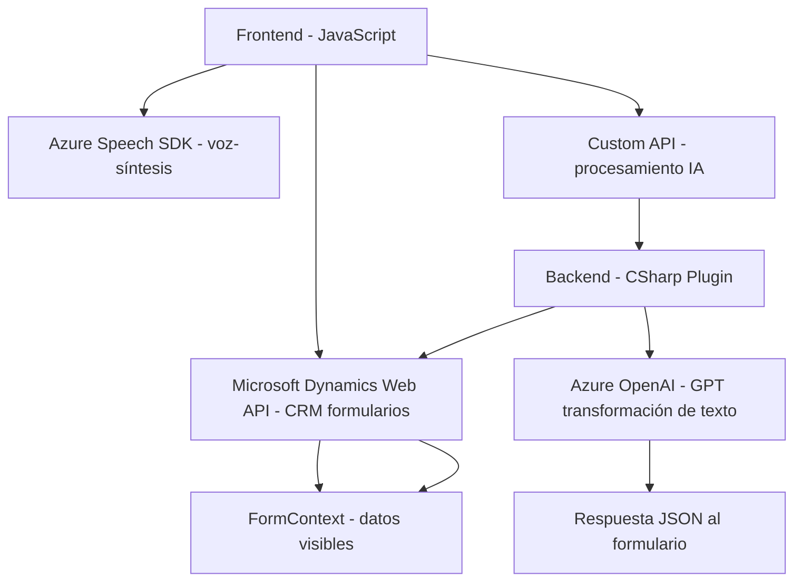

### Breve resumen técnico
El repositorio se centra en la integración entre formularios de Dynamics CRM y servicios de Azure (Speech SDK y OpenAI). Proporciona una solución que permite la interacción por voz y traducción en tiempo real de texto, vinculado con formularios CRM. Está dividida en dos componentes principales: el manejo de entrada/salida por voz (frontend en JavaScript) y la transformación de datos textuales mediante un plugin de Dynamics 365 en C#.

---

### Descripción de arquitectura
La solución sigue una **arquitectura desacoplada basada en servicios**, con integración dinámica de tecnologías externas. Utiliza patrones que permiten la extensibilidad y modularidad, como:

1. **Frontend**: 
   - Manejo de datos visibles en formularios CRM mediante funciones autónomas en JavaScript.
   - Uso dinámico del SDK de Azure Speech para entrada y síntesis de voz.
   - Procesamiento condicional y delegación a APIs de Dynamics y Azure.

2. **Backend (Plugin)**:
   - Arquitectura basada en plugins de Dynamics 365 (implementación de la interfaz `IPlugin`).
   - Servicio externo (Azure OpenAI) integrado para transformación de datos.
   - Comunicación mediante solicitudes HTTP y generación del formato JSON esperado.

Estas características clasifican la solución dentro de una **arquitectura de n capas** con separación de responsabilidades entre frontend, backend y servicios externos.

---

### Tecnologías usadas
1. **Frontend (JavaScript)**:
   - **Azure Speech SDK**: Para entrada/salida de voz en el navegador.
   - **Microsoft Dynamics Web API**: Para interacción con formularios y atributos CRM.

2. **Backend (C#)**:
   - **Microsoft.Xrm.Sdk**: Para la implementación del plugin en Dynamics 365.
   - **Azure OpenAI (GPT)**: Para procesamiento avanzado de texto.
   - **Newtonsoft.Json y System.Text.Json**: Para manejo de JSON.

3. **Integración externa**:
   - Carga dinámica del SDK de Azure Speech desde recursos en línea.
   - Solicitudes HTTP hacia Azure OpenAI y otras APIs de Dynamics 365.

---

### Diagrama Mermaid válido para GitHub

---

### Conclusión final
Este repositorio presenta una solución orientada a integrar tecnologías de vanguardia entre formularios de Dynamics CRM y servicios avanzados de Azure, como Speech SDK y OpenAI GPT. Utiliza patrones arquitectónicos como n capas y modularidad, que permiten una solución extensible y con alta cohesión. El uso del SDK de Azure Speech para síntesis y entrada de voz en el frontend, combinado con el poder de transformación textual mediante Azure OpenAI en el backend, destaca como principal fortaleza técnica. Sin embargo, sería importante considerar pruebas intensivas de rendimiento debido a la dependencia de múltiples servicios externos en tiempo real.