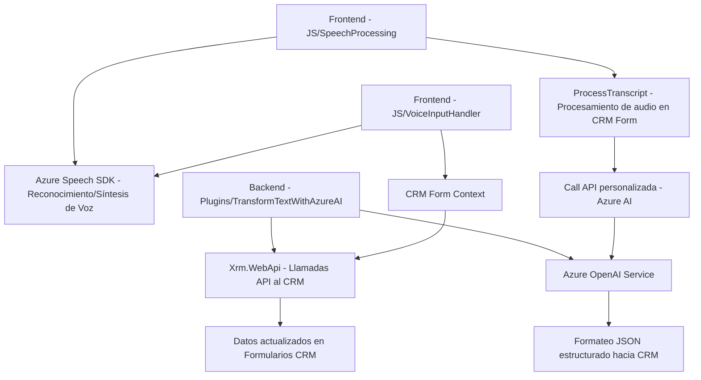

### Breve resumen técnico:
Este repositorio parece pertenecer a una solución híbrida que integra funcionalidades de frontend con el procesamiento de voz, integración con APIs personalizadas para enriquecimiento de datos, y funcionalidad de backend implementada como un plugin en Dynamics 365. Usa el **Azure Speech SDK** para la síntesis y reconocimiento de voz, y el **Azure OpenAI Service** para transformar texto en un formato estructurado. Además, interactúa con APIs internas de Dynamics CRM.

---

### Descripción de arquitectura:
La solución está dividida en estos bloques:
- **Frontend**:
  - Javascript Archivos que interactúan con formularios en el CRM y usuarios finales.
  - Uso del Azure Speech SDK para funcionalidades de reconocimiento y síntesis de voz en tiempo real.
  - Modularidad en funciones que permiten procesar datos de formularios y aplicar valores directamente en el frontend del sistema Dynamics.
- **Backend**:
  - Implementado como un plugin de Dynamics 365 que sigue el **Plugin Pattern**.
  - Actúa como una capa de lógica de negocio, invocando servicios de terceros (Azure OpenAI) para estructurar y enriquecer el texto procesado en el frontend.
  - Utiliza funciones como `HttpClient` para integrar servicios externos como API de OpenAI.
  
La arquitectura general puede describirse como una solución **híbrida n-capas**, con responsabilidades divididas entre frontend, backend (plugin), y servicios externos en la nube. La arquitectura permite escalabilidad al integrar servicios de IA y voz de Azure, mientras mantiene el desacoplamiento con una modularidad clara.

---

### Tecnologías usadas:
1. **Frontend**:
   - **Azure Speech SDK**: Captura de voz, síntesis y reconocimiento.
   - **JavaScript**: Para lógica basada en front-facing CRM Forms y operaciones asincrónicas.
   - **Xrm.WebApi**: API para la interacción con el CRM.
2. **Backend**:
   - **Microsoft Dynamics SDK**: Gestión de plugins y acceso al contexto de Dynamics CRM.
   - **Azure OpenAI API**: Transformación de textos mediante GPT-4.
   - **Newtonsoft.Json** y **System.Text.Json**: Manipulación de datos JSON.
3. **Patrones de Arquitectura**:
   - **Plugin Pattern** para encapsulación lógica en Dynamics.
   - **Facade**: Simplifica procesos complejos en el frontend, como carga dinámica de SDK.
   - **Gestión Dinámica de Dependencias**: Uso de scripts externos para SDK en tiempo de ejecución en lugar de dependencias estáticas.
   - **Modularidad**: Cada archivo y función se enfocan en tareas específicas, apoyando mantenibilidad del código.

---

### Diagrama Mermaid válido para GitHub:

---

### Conclusión final:
La solución presentada combina capacidades de interacción vocal con servicios basados en inteligencia artificial en la nube, específicamente Azure Speech SDK y OpenAI Service. Se apoya en una arquitectura modular y sigue el patrón de plugins para interactuar con la plataforma Dynamics 365. Su diseño híbrido la hace adecuada para escenarios empresariales que requieren integración entre frontend, servicios en la nube y aplicaciones de backend. La solución exhibe buenas prácticas de desacoplamiento y separación de responsabilidades.