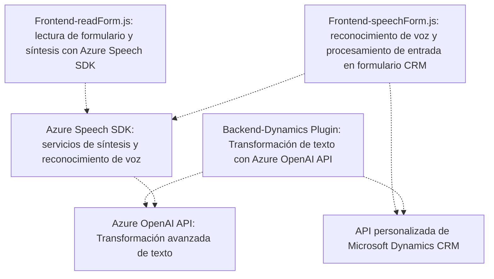

### Breve resumen técnico:
El repositorio analiza la integración de servicios basados en **Microsoft Dynamics CRM**, **Azure Speech SDK**, y **Azure OpenAI API**, con funcionalidades específicas para interacción con formularios dinámicos mediante entrada de voz y síntesis/transformación de texto utilizando inteligencia artificial. La solución tiene múltiples componentes orientados a tareas específicas y a la integración fluida con servicios externos.

---

### Descripción de arquitectura:
Este repositorio implementa una **arquitectura de Cliente-Servidor** sobre **Microsoft Dynamics CRM**. Cada componente se organiza de forma modular:
1. **Frontend**: Dos módulos (`readForm.js` y `speechForm.js`) que gestionan entrada y salida de datos desde formularios, procesan voz y contenido del formulario, y sintetizan audio utilizando **Azure Speech SDK**.
2. **Backend**: Un **plugin (TransformTextWithAzureAI.cs)** basado en el SDK de Dynamics CRM que ejecuta solicitudes a la **API Azure OpenAI** para transformar contenido de texto.
El diseño global sigue una estructura de **n-capas**, separando frontend, backend y servicios externos.

---

### Tecnologías usadas:
1. **Frontend (JavaScript y HTML)**:
   - Uso de `Azure Speech SDK` para lectura y síntesis de texto en voz.
   - Funciones moduladas para gestionar datos del formulario CRM.
   - Dinámico con acceso a datos mediante API de Microsoft Dynamics CRM (`formContext` y `Xrm.WebApi.online`).
2. **Backend (.NET/C#)**:
   - **Plugin para Dynamics CRM** implementado sobre `.NET Framework`.
   - Solicitudes HTTP con `HttpClient` para llamar a la **API Azure OpenAI**.
   - Serialización de JSON con `System.Text.Json` o `Newtonsoft.Json`.
3. **Servicios externos**:
   - **Azure Speech SDK** para capacidades de síntesis y reconocimiento de voz.
   - **Azure OpenAI API** con claves de autentificación para procesamiento avanzado usando modelos de IA.

---

### Diagrama mermaid:

---

### Conclusión final:
La solución construida en este repositorio presenta una arquitectura modular y orientada a la integración de servicios, combinando funcionalidades de procesamiento de voz y texto mediante tecnologías modernas como **Azure Speech SDK** y **Azure OpenAI API**. La elección de una arquitectura de **n-capas** permite separar las responsabilidades del frontend, backend y servicios para facilitar el mantenimiento y la escalabilidad. Es una solución acertada para entornos empresariales que requieren una interacción dinámica con clientes y usuarios mediante formularios digitales y capacidades de reconocimiento y síntesis de voz.