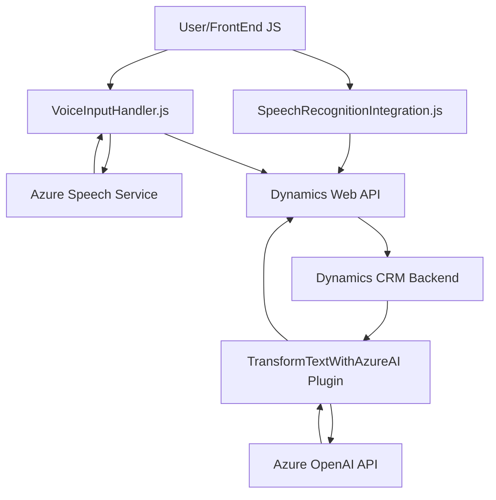

### Breve resumen técnico:
El proyecto implementa una integración avanzada con **Dynamics CRM**, utilizando el reconocimiento de voz y la síntesis de voz con **Azure Speech SDK**, además de un plugin con **Azure OpenAI** para el procesamiento y estructuración de texto. Este repositorio parece ser una solución híbrida entre un **frontend** basado en JavaScript y una **API/plugin** para ejecutar procesos detrás de Dynamics CRM.

---

### Descripción de arquitectura:
1. **Tipo de solución**: La solución es un híbrido de **microservicios** y **frontend**:
   - El código está dividido en varias capas:
     - **Frontend (JS)**: Interactúa directamente con los usuarios para recopilar datos, reconocer y sintetizar voz.
     - **Backend (plugin)**: Amplía las funcionalidades de Dynamics y hace uso de APIs de Azure para la manipulación y estructuración de datos.
2. **Arquitectura**:
   - La solución utiliza una **arquitectura de N capas**:
     - Capa de interacción (Javascript Frontend para reconocimiento/síntesis de voz).
     - Capa intermedia (API para procesamiento de voz/mapeo en Dynamics).
     - Capa de backend/plugin en Dynamics CRM.
   - Existe un componente de **event-driven architecture**, ya que los procesos se activan por eventos como interacción de voz o acciones en Dynamics.
   - La solución también hace uso de **servicios externos** a través de SDKs y APIs como Azure Speech y Azure OpenAI.

---

### Tecnologías usadas:
1. **Frontend**:
   - **JavaScript**: Para manejo de formularios y lógica interactiva.
   - **Azure Speech SDK**: Utilizado para reconocimiento/síntesis de voz.
   - **Dynamics Web API**: Para interacción directa con los campos del formulario.
2. **Backend**:
   - **C# plugin con Dynamics CRM**: Implementa lógica avanzada en el contexto del CRM.
   - **Azure OpenAI API**: Procesamiento y estructuración de texto mediante inteligencia artificial.
3. **Dependencias generales**:
   - **System.Text.Json** y **Newtonsoft.Json**: Serialización y deserialización de estructura de datos en JSON.
   - **HTTP Client libraries**: Para solicitudes a API remotas.

---

### Diagrama Mermaid:  

---

### Conclusión final:
Esta solución representa una implementación robusta que integra tecnologías avanzadas para facilitar interacciones vocales en un contexto empresarial como Dynamics CRM. Se basa en una arquitectura modular de N capas, apoyándose en servicios externos (Azure Speech SDK y Azure OpenAI API) para ofrecer funcionalidades como reconocimiento, síntesis de voz y procesamiento de texto. Además, utiliza dinámicamente la API de Dynamics para asignar datos a los campos del formulario y emplea un plugin basado en C# para extender las capacidades del backend del CRM.