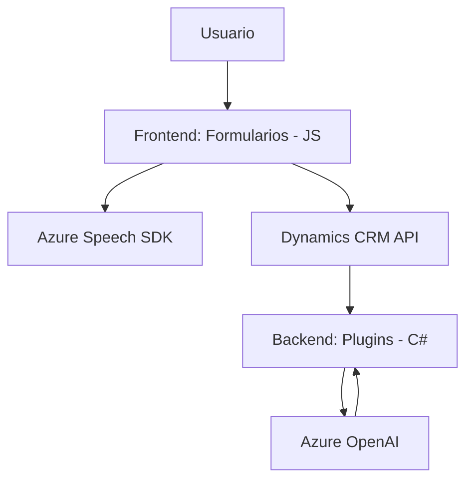

### Breve resumen técnico
El repositorio presenta una solución orientada a la integración de capacidades de voz y procesamiento de datos con Microsoft Dynamics CRM, aprovechando servicios de Azure, específicamente Azure Speech SDK y Azure OpenAI. Incluye módulos frontend en JavaScript para manipulación del DOM y SDK, y plugins backend en C# para extender las capacidades de Dynamics CRM mediante procesamiento avanzado.

---

### Descripción de arquitectura
La solución sigue una arquitectura **n capas**, con separación entre el nivel de presentación (JavaScript frontend), el nivel de negocio (manipulación de datos con Dynamics CRM y procesamiento de voz), y la capa de integración externa (llamadas al Azure Speech SDK y Azure OpenAI). 

Si bien el frontend opera de forma independiente al backend (C# plugin), se define una relación gracias al uso conjunto de Dynamics CRM, actuando este como una capa intermediaria para comunicar ambos.

Es importante destacar que:
- La solución sigue patrones de desacoplamiento funcional, con un enfoque modular en el frontend para cada responsabilidad (lectura de formularios, síntesis de voz, procesamiento de transcripciones).
- En el backend, los plugins extienden la funcionalidad del CRM mediante la arquitectura de servicios y patrones establecidos en Dynamics (plugin-based extensibility).

---

### Tecnologías usadas
1. **Frontend**:
   - JavaScript: Manipulación del DOM e interacción dinámica con el SDK y APIs de Dynamics.
   - Azure Speech SDK: Síntesis de voz y procesamiento de entrada en tiempo real.
   - Dynamics CRM API: Gestión del contexto del formulario y datos visibles.
2. **Backend**:
   - C# .NET Framework:
     - Microsoft Dynamics CRM SDK: Implementación de plugins usando `IPlugin`.
     - Azure OpenAI: Procesamiento de datos mediante inteligencia artificial.
     - HttpClient (para integración con servicios REST API).
3. **Patrones arquitectónicos**:
   - Arquitectura **n capas**.
   - Modularidad funcional en el frontend.
   - Plugin architecture en el backend.
   - Service-oriented architecture (integración externa con servicios de Azure).
   - DTO (Data Transfer Object) para comunicación en formato JSON.

---

### Diagrama **Mermaid** válido para GitHub

---

### Conclusión final
La solución es altamente modular y extensible, diseñada para integrarse con plataformas empresariales mediante APIs y plugins. Su arquitectura en capas asegura la separación de responsabilidades entre la presentación, lógica de negocio y capa de integración externa. El uso de tecnologías modernas como Azure Speech SDK y OpenAI en combinación con Dynamics CRM permite funcionalidades avanzadas como síntesis de voz y procesamiento cognitivo directamente integrados en formularios interactivos.

La estructura del código es organizada, orientada a funciones con buena legibilidad. Sin embargo, se podría mejorar el manejo de errores y asegurarse que las dependencias externas estén adecuadamente encapsuladas y documentadas para robustez y mantenibilidad.