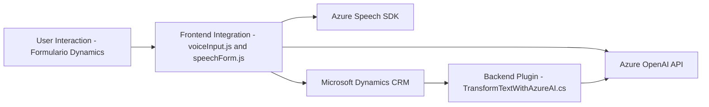

### Breve resumen técnico del repositorio

Este repositorio parece implementar una solución basada en **servicios de voz y texto integrados con formularios dinámicos** en un entorno como **Microsoft Dynamics CRM**. Consta de tres componentes principales:

1. **Frontend JavaScript Files**: Implementa funcionalidades del lado cliente para procesar los datos de un formulario y realizar conversiones de texto a voz o para obtener campos y sus valores mediante lógica personalizada.
2. **Plugin Backend (.NET with C#)**: Implementa un plugin que transforma datos en el lado servidor utilizando **Azure OpenAI API**.
3. **Integración externa**: Azure Speech SDK y Azure OpenAI forman la base de las capacidades de síntesis y análisis de texto.

---

### Descripción de arquitectura

Este sistema utiliza una arquitectura de **N capas**, con separación clara entre los niveles de presentación (Frontend), lógica empresarial y servicios externos:

- **Frontend**: Los archivos en `FRONTEND/JS/` manejan la extracción de datos del formulario, procesamiento dinámico y comunicación con servicios externos (como SDK, API).
- **Backend**: El archivo en `Plugins/TransformTextWithAzureAI.cs` implementa una lógica de plugin para extender las funcionalidades del CRM. Este es ejecutado en eventos del sistema y actúa como capa de interacción con APIs externas.
- **Servicios Externos**: La solución se integra con APIs de Azure Speech SDK y Azure OpenAI para características de síntesis de voz y procesamiento de texto.

La arquitectura combina plugins y servicios externos para expandir las capacidades del sistema base (Dynamics CRM), sin alterar su estructura.

---

### Tecnologías, frameworks y patrones usados:

1. **Frontend**:
   - JavaScript (procedural con funciones modulares).
   - **Azure Speech SDK**: Para síntesis de texto a voz y reconocimiento de texto hablado.
   - **Dynamics CRM Context (Xrm page model)**: Se usa para interactuar con el modelo de datos (formContext y campos).

2. **Backend Plugin**:
   - **C# con .NET Framework**: Framework base compatible con Dynamics CRM plugins.
   - **Microsoft.Xrm.Sdk**: Interfaz para integrar lógica personalizada en plugins del CRM y acceder a entidades como `IPluginExecutionContext`.
   - **System.Net.Http**: Comunicación cliente-servidor con la API de Azure OpenAI.
   - **Newtonsoft.Json**: Procesamiento eficaz de datos en formato JSON.
   - **Azure OpenAI API**: Transformar texto con reglas específicas a través de un modelo de inteligencia artificial avanzado.

3. **Patrones**:
   - **Capa de presentación y lógica empresarial**: División clara entre frontend y backend con conexiones bien definidas mediante API.
   - **Single Responsibility Principle**: La modularidad ya sea en el frontend (funciones independientes) o backend (usando conceptos de SOLID con clases y métodos).
   - **Plugin Framework**: Extensión modular en Dynamics CRM.
   - **Integración de servicios externos**: Comunicación API y SDK para capacidades más avanzadas como generación de contenido basado en AI o síntesis de audio.

---

### Dependencias y componentes externos

#### **Externa**:
1. **Azure Speech SDK**: Para la síntesis de texto hablado y reconocimiento de voz.
2. **Azure OpenAI API**: Transformación de texto en JSON estructurado siguiendo reglas.
3. **Microsoft Dynamics CRM SDK**: Herramientas para desarrollo de plugins (en el archivo `TransformTextWithAzureAI.cs`).

#### **Interna**:
1. **Dynamics CRM Context** (`executionContext`, `formContext`): El sistema depende del modelo de página y datos asociados del formulario de Dynamics CRM.
2. **Plugins personalizados**: Componente desarrollado para extender la funcionalidad del CRM mediante integración con API externas.

---

### Diagrama Mermaid (GitHub-Compatible)

---

### Conclusión Final

Este repositorio organiza una solución **orientada a servicios**, basada en una arquitectura de **N capas**, que extiende las capacidades de **Microsoft Dynamics CRM** mediante integración con servicios avanzados de **Azure Speech SDK** y **Azure OpenAI API**. Integra funcionalidades tanto en el frontend como en los plugins del backend para ofrecer soluciones innovadoras como la síntesis de voz y la conversión de datos en un formato estructurado con AI. 

La elección de la arquitectura modular basada en capas y el uso de tecnologías probadas aseguran una alta integración con potentes sistemas en la nube, escalabilidad y flexibilidad ante cambios futuros en la infraestructura subyacente. Recomendaría seguir documentando casos de uso, estructura global del sistema y cualquier diagrama UML adicional para mejorar la comprensión de los desarrolladores que deseen contribuir al repositorio.