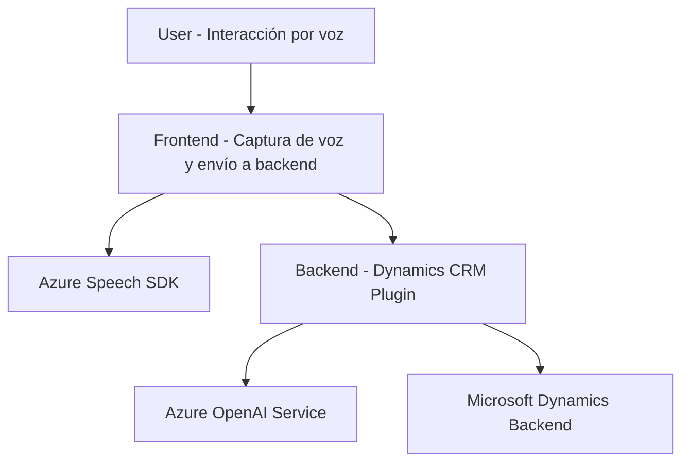

### Breve Resumen Técnico:
El proyecto parece estar enfocado en integrar funcionalidades avanzadas de voz y procesamiento de lenguaje natural con formularios en un entorno probablemente basado en Microsoft Dynamics CRM. Utiliza el Azure Speech SDK para la entrada/salida por voz, junto con un plugin que emplea Azure OpenAI para transformar textos de formulario. Hay tanto componentes frontend (en JavaScript) como backend (en C#, dentro del plugin).

---

### Descripción de Arquitectura:
La arquitectura del proyecto se asemeja a un sistema de **arquitectura de n capas** con elementos adicionales de integración con microservicios. Se tiene lo siguiente:
1. **Frontend**: Donde se opera la interacción con el usuario y los formularios dinámicos, utilizando el navegador y servicios de SDK.
2. **Backend**: Con un plugin que actúa como intermediario entre Dynamics CRM y el servicio externo Azure OpenAI.
3. **Microservicios externos**: Como el Azure Speech SDK (text-to-speech y speech-to-text) y Azure OpenAI.

El proyecto separa claramente las responsabilidades:
- **Capa de presentación**: Funciona en el frontend con HTML/JavaScript para recolectar datos y activar la integración con servicios de voz.
- **Capa de lógica de negocio**: Implementada en el backend con C#, maneja la lógica para transformar el texto.
- **Capa de datos**: Aunque no hay acceso directo a bases de datos en la estructura analizada, se interactúa con registros en Microsoft Dynamics CRM, posiblemente utilizando APIs internas (`Xrm.WebApi`).

Patrones utilizados:
- **Factory pattern**: En la creación dinámica de instancias para el procesamiento de voz con el SDK (ej. creadores de configuraciones, objetos de reconocimiento de voz).
- **Callback pattern**: Uso de callbacks para garantizar la carga secuencial de SDK en el frontend.
- **Plugin pattern** (extensión vertical en Dynamics CRM): El plugin en el backend sigue el patrón de responsabilidad única.
- **API Gateway pattern**: Utilización de APIs externas (Speech SDK y OpenAI) para delegar la lógica especializada.

---

### Tecnologías y Frameworks Usados:
1. **Lenguajes**:
   - **JavaScript**: Funcionalidades del frontend y conexión con servicios como Azure Speech SDK.
   - **C#**: Implementación del plugin para Dynamics CRM.
2. **Frameworks y bibliotecas**:
   - **Azure Speech SDK**: Funcionalidad de entrada/salida de voz.
   - **Azure OpenAI Service**: Procesamiento de lenguaje natural (GPT-4) en backend.
   - **Microsoft Dynamics 365 SDK (Microsoft.Xrm.Sdk)**: Extensiones y manipulaciones específicas en el CRM.
   - **Newtonsoft.Json** o **System.Text.Json**: Para operaciones con datos JSON.
3. **Servicios**:
   - Dynamics CRM APIs.
   - Azure Cloud (Speech SDK y OpenAI).

---

### Diagrama Mermaid:

---

### Conclusión Final:
La solución presentada corresponde a un sistema de integración entre un frontend y un CRM que aprovecha servicios de voz y procesamiento de lenguaje natural en la nube. Implementa una arquitectura de **n capas**, combinando patrones de diseño como el Plugin pattern (Dynamics extensions), Factory (SDK instanciación) y Callback (manejo de SDK). Las principales dependencias externas son el **Azure Speech SDK**, el servicio de **Azure OpenAI**, y el entorno **Dynamics CRM**.

Si bien la estructura técnica parece bien definida, se observan posibles riesgos de seguridad por el manejo de credenciales en el código fuente (recomendable externalizar en entornos seguros). El sistema modular también indica que podría ser adaptable para otras plataformas con formularios dinámicos, lo que otorga potencial para ser utilizado en diferentes industrias y aplicaciones.