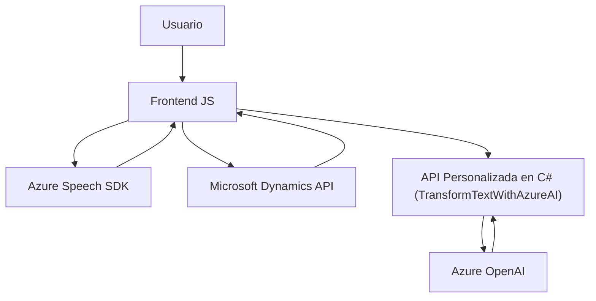

### Breve resumen técnico:

La solución presentada es un ecosistema compuesto por módulos **frontend (JavaScript)** y un complemento **backend (C#)** orientados a la integración con **Microsoft Dynamics CRM**. Utiliza servicios externos, como **Azure Speech SDK** y **Azure OpenAI API**, para mejorar la interacción con formularios mediante reconocimiento de voz, síntesis de voz y procesamiento avanzado de datos. 

### Descripción de arquitectura:

1. **Tipo de solución:** Es una integración de un sistema **frontend-backend** que conecta funcionalidades de reconocimiento/síntesis de voz y procesamiento de contenido con los servicios de Dynamics CRM.
   
2. **Arquitectura aplicada:** Se clasifica como una arquitectura **n-capas**:
   - Capa **Frontend** (JS): Maneja la interacción de usuario mediante voz para lectura y llenado de formularios.
   - Capa **Backend** (C# plugin): Complementa la lógica con procesamiento avanzado de datos utilizando Azure OpenAI.
   - Dependencias a servicios externos (Azure SDK/API): Introducen integración con **microservicios** externos.

### Tecnologías usadas:

1. **Frontend:**
   - Lenguaje: **JavaScript**
   - SDK: **Azure Speech SDK**
   - APIs: DOM API, CRM/Dynamics API
   
2. **Backend:**
   - Lenguaje: **C#**
   - SDK: **Microsoft Dynamics CRM SDK**
   - API externa: **Azure OpenAI**

3. **Patrones detectados:**
   - **Carga dinámica de SDK:** Lazy loading del Azure Speech SDK en el frontend.
   - **Plugin-based Architecture:** En el backend, para la integración con eventos de Dynamics CRM.
   - **Modularidad:** Separación de las funciones por responsabilidades específicas (extracción, procesamiento, síntesis y asignación).
   - **Service Provider Pattern:** Usado en el plugin para acceder a los servicios dinámicos proporcionados por Microsoft CRM.
   - **Integración de microservicios:** Conexión a servicios gestionados de Microsoft Azure (Speech SDK y OpenAI).

### Dependencias o componentes externos presentes:
   - **Azure Speech SDK:** Para reconocimiento y síntesis de voz.
   - **Azure OpenAI API:** Procesamiento de texto con IA en el backend.
   - **Microsoft Dynamics API:** Contextos y accesos a datos de formularios dentro del CRM.
   - **HttpClient en C#:** Comunicación con servicios HTTP externos.

---

### Diagrama **Mermaid** 100 % compatible con **GitHub Markdown**:

---

### Conclusión final:

La solución representa un sistema de integración que mejora la interacción entre el usuario y formularios en un contexto de Microsoft Dynamics CRM. Combina tecnologías modernas como **Azure Speech SDK** para reconocimiento/síntesis de voz y utiliza **Azure OpenAI API** para procesamiento avanzado de texto. La arquitectura sigue un enfoque clásico de **n-capas**, complementado con patrones como **Plugin-Based Architecture** y **modularidad**. Se observa un modelo híbrido donde el frontend se comunica con microservicios para realizar su tarea. El diseño es adecuado para sistemas que necesitan potenciar la productividad y experiencia del usuario en escenarios de gestión de datos empresariales.