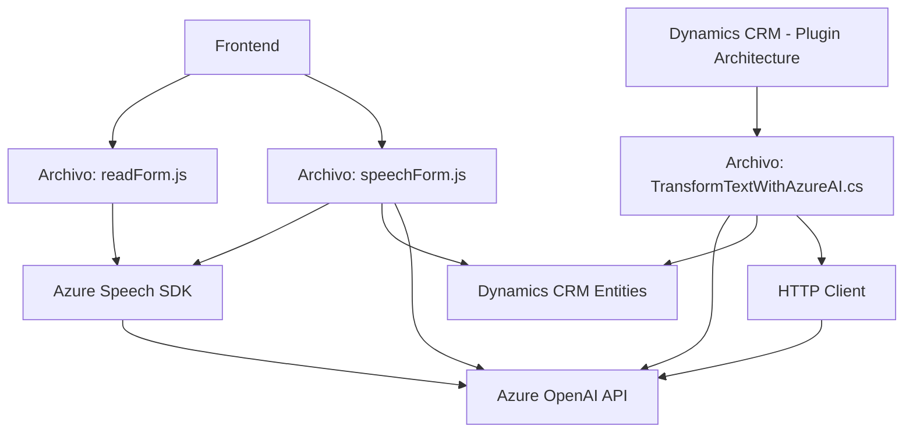

### Breve resumen técnico
La solución es un sistema compuesto que incluye un **frontend**, **consumidores de API**, y un plugin diseñado para trabajar junto a Dynamics CRM. Pone un alto énfasis en la integración con servicios externos de Azure (Speech SDK y OpenAI) para procesar y transformar datos. Cada componente juega un rol crucial: el frontend procesa entrada y salida de datos enriquecida (texto a voz y procesamiento de voz), y el plugin en backend trabaja para transformar texto con inteligencia artificial y devolver resultados estructurados.

### Descripción de arquitectura
El sistema se estructura como una solución de **arquitectura n-capas**:
1. **Capa de presentación (frontend)**: Interactúa directamente con usuarios finales en un entorno web/dinámico (Dynamics CRM). Usa el contexto del formulario para vincular datos con la backend.
2. **Capa de negocio (backend)**: Provee lógica para procesamiento avanzado de datos a través de un plugin en Dynamics CRM, interfiriendo con funciones de transformación de texto y APIs de terceros.
3. **Capa de integración y servicios externos**: Conexión y dependencia de servicios Azure SaaS:
   - **Azure Speech SDK**: Para reconocimiento de voz, transcripción y síntesis de texto.
   - **Azure OpenAI**: Para análisis semántico de texto y transformación basada en inteligencia artificial.

Patrones principales:
- Modularidad funcional: Cada archivo cumple una tarea claramente delimitada (procesamiento voz-frontend, transformación de texto-backend).
- Plugins en CRM: Integración directa con Dynamics CRM para operaciones en entidades del sistema.
- Manejo de APIs: Uso eficiente de SDKs y servicios REST.

### Tecnologías usadas
- **Frontend**: JavaScript y Azure Speech SDK.
- **Backend**: .NET Framework y Dynamics CRM SDK, integración con Azure OpenAI.
- **Azure Services**: Speech y OpenAI API para computación avanzada en la nube (reconocimiento de voz, texto a imagen/voz, etc.).

### Dependencias o componentes externos
1. **Azure Speech SDK**:
   - Reconocimiento y síntesis de voz.
   - Carga dinámica desde URL pública `https://aka.ms/csspeech/jsbrowserpackageraw`.
2. **Azure OpenAI API**:
   - Procesa texto con inteligencia artificial.
   - Integración mediante llamadas HTTP POST y JSON.
3. **Dynamics CRM SDK**:
   - Interfaces necesarias para el desarrollo de plugins (e.g., `IPlugin`, `IOrganizationService`, etc.).
   - API `Xrm.WebApi` para interactuar con entidades del CRM desde el frontend.
4. **Newtonsoft.Json**:
   - Procesamiento y generación de objetos JSON.
5. **HttpClient**:
   - Comunicación directa con servicios externos (Azure OpenAI).

### Diagrama Mermaid válido para GitHub

### Conclusión final
La solución en cuestión presenta una integración robusta entre un frontend dinámico, capacidades avanzadas de procesamiento de voz (Azure Speech SDK) y un plugin backend que utiliza inteligencia artificial (Azure OpenAI) para enriquecer procesos en el contexto de Dynamics CRM. Aunque se basa en una arquitectura típica de n-capas, su dependencia de servicios externos abre la puerta a escalabilidad y alta capacidad de respuesta en operaciones críticas. Para optimizaciones futuras, es recomendable considerar el uso de mecanismos avanzados como patrones de inyección de dependencias en los plugins y opciones de caching para minimizar el tiempo de respuesta del API externo.