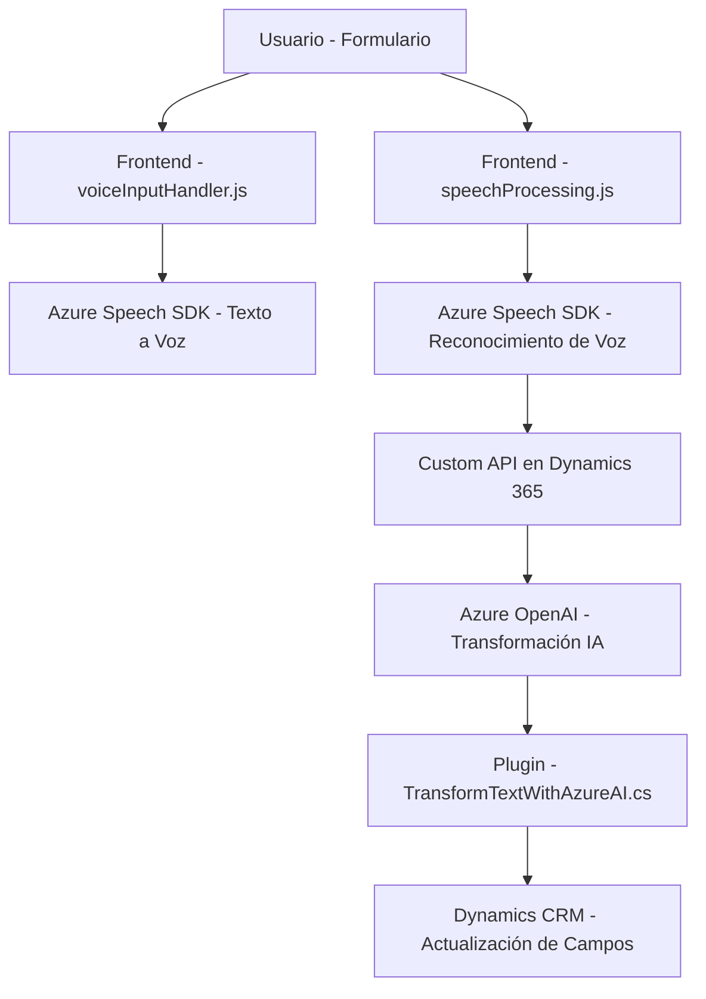

### Breve Resumen Técnico:
El repositorio parece estar diseñado para integrar capacidades de texto a voz y reconocimiento de voz en un sistema de Dynamics CRM utilizando el **Azure Speech SDK** y Azure OpenAI. Los archivos muestran una relación entre un **frontend JavaScript**, un plugin de Dynamics 365, y una API personalizada en el backend. El objetivo es mejorar la interacción con formularios, utilizando comandos de voz y transformación dinámica del texto mediante inteligencia artificial.

---

### Descripción de Arquitectura:
La arquitectura del sistema es **orientada a eventos** y **modular**, con los siguientes componentes principales:
- **Frontend:** Responsable de la interfaz y la interacción con el usuario (manejo de formularios, emisión de voz, reconocimiento de voz), realizado en JavaScript.
- **Backend:** Contiene plugins en .NET para Dynamics CRM que procesan datos y se integran con el servicio **Azure OpenAI** para transformar texto en estructuras JSON mediante IA.
- **External Services Integration:** Se conecta a APIs externas como **Azure OpenAI** y **Azure Speech SDK**, adoptando un estilo de arquitectura **distribuida** con servicios dedicados.
- **Client-side SDKs:** La integración directa del SDK de Azure en el frontend evidencia un patrón de **SDK client-side**.
- **RPC or API Communication:** Backend interactúa con servicios web remotos o APIs REST.

La arquitectura completa es más cercana a un enfoque de **microfrontends con tecnología cloud** que pueden interactuar con un backend basado en microservicios o Plugins. Sin embargo, tiene elementos de una arquitectura **de n capas**, donde las capas de presentación (frontend) y lógica de negocio (backend) están separadas.

---

### Tecnologías Usadas:  
- **Frontend:**
  - Lenguaje: JavaScript.
  - Framework/librerías: Azure Speech SDK.
  - Dinámica: Event-driven programming (callbacks y promesas).
  - Entorno: Dynamics CRM Forms.

- **Backend:**
  - Lenguaje: C#.
  - Framework: .NET (usando Microsoft.Xrm.Sdk para plugins).
  - Servicios Externos:
    - Azure OpenAI API (uso de modelos GPT para procesamiento de texto).
    - Dynamics CRM Plugins para implementar lógica específica.

- **Patrones:**
  - Modularidad.
  - Asynchronous programming.
  - Service-oriented architecture (SOA).
  - API-first design.
  - Encapsulación de servicios logicamente relacionados.

---

### Diagrama Mermaid válido para GitHub:

---

### Conclusión Final:
Este repositorio constituye una solución híbrida basada en la integración de tecnología cliente-servidor y servicios externos para llevar a cabo tareas avanzadas como síntesis de texto a voz y reconocimiento de voz basados en IA. Utiliza tanto programación orientada a eventos como patrones de integración de SDK y servicios REST, mostrando una buena separación de responsabilidades entre frontend y backend. Sin embargo, podría beneficiarse de un enfoque más seguro para el manejo de claves API y una validación más robusta de datos en la capa de plugins.

