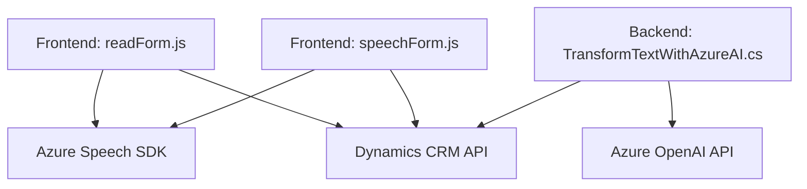

### Breve Resumen Técnico:
Los archivos presentados implementan una solución distribuida que combina integraciones con API externas (Azure Speech SDK y Azure OpenAI) y procesamiento dinámico de datos en un entorno CRM de Dynamics 365. La solución se divide en tres componentes principales: un frontend para interacción, gestión del reconocimiento de voz y síntesis, y un backend con un plugin para procesamiento avanzado de texto.

---

### Descripción de la Arquitectura:
La solución utiliza una **arquitectura multicapa** (n-capas) con integración de módulos independientes:
1. **Frontend:** Contiene dos scripts (`readForm.js` y `speechForm.js`) que implementan la lógica de interacción con formularios y la interfaz de usuario. Estos scripts trabajan en conjunto para leer información del usuario, procesarla mediante Azure Speech SDK y actualizar los formularios de Dynamics CRM.
2. **Backend:** Un plugin (`TransformTextWithAzureAI.cs`) que se ejecuta en el entorno de Dynamics CRM para transformar texto utilizando el modelo Azure OpenAI. La lógica del plugin está desacoplada y diseñada para comunicación RESTful con servicios externos.

El diseño favorece modularidad y flexibilidad mediante la separación de responsabilidades:
- **Frontend:** Procesamiento de interfaz y lógica cliente.
- **Backend:** Procesamiento avanzado con AI y comunicación con servicios externos.

---

### Tecnologías Usadas:
1. **Frontend:**
   - **JavaScript**: Implementación del procesamiento dinámico del formulario y conexión con Azure Speech SDK.
   - **Azure Speech SDK**: Para reconocimiento de voz y síntesis de texto a voz.
   - **Dynamics CRM API (Xrm.WebApi)**: Gestión dinámica de entidades y atributos en el CRM.

2. **Backend:**
   - **C#**: Código del plugin, que utiliza:
     - **Dynamics CRM SDK**: Para interacción con servicios y datos del CRM.
     - **HttpClient**: Realización de solicitudes HTTP para integrar Azure OpenAI.
     - **Azure OpenAI API**: Procesamiento avanzado de texto mediante IA.
     - **Newtonsoft.Json**: Serialización de datos JSON para comunicación con la API.

---

### Dependencias o Componentes Externos:
1. **Azure Speech SDK:** Para reconocimiento de voz y síntesis de texto.
2. **Azure OpenAI Service:** Procesamiento avanzado de entrada textual mediante GPT-4.
3. **Dynamics CRM SDK:** Gestión de datos y lógica dentro del entorno de Dynamics CRM.
4. **REST API:** Uso de solicitudes HTTP para comunicación con servicios externos.
5. **Formularios CRM de Dynamics:** Contexto dinámico y atributos/claves del formulario.

---

### Diagrama Mermaid:
El siguiente diagrama representa los principales componentes y su interacción en el sistema. Está 100% compatible con GitHub Markdown y sigue las reglas solicitadas.

---

### Conclusión Final:
La solución implementa una arquitectura distribuida basada en n-capas que divide claramente las responsabilidades entre frontend y backend. Aprovecha tecnologías modernas como Azure Speech SDK y Azure OpenAI para dar soporte a funcionalidades avanzadas de reconocimiento de voz y procesamiento dinámico de texto. La estructura de los archivos es modular, escalable y bien adaptada al entorno de Dynamics CRM. Cada módulo interactúa fluidamente con sus dependencias y componentes externos, asegurando robustez y flexibilidad en la implementación del sistema.