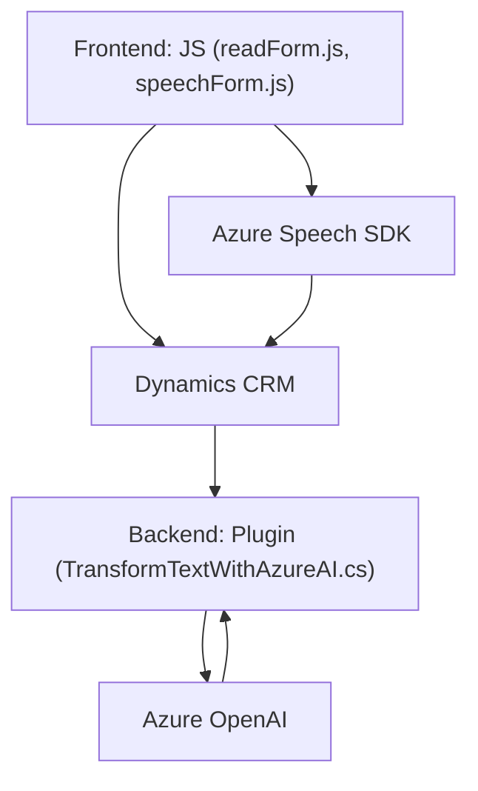

### Breve resumen técnico

El repositorio proporciona una solución integrada, construida en varios módulos, que implementan características avanzadas de entrada y salida de voz, análisis de texto con IA, y síntesis de audio para integrarse con formularios de Microsoft Dynamics CRM, utilizando Azure Speech SDK y Azure OpenAI. Está compuesto por archivos frontend (JavaScript) y backend (C# plugins), con un enfoque en interacción bidireccional y procesamiento de datos.

---

### Descripción de arquitectura

La arquitectura de este sistema es **modular**, diseñada para interactuar con APIs externas (Azure) y una plataforma de gestión empresarial (Dynamics CRM). Se observa un modelo de capas horizontal:
1. **Frontend** (JavaScript): Procesamiento en el cliente para operaciones de voz (lectura, entrada vocal) con integración directa del Speech SDK.
2. **Backend (C# plugins)**: Procesos de transformación textual y conexión con Azure OpenAI, integrados como plugins de Dynamics CRM.
3. **Servicios externos**: Utilización de Azure Speech SDK y OpenAI como microservicios para procesamiento y almacenamiento en la nube.

---

### Tecnologías usadas

1. **Frontend (JavaScript)**:
   - Azure Speech SDK (síntesis y reconocimiento de voz).
   - DOM API (manipulación de elementos del formulario dinámico).
   - Event-driven programming (eventos y callbacks para ejecución asincrónica).

2. **Backend (C#)**:
   - Microsoft Dynamics CRM SDK (`IPlugin`, `IOrganizationService`).
   - Azure OpenAI API (procesamiento de texto estructurado).
   - HTTP Clients (`System.Net.Http`) para integración con servicios REST.
   - JSON handling (deserialización y manipulación de estructuras JSON).

3. **Patrones arquitectónicos**:
   - **MVC implícito** en frontend: separación conceptual entre la lógica del controlador (JavaScript funciones), modelo (datos dinámicos de formulario), y vista (interface HTML/CRM).
   - **Plugin pattern** en backend (extensión de `IPlugin`).
   - **Microservicios**: Azure Speech SDK y OpenAI son utilizados como servicios externos de inteligencia artificial.

---

### Diagrama Mermaid válido para GitHub

---

### Conclusión final

Este repositorio representa una solución orientada a la inteligencia artificial y la integración empresarial, utilizando tecnologías modernas de Azure para reconocimiento y síntesis de voz, además de modelos de IA para procesamiento del lenguaje natural. La arquitectura modular facilita la escalabilidad y reutilización de funciones específicas, mientras que la separación entre frontend y backend asegura que los datos y la lógica se manejan de forma especializada. Los microservicios (Azure Speech y OpenAI) refuerzan la robustez y ubicuidad de las operaciones.