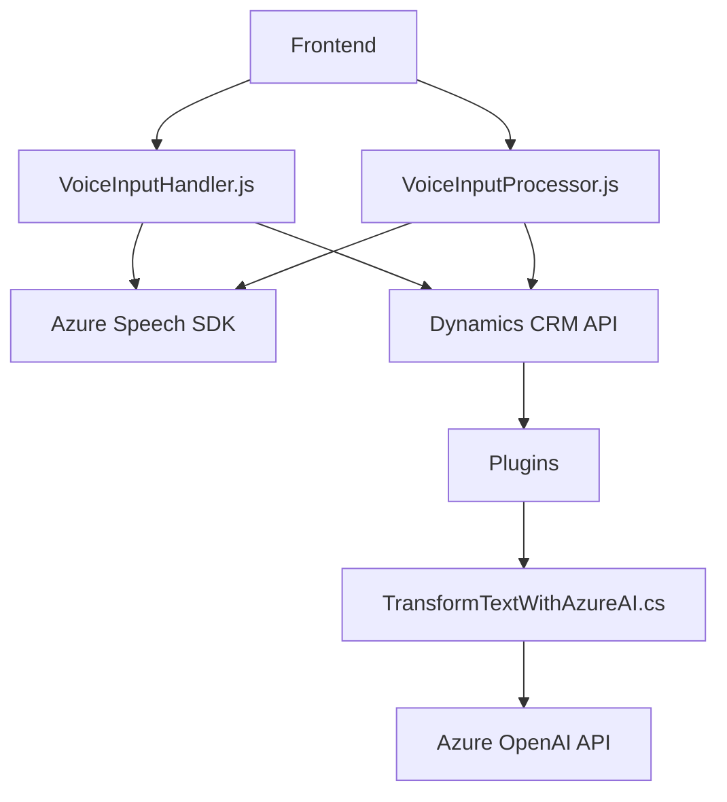

### Resumen técnico
El repositorio provee funcionalidad centrada en entrada, procesado y salida de voz mediante `Azure Speech SDK`, combinado con integración directa en un sistema CRM (Dynamics), junto con lógica avanzada de procesamiento de texto apoyada por servicios de `Azure OpenAI`.

---

### Descripción de arquitectura
La arquitectura es modular y distribuida:
1. **Frontend (JavaScript):**
   - Procesa entrada/salida de voz con Azure Speech SDK.
   - Interactúa con el CRM para asignación y manejo de datos visibles.
   - Manejo extensivo de flujos asincrónicos en el navegador con lógica en funciones aisladas.

2. **Plugins (C# - Dynamics CRM):**
   - Implementa lógica personalizada en el backend de Dynamics CRM mediante un plugin que transforma texto enviado desde el cliente.
   - Genera respuestas JSON a través de comunicación directa con servicios externos (Azure OpenAI).

3. **Servicios Externos:**
   - Azure Speech SDK: Reconocimiento y síntesis de voz.
   - Azure OpenAI: Procesamiento de texto utilizando APIs basadas en NLP.
   
---

### Tecnologías usadas
#### En el Frontend:
1. **Azure Speech SDK:** Para entrada y salida de voz.
2. **JavaScript Modular:** División de responsabilidades dentro de `readForm.js` y `voiceInputProcessor.js`.
3. **Dynamics CRM APIs:** Se integran mediante el objeto `Xrm.WebApi` y funciones específicas.
4. **DOM Manipulation:** JavaScript interactúa con el formulario (manejo de atributos visibles).

#### En el Backend:
1. **Azure OpenAI:** Procesamiento avanzado de lenguaje.
2. **Dynamics CRM Plugins (C#):** Extensiones en eventos del CRM mediante la interfaz `IPlugin`.
3. **Microsoft.Xrm.Sdk (C#):** Para comunicación nativa con el modelo del CRM.
4. **System.Net.Http:** Invocación de servicios REST con seguridad.
5. **System.Text.Json & Newtonsoft.Json:** Manejo avanzado de datos JSON.

#### Patrones identificados:
- Modular Architecture: Código organizado en módulos independientes.
- Plugin Pattern: Extensiones basadas en eventos en Dynamics CRM.
- REST Integration: Servicios API como Azure Speech y OpenAI.
- Delegate & Singleton: Gestión eficiente del SDK de Azure.
- Domain-Driven Design (CRM-specific logic): Utilización de los atributos y lógica del dominio CRM.

---

### Diagrama **Mermaid**

---

### Conclusión final
El sistema integra tecnologías modernas para procesar datos de voz en aplicaciones empresariales como Dynamics CRM. Utiliza una arquitectura modular en el frontend para la interacción del usuario con formularios y SDKs de voz, y una arquitectura basada en microservicios en el backend, que delega procesamiento avanzado a servicios de Azure OpenAI. Esto refuerza la escalabilidad, la reutilización de componentes y la capacidad de integración con sistemas externos. 

Esta solución es especialmente útil en escenarios donde el procesamiento de voz y texto se utiliza para mejorar la eficiencia en formularios dinámicos o sistemas empresariales. Sin embargo, la dependencia directa de servicios de terceros como Azure podría ser un punto crítico a considerar en términos de costos, disponibilidad y seguridad.