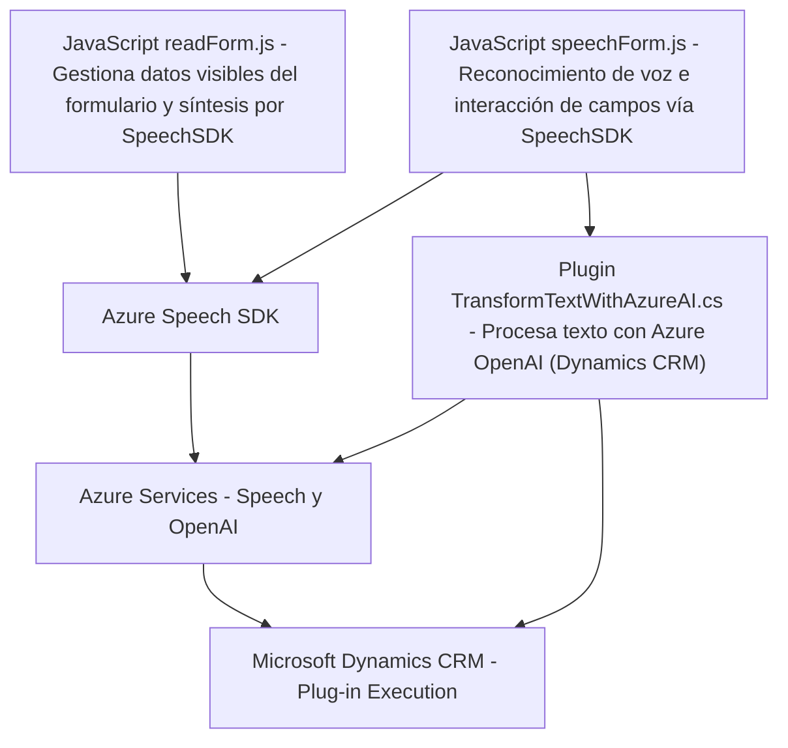

### Breve resumen técnico
El repositorio contiene una solución en la que se integran tres módulos principales:
1. **Frontend (JavaScript)**: Manejo de interacción con formularios y generación de voz/reconocimiento mediante el SDK de Azure Speech.
2. **Backend Plugin (.NET/CRM)**: Implementa un plugin para Microsoft Dynamics que utiliza Azure OpenAI para la transformación de texto.
3. **Azure Services**: Tanto el frontend como el backend hacen uso extensivo de servicios de Microsoft Azure, específicamente el SDK de Speech y modelos de Azure AI.

La solución está enfocada en mejorar la interacción con formularios mediante voz, usando análisis de datos y procesamiento con inteligencia artificial.

---

### Descripción de arquitectura
La solución sigue arquitectura orientada a eventos y servicios:
1. **Frontend**:
   - Estructura modular con funciones independientes para tareas específicas (sólido desacoplamiento).
   - El frontend interactúa con Azure Speech SDK para sintetizar y reconocer audio.
   - Empuja datos al backend mediante APIs y sincroniza la información.
2. **Backend/plugin**:
   - Siguió un diseño basado en plugins de Microsoft Dynamics CRM para facilitar la integración.
   - Interactúa con Azure OpenAI a través de un patrón de solicitud-respuesta HTTP para realizar procesamiento avanzado (p.ej., transformar texto).
3. **Servicios de Azure**:
   - Los módulos dependen de servicios externos (Speech SDK para reconocimiento de voz y OpenAI para procesamiento y transformación de texto).

---

### Tecnologías usadas
1. **Frontend JavaScript**:
   - **Azure Speech SDK**: Para generación de voz y reconocimiento.
   - DOM Manipulation (JS): Dinámico manejo del SDK y formularios web.
2. **Backend Plugin (.NET)**:
   - **C#** y **Microsoft Dynamics CRM SDK**: Implementación del plugin.
   - **Azure OpenAI**: Acceso a modelos de IA para procesamiento natural del lenguaje (REST API).
   - **Newtonsoft.Json**: Procesamiento de respuestas JSON.
   - **HttpClient**: Para interactuar con servicios REST externos.
3. **Architecture Patterns**:
   - **Event-driven**: Los módulos se ejecutan según el flujo del usuario (inputs mediante voz).
   - **Module-based frontend**: Cada funcionalidad es representada por funciones separadas.
   - **Microservicio/restful API**: Comunicación del backend con Azure servicios mediante HTTP.
   - **Plugin architecture**: En el módulo específico de CRM.

---

### Diagrama Mermaid válido para GitHub Markdown

---

### Conclusión final
El repositorio representa una solución híbrida que utiliza un **enfoque orientado a eventos** y organiza funcionalidades específicas de forma modular en el frontend y el backend. La arquitectura está diseñada para integrar componentes externos (Azure Speech SDK y Azure OpenAI) dentro de entornos CRM (Dynamics). La estructura es adecuada para aplicaciones empresariales orientadas a la automatización de procesos mediante IA y voz.

Sin embargo, el uso de secretos sensibles como claves y endpoints directamente en el código debería mejorarse mediante configuraciones más seguras, como utilizando Azure Key Vault u otros métodos de gestión de secretos.

La solución está bien diseñada para su propósito actual, pero puede beneficiarse del uso de mejores prácticas de seguridad y gestión del estado en el frontend (por ejemplo, utilizando una capa intermedia de autenticación).