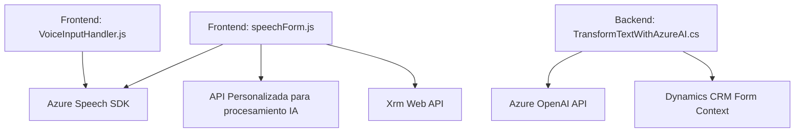

### Breve Resumen Técnico
El conjunto de archivos analizados pertenece a una **solución híbrida que incluye un frontend web y un backend plugin para reconocimiento y síntesis de voz**, integrándose con servicios externos como **Azure Speech SDK** y **Azure OpenAI API**, y funcionan dentro de un ecosistema de **Dynamics CRM**. La solución está orientada a mejorar la accesibilidad mediante análisis y transformación de datos a partir de formularios.

---

### Descripción de Arquitectura
La solución puede clasificarse como **n-capas**, con los siguientes niveles:
1. **Frontend**: Maneja la interacción con el usuario, incluida la entrada de voz y visualización del formulario. Utiliza el **Azure Speech SDK** y llama a APIs personalizadas para procesamiento.
2. **Backend (Plugins)**: Se emplea como una capa lógica en Dynamics CRM que extiende funcionalidades cuando se requieren transformaciones de texto mediante **Azure OpenAI**.

Además, se utilizan patrones como:
- **Integración de servicios**: Integración estrecha entre el frontend y APIs externas (Speech SDK y OpenAI).
- **Factory-like pattern**: Dinamismo en la creación de mappings y procesamiento adaptativo según la configuración del formulario y contexto.

---

### Tecnologías Usadas
1. **Frontend (JavaScript)**:
   - **Azure Speech SDK** para síntesis y reconocimiento de voz.
   - Promesas y asincronía en el manejo de operaciones de red.
   - Manipulación de DOM y contexto de formularios basado en una API de CRM (`Xrm.WebApi`).

2. **Backend (C#)**:
   - **Microsoft.Xrm.Sdk**: Framework para Plugins en Dynamics CRM.
   - **Azure OpenAI API**: Servicio para transformación avanzada de texto.
   - **HTTP Client**, **JSON libraries** (`System.Text.Json`, `Newtonsoft.Json`) para integración directa con servicios externos.

3. **Patrones de integración observados**:
   - Plugin architecture para eventos específicos en Microsoft CRM.
   - Service-oriented architecture con integración de servicios externos mediante HTTP REST.

---

### Diagrama **Mermaid** (Compatible con GitHub Markdown)

---

### Conclusión Final
La solución analizada presenta componentes frontend para la síntesis de voz y entrada por voz, y un backend basado en plugins para la transformación de texto utilizando IA. Se emplea una arquitectura de **n-capas** junto a integración de APIs externas (Azure Speech SDK, Azure OpenAI), con un fuerte enfoque en accesibilidad y procesamiento de datos desde formularios interactivos en Microsoft Dynamics CRM. Aunque modular, la solución depende en gran medida de servicios Microsoft, lo que implica potenciales costos y restricciones tecnológicas.