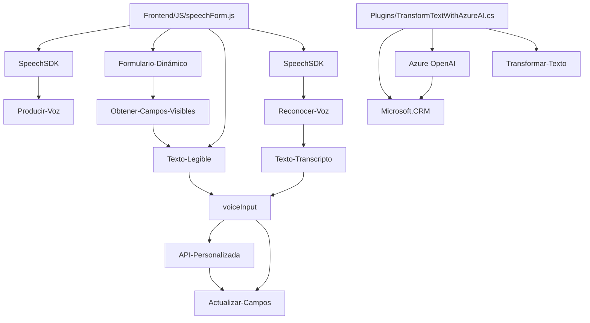

### Breve Resumen Técnico
El repositorio integra funcionalidades relacionadas con la síntesis y reconocimiento de voz usando **Azure Speech SDK** y manipulación dinámica de formularios en un entorno CRM empresarial. También se incluye un plugin en C# que interactúa con **Azure OpenAI** para transformar texto. La solución se puede describir como un conjunto de componentes distribuidos orientados a servicios (SOA) que extiende las capacidades de un sistema CRM existente.

---

### Descripción de Arquitectura
La arquitectura del proyecto es híbrida y basada en componentes:
1. **API Plugin**: El archivo `TransformTextWithAzureAI.cs` implementa un plugin para Dynamics CRM. Es un servicio externo acoplado a la arquitectura del CRM que amplía las funcionalidades del backend. Este plugin usa principalmente el modelo de microservicios y patrones relacionados con SOA, aprovechando Azure OpenAI como un servicio externo.  
   
2. **Frontend**: Los archivos `readForm.js` y `speechForm.js` conforman un módulo basado en **Javascript** que apunta a la interacción y actualización dinámica de formularios mediante el uso de voz y servicios. Utiliza un enfoque modular con carga dinámica para integrar dependencias como **Azure Speech SDK**.

3. Arquitectura global:
   - La solución sigue patrones de **n capas**, donde la capa lógica y presentación están conectadas mutuamente mediante formularios dinámicos.
   - Utiliza **archivos Plugin** como extensiones del backend para producir el procesamiento necesario con servicios externos (Azure OpenAI).

---

### Tecnologías Usadas
1. **Microsoft Dynamics CRM SDK**: Para extender funcionalidad mediante plugins (`IPlugin`).
2. **Azure Speech SDK**: Proporciona síntesis y reconocimiento de voz.
3. **Azure OpenAI**: Utilizado en el plugin C# para el procesamiento transformacional de texto con modelos GPT.
4. **JavaScript**: Para el desarrollo frontend del procesamiento de formularios y el uso del SDK de Azure Speech.
5. **C# y .NET**: Lenguaje backend de los plugins CRM.
6. **HTTP REST**: Comunicación con servicios externos.
7. **JSON**: Formato para estructuración de datos entre servicios.
8. **Aplicación dinámica sobre formularios CRM (FormContext)**: Base para la interacción modular entre la lógica frontend y el sistema CRM.

---

### Diagrama Mermaid Compatible con GitHub Markdown

---

### Conclusión Final
El repositorio parece formar parte de una solución empresarial orientada a la automatización de tareas en un entorno CRM. Su objetivo principal es mejorar la interacción entre usuarios y formularios a través de reconocimiento y síntesis de voz, combinando tecnologías como Azure Speech SDK, OpenAI y Dynamics CRM. La estructura modular y su enfoque basado en servicios externos la hace extensible y adaptable a varias operaciones.

El diseño hibrida patrones de arquitectura de **n capas** y **SOA**, lo que permite una separación clara entre el backend, el frontend, y los servicios de terceros. La solución destaca por su enfoque en micromódulos, generación dinámica de datos y uso extensivo de APIs externas. Sin embargo, su alta dependencia de servicios de Microsoft podría requerir una planificación cuidadosa de continuidad en entornos distintos.