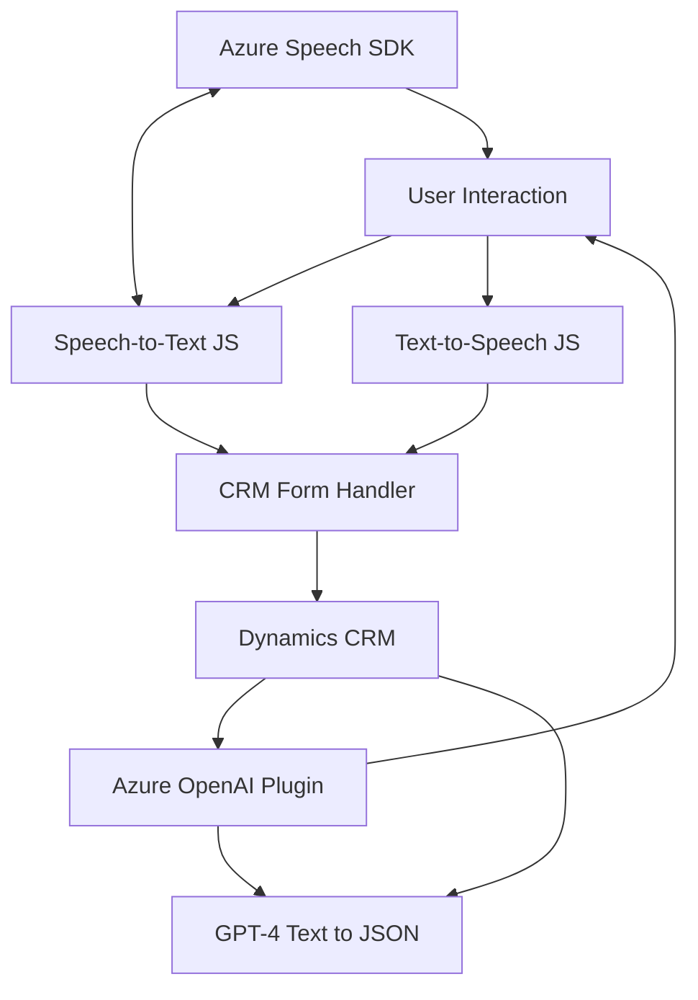

**Resumen técnico:**  
El repositorio contiene una solución orientada a mejorar la interacción entre usuarios y Microsoft Dynamics CRM, añadiendo reconocimientos y síntesis de voz mediante Azure Speech SDK para la interfaz frontend, y un plugin backend con Azure OpenAI para la generación de JSON estructurados basados en texto.

---

### **Descripción de arquitectura:**  
**📌 Tipos de solución:**  
1. **Frontend:**  
   - Proporciona interacción directa con el usuario (voz para formularios con Azure Speech SDK).  
2. **Backend Plugin:**  
   - Amplía la funcionalidad de Dynamics CRM con procesamiento de texto mediante GPT-4 (Azure OpenAI).  

**📌 Arquitectura utilizada:**  
1. **Modularidad Funcional:**  
   - Cada archivo en frontend realiza tareas específicas (captura de voz, síntesis de audio, reconocimiento de voz, carga del SDK).  
2. **Integración API:**  
   - En el backend, el plugin trabaja como una extensión modular que interactúa con Azure OpenAI a través de una arquitectura cliente-servidor.  

3. **Esquema híbrido:**  
  - El diseño del sistema tiene fragmentos monolíticos: los plugins trabajan dentro del contexto de Dynamics CRM, pero también hay una integración explícita a través de servicios micro (Azure Speech SDK, OpenAI).

**📌 Patrones comunes destacados:**  
- **Carga dinámica:** Frontend usa `ensureSpeechSDKLoaded` para cargar el SDK solo cuando se necesita.  
- **Delegación funcional:** Las tareas están separadas en funciones específicas (procesamiento de texto, interacción con formularios, llamadas API).  
- **Asíncronía:** Uso de promesas y llamadas HTTP para SDK externos y el backend con OpenAI.  
- **Extensión modular:** Dynamics CRM utiliza un plugin extensible que se comunica con APIs externas.  

---

### **Tecnologías usadas:**  
1. Frontend:  
   - **JavaScript**: Para funciones interactivas en formularios y manejo del SDK.  
   - **Azure Speech SDK**: Reconocimiento de voz y síntesis.  
   - **Dynamics API (`Xrm.WebApi`)**: Para interacción directa con formularios del CRM.  

2. Backend Plugin:  
   - **C#**: Usado para desarrollar la lógica del plugin.  
   - **Microsoft.Xrm.Sdk**: Framework nativo de Dynamics CRM para plugins.  
   - **Azure OpenAI**: Procesamiento de texto avanzado con GPT-4.  
   - **Newtonsoft.Json**: Para manipulación estructurada de JSON.  
   - **System.Net.Http**: Para llamadas HTTP hacia el servicio AI.  

---

### **Dependencias o componentes externos:**
1. **Externa:**
   - Azure OpenAI GPT-4 (plugin).
   - Azure Speech SDK (frontend).  
   - Microsoft Dynamics CRM API.  

2. **Interna:**
   - Contexto `formContext` (frontend y plugins para interacción con formularios).

---

### **Diagrama Mermaid (Estructura simplificada):**

---

### **Conclusión final:**  
Esta solución combina un enfoque modulable entre frontend y backend, integrando tecnologías de Azure para crear una experiencia dinámica de usuario en Microsoft Dynamics CRM. El diseño, aunque híbrido (con características monolíticas y microconfiguraciones), proporciona un flujo funcional limpio que optimiza el manejo de texto y voz, siendo adaptable para entornos corporativos complejos.