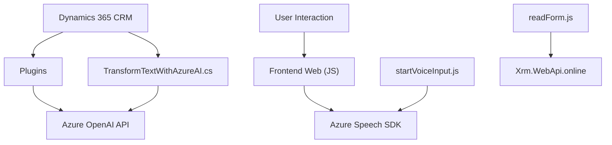

### Breve resumen técnico
El repositorio describe un ecosistema de archivos que implementan integración entre tecnologías web (Frontend JavaScript), Dynamics 365 CRM, y servicios de Azure (Azure Speech SDK y Azure OpenAI). La solución habilita el manejo de entradas de voz y texto para interactuar con la interfaz de usuario (formularios), transformarlas en datos estructurados mediante Inteligencia Artificial (Azure OpenAI) y actualizarlas en Dynamics CRM.

---

### Descripción de arquitectura
La solución utiliza una arquitectura híbrida:
1. **Frontend basado en JS:** Maneja la interacción del usuario en formularios web, reconoce voz, y convierte texto en datos procesables.
2. **Backend Dynamics CRM + Plugins:** Amplía la funcionalidad del sistema CRM mediante métodos ejecutados en el backend (Plugins).
3. **Integración con Servicios Externos:** El sistema aprovecha Azure Speech SDK para reconocimiento y síntesis de voz, y Azure OpenAI para transformación de texto.

Por diseño, esta es una arquitectura **híbrida de integraciones entre servicios**:
- Usa **modularización** para separar preocupaciones (entrada de voz, procesamiento de datos, integración con servicios externos).
- Utiliza **patrones de plugins** en Dynamics CRM para ejecutar procesos de transformación y actualización de datos.
- **Micro-servicios de Azure** proporcionan capacidades avanzadas (reconocimiento de voz y IA).

---

### Tecnologías usadas
1. **Frontend**:
   - Lenguaje: JavaScript.
   - Bibliotecas: Azure Speech SDK.
   - Framework: Dynamics 365 Web API para interacción con formularios y entidades CRM.
2. **Backend**:
   - Entorno: Microsoft Dynamics CRM Plugin Framework.
   - Lenguaje: C#.
   - Bibliotecas:
     - `Microsoft.Xrm.Sdk`: Para interactuar con APIs de Dynamics CRM.
     - `Newtonsoft.Json` y `System.Text.Json`: Manejo de datos JSON.
     - `System.Net.Http`: Ejecución de solicitudes a APIs externas.
3. **Servicios Externos**:
   - **Azure Speech SDK**: Para síntesis y reconocimiento de voz.
   - **Azure OpenAI API (GPT-4)**: Para transformar texto en JSON estructurado.

---

### Diagrama Mermaid válido para GitHub:

---

### Conclusión final
La solución representa una integración entre frontend habilitado por JavaScript y backend de Dynamics CRM mediante plugins. Aprovecha servicios externos como Azure Speech para reconocimiento de voz y síntesis, y Azure OpenAI para procesamiento de texto – logrando automatización avanzada en escenarios CRM. Su arquitectura se organiza de manera modular, siguiendo patrones de event-driven programming y de integración de APIs REST. Es una solución robusta que habilita extensibilidad en el manejo de voz e IA dentro de formularios CRM con la ayuda de tecnologías Microsoft.