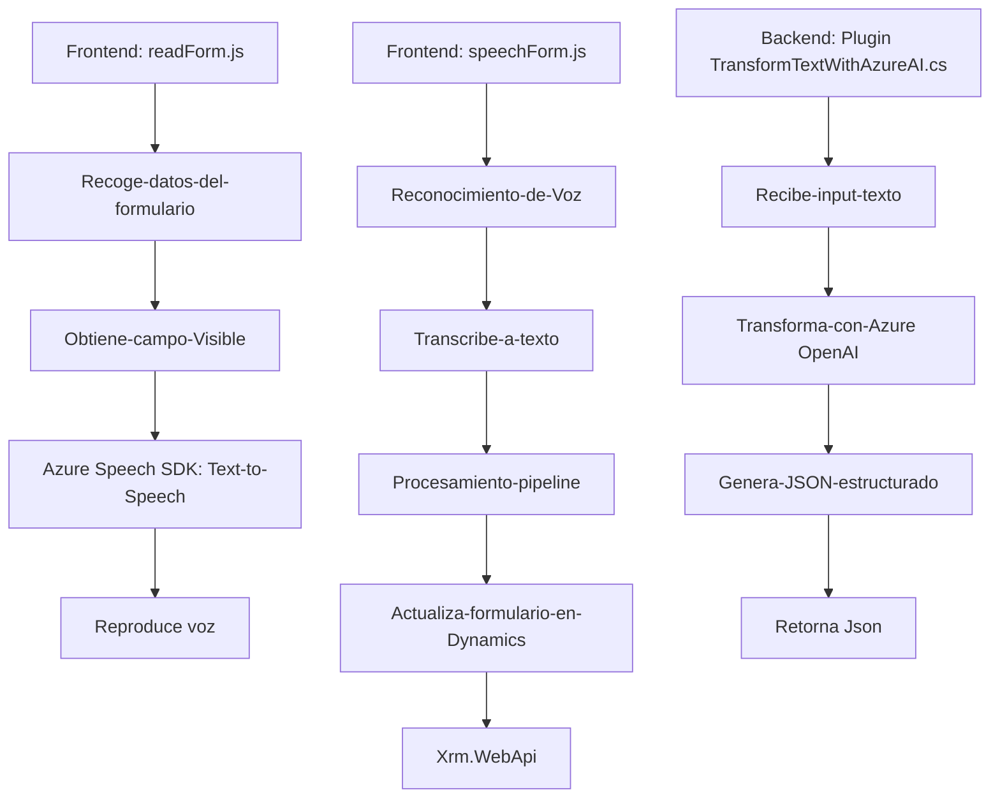

# Análisis y Resumen Técnico

## 1. Tipo de solución
La solución presentada es un **modelo híbrido** que integra diferentes componentes como:
- **Frontend:** Archivos en JavaScript que habilitan funcionalidad avanzada en formularios interactivos (como reconocimiento de voz y síntesis de texto a voz).
- **Backend Plugin:** Código en C# que define un plugin para el sistema Microsoft Dynamics CRM, orientado a transformar datos utilizando Azure OpenAI.

Los archivos presentados sugieren que el sistema está diseñado para ampliar la funcionalidad nativa de formularios en Microsoft Dynamics mediante APIs externas, integrando tanto un **componente de plugin** en el backend como una **interacción dinámica y responsiva en el frontend**.

## 2. Tecnologías, Frameworks y Patrones
- **Tecnologías principales:**
  - **Frontend:** Lenguaje *JavaScript* con integración de SDKs externos (Azure Speech SDK) que ofrecen síntesis y reconocimiento de voz.
  - **Backend:** Lenguaje *C#*, utilizado en el desarrollo del Plugin bajo el *Microsoft Dynamics CRM SDK*. También se incluye integración con Azure OpenAI para procesamiento de texto basado en IA.

- **Frameworks y bibliotecas:**
  - **Azure Speech SDK:** Para soporte de síntesis de texto a voz, reconocimiento por micrófono y manipulación de audio.
  - **Newtonsoft.Json o System.Text.Json:** Procesamiento de JSON, típico en sistemas que intercambian datos con APIs externas.
  - **Microsoft Dynamics SDK:** Extensiones y plugins mediante la interfaz `IPlugin`.

- **Patrones arquitectónicos:**
  - **Modularidad:** Diseñado con funciones específicas para tareas diferenciadas tanto en el frontend como en el backend.
  - **Dependency Injection:** Uso de parámetros como `formContext` o `executionContext` para integrar la lógica con las estructuras nativas de Dynamics CRM.
  - **Pipeline (procesamiento en etapas):** Se observa en la transformación de datos paso a paso desde el reconocimiento por voz hasta su impacto en formularios.
  - **Plugin-Based Architecture:** El backend utiliza un diseño orientado a extender funcionalidades nativas mediante plugins.
  - **API Integration:** La arquitectura está basada en consumo de APIs (Azure Speech y Azure OpenAI) para servicios especializados en IA.

---

## 3. Tipo de arquitectura
La solución parece implementar una arquitectura **n capas**:
1. **Capa de presentación:**
   - Componente frontend que interactúa con la UI del usuario en Dynamics (formulario dinámico enriquecido con voz).
2. **Capa lógica de aplicación:**
   - Funciones específicas para síntesis de voz, transcripción y procesamiento de texto estructurado.
3. **Capa externa de servicios:** 
   - Integración con Azure Speech SDK para funcionalidades vocales y Azure OpenAI para transformación avanzada de texto.
4. **Capa de almacenamiento:**
   - Usa APIs y el contexto de Dynamics para interactuar con los datos almacenados en la base de datos de la plataforma CRM.

**Nota:** Aunque utiliza servicios externos, no parece tener una arquitectura de microservicios independiente, ya que todo está acoplado a componentes específicos de Microsoft Dynamics.

---

## 4. Componentes externos presentes
### Dependencias externas posibles:
1. **Azure Speech SDK API:** 
   - Utilizada tanto en el reconocimiento como en la síntesis de voz.
2. **Azure OpenAI API:** 
   - Procesamiento de texto para obtener resultados en formato JSON basado en reglas predefinidas.
3. **Microsoft Dynamics CRM Services:** 
   - Interacción nativa con la plataforma CRM mediante el SDK y APIs personalizadas.
4. **Bibliotecas de terceros:**
   - **Newtonsoft.Json o System.Text.Json:** Manejo de JSON en el backend para enviar datos a Azure y procesar respuestas.
   - **System.Net.Http:** Para las solicitudes HTTP en el plugin hacia los servicios de OpenAI.

---

## 5. Diagrama Mermaid

---

## Conclusión Final
La solución analizada destaca por su integración entre un sistema CRM (Microsoft Dynamics), APIs de reconocimiento/síntesis de voz de Azure, y una arquitectura orientada a configurar y extender funcionalidades específicas de forma modular. Este diseño es ideal para entornos empresariales que buscan **optimizar la interacción humana** con la tecnología mediante voz. Aunque el sistema presenta una arquitectura n-capas, también incorpora elementos que podrían escalarse hacia microservicios, especialmente para el procesamiento con APIs externas.