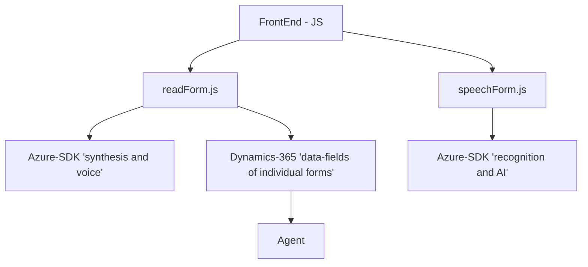

## Breve resumen técnico

El repositorio contiene componentes que, en conjunto, brindan una solución para **procesamiento de entrada y salida de voz** en un entorno Dynamics 365 CRM. Utiliza el SDK de Azure Speech para realizar síntesis y reconocimiento de voz, junto con una Custom API basada en Azure OpenAI para transformar datos de manera estructurada y aplicarlos dinámicamente a formularios del CRM. Las entidades de este repositorio se integran con diversas APIs y servicios externos de Microsoft Azure y Dynamics 365.

---

### Descripción de la arquitectura

La solución aplica una arquitectura **modular** y orientada a eventos:

1. **Frontend**:
   - Archivos como `readForm.js` y `speechForm.js` implementan lógica de interfaz que interactúa con formularios de Dynamics 365 y el SDK de Azure Speech.  
   - Utiliza patrones basados en funciones y promesas para dividir responsabilidades como síntesis de voz, captura de audio, transcripción y el procesamiento de datos resultantes.

2. **Backend (Plugins)**:
   - El archivo `TransformTextWithAzureAI.cs` es un plugin dinámico que, mediante Microsoft Dynamics CRM, transforma datos de texto en JSON utilizando Azure OpenAI.  
   - Sigue el patrón de desarrollo estándar de plugins definidos en la interfaz `IPlugin`.

#### Tipo de arquitectura

La arquitectura general es **n-capas**:
- Capa de presentación (Frontend): Archivos JS interactúan con los usuarios y los datos del formulario.  
- Capa lógica: Plugins en .NET actúan como la lógica de negocio central, transformando datos y realizando procesamientos complejos.  
- Capa de servicios externos: Se integra con servicios de Azure como Speech SDK y OpenAI, además del backend REST de Dynamics 365.

Este diseño modular y desacoplado sugiere una transición hacia una arquitectura **orientada a microservicios**, pero actualmente opera como un sistema distribuido con interdependencia entre componentes.

---

### Tecnologías usadas

1. **Frontend**:
   - JavaScript.
   - SDK de Azure Speech para síntesis y reconocimiento.
   - APIs de Dynamics 365 (`Xrm.WebApi`).

2. **Backend**:
   - C# (.NET Framework o .NET Core).
   - Microsoft Dynamics CRM Plugin API.
   - Azure OpenAI API (REST HTTP).

3. **Patrones**:
   - Modularización por funciones específicas.
   - Promesas para controlar la asincronía en el frontend.
   - Plugin Dynamics CRM basado en la interfaz `IPlugin`.

---

### Dependencias y componentes externos

1. **Azure Speech SDK** - Integración directa para síntesis y reconocimiento de voz.  
2. **Azure OpenAI API** - Procesamiento avanzado de texto (transformación a JSON).  
3. **Dynamics 365 API** - Para manipular datos del CRM, incluidos formularios y entidades.  
4. **Newtonsoft.Json (backend)** - Manejo de estructuras JSON en el plugin.  
5. **HttpClient (backend)** - Realiza solicitudes HTTP a Azure OpenAI.  

---

### Diagrama **Mermaid**

Este diagrama representa la estructura general del repositorio y su interacción con dependencias externas.

