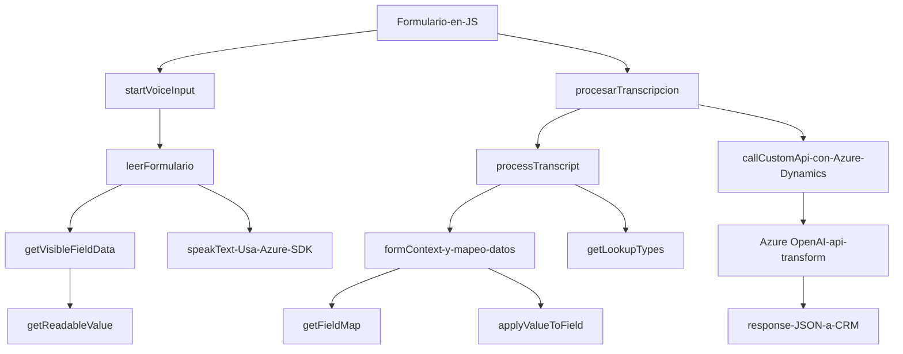

### Breve Resumen Técnico
El repositorio describe un sistema destinado a integrar funcionalidades avanzadas de procesamiento de voz y texto en entornos como aplicaciones web y Microsoft Dynamics CRM. Utiliza tecnologías como Azure Speech SDK para el procesamiento de audio, y Azure OpenAI para la transformación de texto. Estas capacidades están orientadas a la extracción y manipulación de datos a partir de entradas de voz, lo que puede ser útil en aplicaciones CRM o sistemas que operan con formularios dinámicos y voz como entrada.

---

### Descripción de la Arquitectura
La arquitectura del sistema utiliza el diseño modular y un enfoque basado en **n capas**. El sistema incluye:
1. **Frontend (JavaScript)** para el manejo de la entrada y salida de datos desde formularios con la ayuda del SDK de Azure Speech para síntesis y reconocimiento de voz.
2. **Backend (Plugin en C# para Dynamics CRM)** enfocado en la conexión e integración con servicios externos como Azure OpenAI y bases de datos relacionadas al CRM.
3. **Integración con servicios externos (Azure Speech SDK y OpenAI)** que refleja una arquitectura **orientada a servicios (SOA)** y que puede evolucionar hacia una arquitectura de **microservicios**.

En el caso de los archivos *frontend*, se observa la implementación del patrón de *lazy loading* para cargar el SDK de Azure solo cuando sea necesario. El backend utiliza el patrón de `Plugin` de Microsoft Dynamics CRM y patrones como `Dependency Injection` para desacoplar componentes, junto con invocación de APIs externas que aplica un diseño de integración de servicios.

---

### Tecnologías Usadas
1. **Frontend**:
   - **Lenguaje**: JavaScript.
   - **Framework**: No se menciona ninguno, pero utiliza ciertas prácticas comunes en JS (e.g., manipulación del DOM).
   - **SDK**: Azure Speech SDK para reconocimiento y sintetización de texto a voz.
   - **CRM Framework**: Microsoft Dynamics CRM para gestión de formularios y mapeo de datos.

2. **Backend**:
   - **Lenguajes**: C#.
   - **Framework**: Microsoft Dynamics Plugin (parte de CRM).
   - **Integración API REST**: Uso de HttpClient para llamadas a la API de Azure OpenAI.
   - **Tecnologías Azure**:
     - Azure OpenAI.
     - Azure Speech SDK.
   - **Otros**:
     - Libraries como Newtonsoft.Json y System.Net.Http para manipulación de datos y conexión a servicios externos.

3. **Patrones utilizados**:
   - Lazy Loading: Para cargar el SDK de Azure Speech dinámicamente.
   - Command Pattern: Procesamiento por separado de transcripciones de voz.
   - Dependency Injection: Uso de `IServiceProvider` para desacoplar dependencias en el plugin.
   - Service-Oriented Architecture (SOA): Uso de APIs externas en servicios distribuidos.

---

### Diagrama `Mermaid` Compatible con GitHub Markdown

---

### Conclusión Final
Este repositorio representa un sistema que utiliza un enfoque **modular y orientado a servicios**, especializado en el procesamiento de datos a través de soporte para entrada y salida de voz y texto en aplicaciones web y entornos de CRM. Al implementar tecnologías de Microsoft como Azure Speech SDK y Azure OpenAI, permite habilitar capacidades avanzadas e integración con APIs externas para un proceso enriquecido y adaptativo.

El diseño actual es escalable hacia una arquitectura de microservicios bien definida, aunque en su estado actual, sigue adherido a una estructura más cercana a **n capas**, con separación entre frontend (JS) y backend (C# plugin para Dynamics CRM). Sin embargo, el uso intensivo de servicios de Microsoft asegura compatibilidad y gran potencial de escalabilidad con entornos cloud.