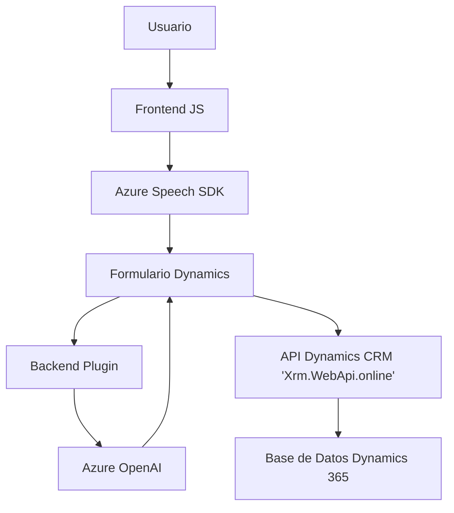

### Breve resumen técnico

Este repositorio contiene tres componentes diferenciados que interactúan entre sí para construir una solución centrada en la manipulación avanzada de datos de formularios mediante entrada y salida de voz, con integración a servicios externos (Azure Speech SDK, Azure OpenAI), perpetuando su funcionalidad sobre formularios empresariales en un entorno de Dynamics 365. Se observan patrones típicos de modularidad, eventos y servicio externo.

---

### Descripción de arquitectura

La solución presenta una arquitectura **n-capas**, en donde cada componente tiene un rol específico:
1. **Frontend (JS):** Procesamiento de datos de formularios empresariales. Este módulo utiliza Azure Speech SDK para lectura y reconocimiento de voz, y gestiona la interacción usuario-sistema mediante transcripción y síntesis de voz.
2. **Backend (C# Plugins):** Implementa lógica de negocio desencadenada por eventos en Dynamics 365. Realiza llamadas a servicios de Azure OpenAI para transformar texto en JSON estructurado y devuelve valores procesados al sistema CRM.
3. **Servicios externos:** Integración extensiva con Azure Speech y Azure OpenAI para manejo de entrada y salida por voz, junto con procesamiento avanzado de datos.

La estructura modular y el uso de dependencias externas refieren directamente a una arquitectura **orientada a servicios** con comunicación entre el frontend, backend y dos servicios externos: Azure Speech SDK y Azure OpenAI.

---

### Tecnologías usadas

#### Lenguajes y frameworks relevantes:
1. **JavaScript:** Para interacción con el frontend de Dynamics CRM.
2. **C#:** Implementación de lógica de negocio en el backend.
3. **Dynamics 365 SDK:** Proporciona herramientas para integración y operaciones sobre formularios empresariales.
4. **Azure Speech SDK:** Sintetiza texto en voz y realiza transcripción de entrada por voz.
5. **Azure OpenAI Service:** Procesa texto y devuelve JSON conforme a reglas específicas.

#### Patrones de diseño observados:
1. **Patrón Modular:** Separación de funciones tanto en frontend como en backend.
2. **Dependencia Externa Dinámica:** Carga de SDKs y llamadas a servicios externos bajo demanda.
3. **DTO (Data Transfer Object):** JSON estructurado para intercambio de datos entre los diferentes componentes.

---

### Componentes/Datos externos

1. **Azure Speech SDK:** Importado dinámicamente para síntesis y reconocimiento de voz.
2. **Azure OpenAI API:** Usado para transformar texto y aplicar reglas específicas.
3. **Dynamics CRM API:** Proporciona servicios de interacción con formularios y datos empresariales, como `Xrm.WebApi.online.execute`.
4. **Localización e idiomas:** Azure Speech SDK probablemente configure idioma y región para conversión precisa de datos.

---

### Diagrama **Mermaid**

---

### Conclusión final

Este repositorio implementa una solución centrada en la accesibilidad y mejora de interacción usuario-sistema en un entorno empresarial basado en Dynamics 365. Utiliza servicios de Azure Speech SDK para reconocimiento/síntesis de voz y Azure OpenAI para transformación avanzada de datos, permitiendo una experiencia intuitiva y automatizada para la manipulación de formularios. Flujos claramente separados, patrones modulares y manejo dinámico de dependencias aseguran escalabilidad y flexibilidad.

Recomendaciones adicionales:
- Implementar mecanismos robustos para manejo seguro de claves de acceso a los servicios externos.
- Documentar posibles errores o identificadores específicos para facilitar los procesos de depuración y escalado.
