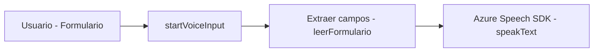
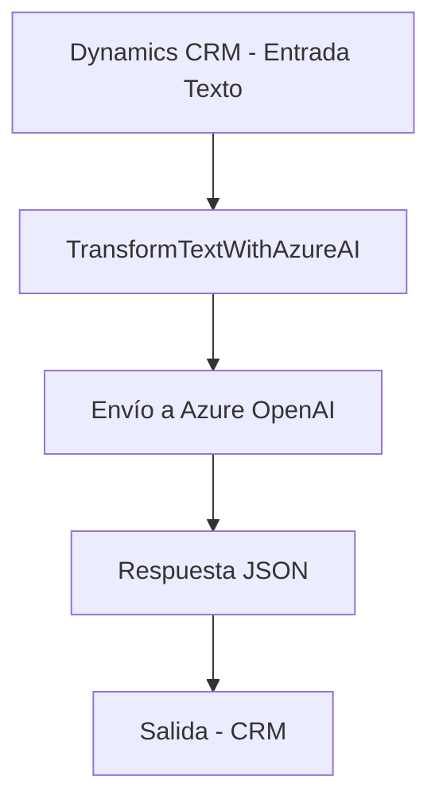
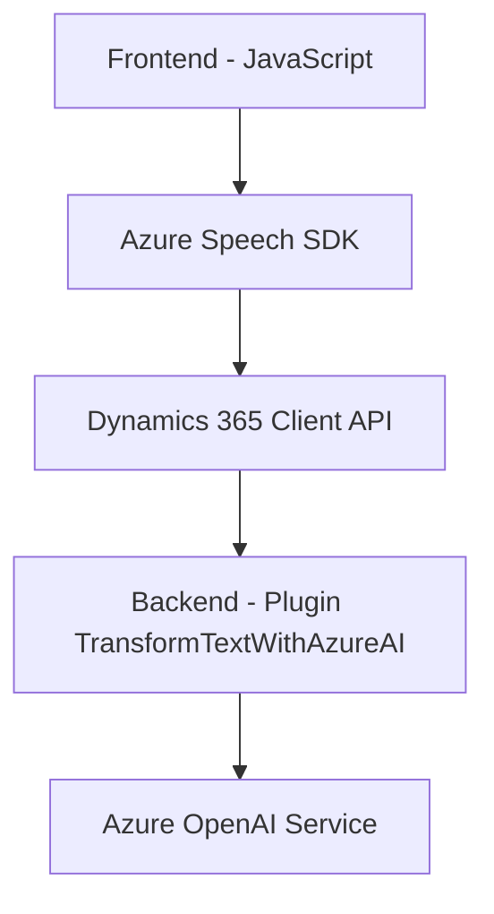

# Análisis técnico del repositorio

## Breve resumen técnico
El repositorio presenta un conjunto de archivos que implementan funcionalidades relacionadas con:

1. **Frontend**: Proceso de voz a texto mediante Azure Speech SDK con integración dinámica de formularios en Dynamics 365 (archivos `readForm.js` y `speechForm.js`).
2. **Backend**: Un plugin de Dynamics CRM (`TransformTextWithAzureAI.cs`) que utiliza el servicio de Azure OpenAI para transformar texto y generar JSON estructurado como salida.

Las soluciones se centran en la integración de APIs externas, soluciones de inteligencia artificial y dinamismo en formularios.

---

## Descripción de arquitectura
La arquitectura general del repositorio combina enfoques de **modularidad por capas** y elementos de una **arquitectura de microservicios**:

1. En el frontend:
   - **Modularidad con funciones específicas**: Manejo de SDKs y APIs con funciones bien definidas y responsivas.
   - **Integración externa**: Aprovechamiento del Azure Speech SDK para procesamiento de voz; comunicación con Dynamics para datos de formularios.
2. En el backend:
   - **Plugins orientados a eventos** de Dynamics CRM: Procesa datos en tiempo real gracias a eventos del CRM mientras consume servicios externos como Azure OpenAI para la inteligencia artificial.
3. Compartida:
   - **N capas (lógica y datos)**: Enfoque conceptual separado entre el frontend, la capa lógica/plataforma (Dynamics), y el backend responsable de procesamiento de IA.

---

## Tecnologías usadas
- **Frontend**:
  - **Azure Speech SDK**: Para síntesis y reconocimiento de voz.
  - **JavaScript ES6**: Implementación de lógica en el navegador.
  - **Dynamics Client APIs (Xrm.WebApi)**: Acceso CRUD y lógica de negocio en formularios.

- **Backend**:
  - **C# / .NET Framework**:
    - **Dynamics CRM SDK**: Para desarrollo de plugins.
    - **HTTP Client**: Para invocar Azure OpenAI.
    - **Newtonsoft.Json / System.Text.Json**: Manipulación avanzada de JSON.

- **Integración externa**:
  - **Azure OpenAI Service**: Transformación avanzada de texto con IA.
  - **Azure Speech SDK**: Procesamiento de voz como entrada/salida en tiempo real.

## Diagramas Mermaid válidos para GitHub
1. **Frontend: Flujo de datos dinámicos y procesamiento de voz**

2. **Backend: Transformación del texto con IA**

3. **Arquitectura general**

---

## Conclusión final
El repositorio implementa una solución híbrida entre funcionalidad frontend (procesamiento de voz y manejo de formularios) y backend (transformación y procesamiento avanzado mediante IA). Esto lo hace idóneo para aplicaciones empresariales en entornos Microsoft Dynamics 365, donde se requiere eficiencia en la gestión de datos y experiencia del usuario.

### Fortalezas:
1. Gran modularidad: Las funciones y clases tienen una separación clara de responsabilidades.
2. Uso de APIs externas poderosas como Azure Speech y Azure OpenAI.
3. Arquitectura flexible y escalable, apta para integrar más funcionalidades.

### Limitaciones:
- **Acoplamiento a Dynamics CRM**: La funcionalidad depende fuertemente de esta plataforma, lo que podría dificultar la migración.
- **Complejidad en manejo de APIs externas**: El uso extensivo de SDKs como Speech y OpenAI requiere configuraciones precisas en producción.

En general, el proyecto demuestra un diseño sólido y una implementación muy especializada para casos empresariales de procesamiento dinámico.