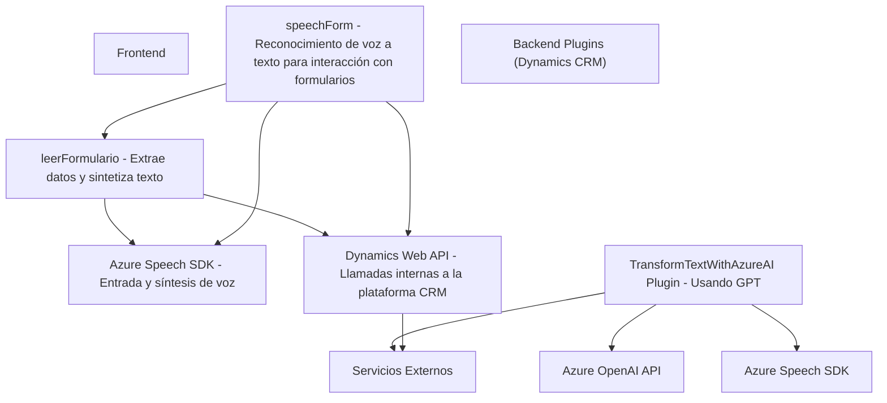

### Breve resumen técnico

El repositorio representa un sistema híbrido que integra capacidades de frontend, backend y plugins con varios servicios de Microsoft Azure, especialmente el **Speech SDK** y **OpenAI API**. La funcionalidad principal está centrada en la interacción de formularios (lectura y escritura) en **Dynamics 365**, usando tecnologías avanzadas como **Azure Speech SDK** para reconocimiento/síntesis de voz y **Azure OpenAI API** para transformación de texto mediante IA.

---

### Descripción de arquitectura

El sistema utiliza una **arquitectura de n capas distribuida**:
1. **Frontend (client-side):** Contiene archivos JavaScript para interactuar con formularios, gestionar reconocimiento y síntesis de voz con Azure Speech SDK y enviar datos al backend.
2. **Backend (Dynamics Plugins):** Plugins en C# extendiendo funcionalidades de Dynamics 365 mediante código personalizado que conecta la interfaz de usuario, datos específicos de formularios, y servicios externos como APIs (Azure OpenAI).
3. **Servicios Externos:** Integración con **Azure Speech SDK** para entrada y salida de voz, y **Azure OpenAI API** para procesamiento textual.

Se observa un patrón de **MVC** a nivel modular, donde:
- El controlador maneja eventos de voz y su procesamiento.
- El modelo procesa los datos y configura los plugins o realiza llamadas a APIs externas.
- La vista (formularios de Dynamics) muestra los resultados transformados en interfaz de usuario.

Además, existe un fuerte componente de integración externa, cumpliendo con las necesidades de procesamiento avanzado (IA), a través de servicios en la nube.

---

### Tecnologías usadas

1. **Frontend (JavaScript):**
   - **Azure Speech SDK:** Para reconocimiento y síntesis de voz (URL: `https://aka.ms/csspeech/jsbrowserpackageraw`).
   - JavaScript/ES6: Usado para funcionalidad asincrónica y modular.

2. **Backend (C# Plugins):**
   - **Microsoft Dynamics CRM SDK:** API para extender funcionalidades del sistema y acceder a servicios organizacionales.
   - **Azure OpenAI integration (GPT model):** IA para transformación avanzada de texto.
   - **System.Net.Http:** Para realizar solicitudes HTTP a servicios externos.
   - **Newtonsoft.Json / System.Text.Json:** Manejo de JSON dentro del plugin.

3. **Servicios en la nube:**
   - **Azure Speech SDK**: Usado para entrada y salida de voz en tiempo real.
   - **Azure OpenAI API**: Implementación del modelo GPT para procesamiento avanzando de texto.

---

### Diagrama Mermaid válido para GitHub

---

### Conclusión final

El repositorio implementa un sistema basado en **Microsoft Dynamics 365** que interactúa con formularios mediante entrada de voz y establece integración con APIs avanzadas para síntesis de voz e inteligencia artificial (IA). 

La arquitectura es predominantemente de **n capas**, con una separación clara entre frontend (autónomo respecto al cliente), backend como plugins, y servicios externos en Azure para IA e interacción con APIs de reconocimiento/síntesis.

Cada componente del sistema está diseñado bajo principios de modularidad y responsabilidad única (SRP). Sin embargo, mejoraría la gestión de información sensible (como la API Key de OpenAI) al emplear configuraciones seguras a través de variables de entorno o servicios específicos de DevOps.

Este sistema se presta para ser escalado, teniendo en cuenta su integración con herramientas externas y su organización modular.